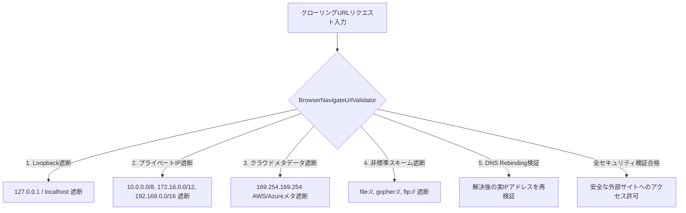
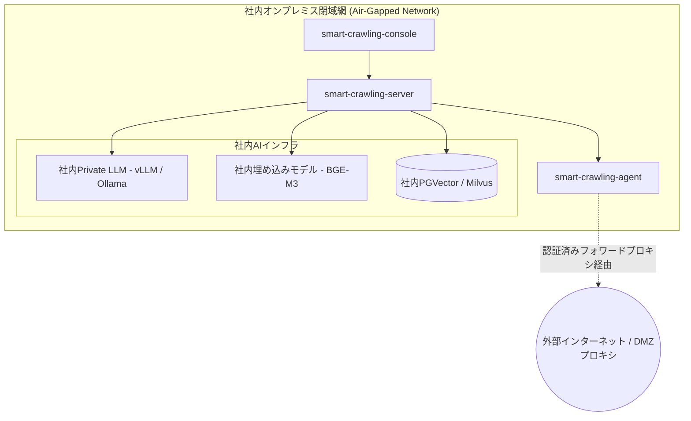

# エンタープライズセキュリティ＆閉域網ガバナンス

企業インフラでWebクローラーを運用する際のセキュリティ要件と規制遵守に対応するためのSyncCrawlのセキュリティアーキテクチャを紹介します。

---

## SSRF(Server-Side Request Forgery) 防御構造

外部URLを巡回するクローラーは、内部IPやクラウドメタデータエンドポイント（`169.254.169.254`）への不正アクセスリスクに配慮する必要があります。

SyncCrawlは、URL検証モジュール**`BrowserNavigateUrlValidator`**により多層の遮断ポリシーを適用します。

### 主要なSSRF防御ポリシー
- **ループバックおよび社内IPの遮断**: `localhost`、`127.0.0.1`、RFC 1918社内プライベートIPへの接続を制限します。
- **クラウドメタデータ保護**: クラウドインスタンスのメタデータサービス（`169.254.169.254`）へのアクセスを制限します。
- **DNS Rebinding対策**: ドメイン解決直後に取得した実際のリクエスト先IPが社内アドレスでないかを通信確立直前に再検査します。
- **プロトコルのホワイトリスト**: `http://` および `https://` を許可し、非標準スキーム（`file://`, `jar://`等）を排除します。

---

## 閉域網（Air-Gapped）およびオンプレミス環境のサポート

外部インターネットと隔離されたオンプレミス環境でもスタンドアロンで動作可能です。

- **社内Private LLM連携**: 外部SaaS APIに依存せず、社内サーバーに構築された`vLLM`、`Ollama`等と連携して外部データ流出リスクを低減します。
- **DMZフォワードプロキシ連携**: 外部Web収集が必要な場合、認可されたDMZフォワードプロキシ経由でトラフィックを送信します。
- **Air-Gappedデプロイ対応**: 社内プライベートレジストリ（Harbor, Nexus）からコンテナイメージおよびパッケージを調達可能です。

---

## 多層RBACと監査ログ（Audit Trail）

すべてのクローリングジョブとナレッジ検索は、ロールベースのアクセス制御と監査ログによって管理されます。

### 1. ロールベースアクセス制御 (RBAC)
- **クローリングエンジニア (Admin)**: シナリオ作成、Quartzスケジュール設定、セレクタールール管理
- **業務アナリスト (Analyst)**: データ照会、RAG検索テスト、収集レポート出力
- **セキュリティ管理担当 (Auditor)**: アクセスログ、通信先IP履歴、セキュリティポリシー監視

### 2. 実行監査ログの記録
ジョブ実行ごとに以下の項目がDBに保存されます：
- 実行ジョブID、リクエスト者アカウントおよびクライアントIP
- 対象URLおよびリダイレクト後の最終到達URL
- 所要時間、HTTPステータスコード、レスポンスサイズ
- 収集ファイルおよびHTMLのSHA-256ハッシュ値
- セレクター復旧（Self-Healing）の発生有無および変更前後のDiff
