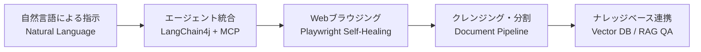

# SyncCrawl™: Webクローリング＆RAGナレッジ構築プラットフォーム

SyncCrawl™は、データ収集、自然言語処理（NLP）、**Playwright MCPによるブラウザ自動化**、そして**RAG（検索拡張生成）ナレッジパイプライン**を連携したエンタープライズ向けWeb収集プラットフォームです。

対象WebサイトのUIやDOM構造が変更された場合でも文脈を分析してセレクターを再構成（Self-Healing）し、収集した非構造化Webデータをクレンジング・埋め込み処理して社内ベクトル知識ベースへ変換します。

---

## 主な機能と構成

従来のクローラーにおける運用保守の課題を軽減し、データ収集からベクトルインデックス化までの工程を一元化します。

### 1. 適応型クローリング (Self-Healing Crawling)
- **自然言語指示の解釈**: 「主要機関のお知らせ最新10件と本文内容を収集」といった業務言語でジョブを登録します。
- **適応型セレクター復旧**: サイト改編でCSS/XPathセレクターが変更されても、DOM構造とテキスト文脈を分析して対象データを再探索します。

### 2. RAGナレッジパイプライン (Knowledge Base)
- **文脈保持チャンキング**: HTML構造を解析し、文脈を保ったままセマンティックチャンクに分割します。
- **多言語埋め込み対応**: 日本語および業務ドメイン用語の処理に適した埋め込みモデルをサポートします。
- **ベクトルデータベース連携**: PGVector、Milvus、Qdrant、Weaviate等の主要Vector DBと連携し、リアルタイム同期を行います。

### 3. 分散ランタイムとセキュリティ設計 (Production Architecture)
- **4つの独立コンテナ**: `Server`、`Agent`、`Scenario-Agent`、`Console`の4つの分散イメージにより柔軟なスケールアウトが可能です。
- **SSRF防御機構**: 内部ネットワークアクセスおよび不正リダイレクトを検証するURL検証モジュール（`BrowserNavigateUrlValidator`）を搭載しています。
- **閉域網（Air-Gapped）対応**: 外部インターネットと隔離されたオンプレミス環境でも、社内Private LLM（vLLM、Ollama）と連携して動作します。

---

## 技術仕様概要

| 区分 | サポート技術および仕様 |
| :--- | :--- |
| **コアバックエンド** | Java 21, Spring Boot 3.5, LangChain4j, Flyway |
| **ブラウザ自動化** | Playwright MCP, Headless Chromium, 分散Worker |
| **ストレージ＆キャッシュ** | PostgreSQL, Redis, MinIO / S3 オブジェクトストレージ |
| **ベクトルデータベース** | PGVector, Milvus, Qdrant, Weaviate |
| **運用コンソール** | Vue 3, Vite, TypeScript, Quasar Design System |
| **デプロイインフラ** | Docker Multi-Arch (amd64/arm64), Kubernetes(AKS), Air-Gapped Runner |

---

## ドキュメント一覧

- [システムアーキテクチャ＆Clean Architecture](./architecture.md): 4層分散アーキテクチャとコンポーネント構成
- [適応型クローリング＆AI自己修復エンジン](./adaptive-crawling-engine.md): Playwright MCP連携およびセレクター修復動作原理
- [RAGナレッジパイプライン＆ベクトル連携](./rag-knowledge-pipeline.md): データクレンジング、チャンキング、Vector DB同期
- [エンタープライズセキュリティ＆閉域網ガバナンス](./enterprise-security-governance.md): SSRF遮断、Air-Gapped運用および監査証跡
- [REST API＆MCP Toolリファレンス](./api-reference.md): ジョブ制御、クエリ、結果取得のためのAPI仕様
- [エンタープライズFAQ＆導入ガイド](./enterprise-faq.md): Bot対策、スケーリングおよび主要なQ&A