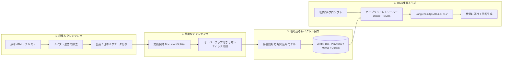

# RAGナレッジパイプライン＆ベクトル連携

SyncCrawlは、収集したWebデータを整理して生成AIアプリケーションで活用できる**RAG（Retrieval-Augmented Generation）ナレッジベース**へと変換します。

---

## ナレッジ変換パイプライン構成



---

## 主要な処理ステップ

### 1. ノイズ除去と構造化 (Boilerplate Stripping)
Webページにはヘッダー、フッター、広告、著作権表記など検索精度に不要な要素が含まれる場合があります。
- **本文抽出アルゴリズム**: テキスト密度とタグパターンを分析し、コンテンツ本文を抽出します。
- **メタデータ保持**: URL、収集日時、タイトル、カテゴリをチャンクのメタデータとして保持し、引用元（Citation）を提供します。

### 2. 文脈を保持するセマンティック・チャンキング
- **構造認識分割**: 見出しタグ（`<h1>`〜`<h6>`）、段落（`<p>`）、リスト、テーブル（`<table>`）の境界を考慮して分割します。
- **オーバーラップ設定**: チャンク間に適正なオーバーラップ（100〜200トークン）を設けて意味の断絶を防ぎます。

### 3. 埋め込みモデルのサポート
LangChain4jの標準インターフェースにより、各種埋め込みモデルを柔軟に選択可能です。

| モデル区分 | 推奨モデル | 特徴と適合環境 |
| :--- | :--- | :--- |
| **閉域網（オンプレミス）** | `BGE-M3`, `KoSimCSE`, `Snowflake-Arctic` | 外部通信を行わないオンプレミス環境、日本語検索 |
| **商用クラウドAPI** | `OpenAI text-embedding-3-large`, `Cohere v3` | グローバルな多言語RAG環境 |
| **軽量CPU環境** | `all-MiniLM-L6-v2`, `ONNX Runtime` | リソース制約のあるエッジ環境 |

---

## サポートするベクトルデータベース (Vector DB)

```java
// LangChain4j Vector DB 接続設定例 (Spring Boot Bean)
@Bean
public EmbeddingStore<TextSegment> embeddingStore(PgVectorProperties properties) {
    return PgVectorEmbeddingStore.builder()
            .host(properties.getHost())
            .port(properties.getPort())
            .database(properties.getDatabase())
            .user(properties.getUsername())
            .password(properties.getPassword())
            .table("synccrawl_knowledge_vectors")
            .dimension(1024) // BGE-M3基準
            .build();
}
```

- **PostgreSQL (pgvector)**: 専用DBを追加せず、既存のRDBMS環境でリレーショナルデータとベクトルを管理
- **Milvus / Qdrant**: 大規模ベクトルデータの分散処理と高速検索をサポート
- **Elasticsearch / OpenSearch**: BM25キーワード検索とベクトルDense Retrievalを組み合わせたハイブリッド検索に対応

---

## 同期とライフサイクル管理

- **差分更新（Incremental Sync）**: ページ内容に変更があった場合のみベクトルを再計算して更新します。
- **TTLによる自動有効期限管理**: 期限切れの情報は設定周期に従って自動整理可能です。
- **ドメイン信頼度スコアリング**: 公式サイトと一般サイトで重み付けを変え、検索時の優先順位を制御します。
