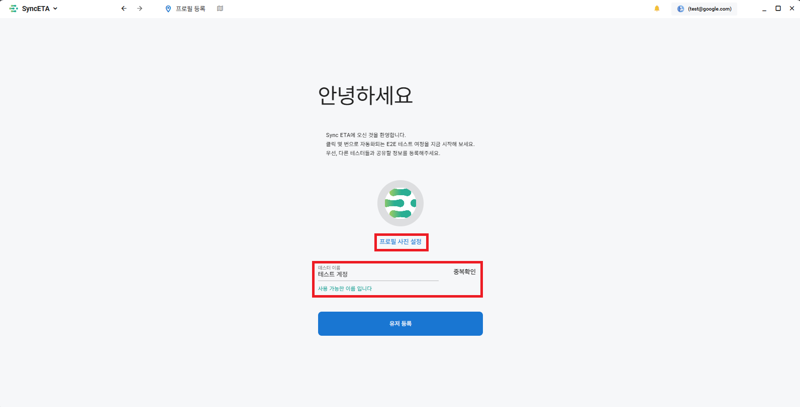
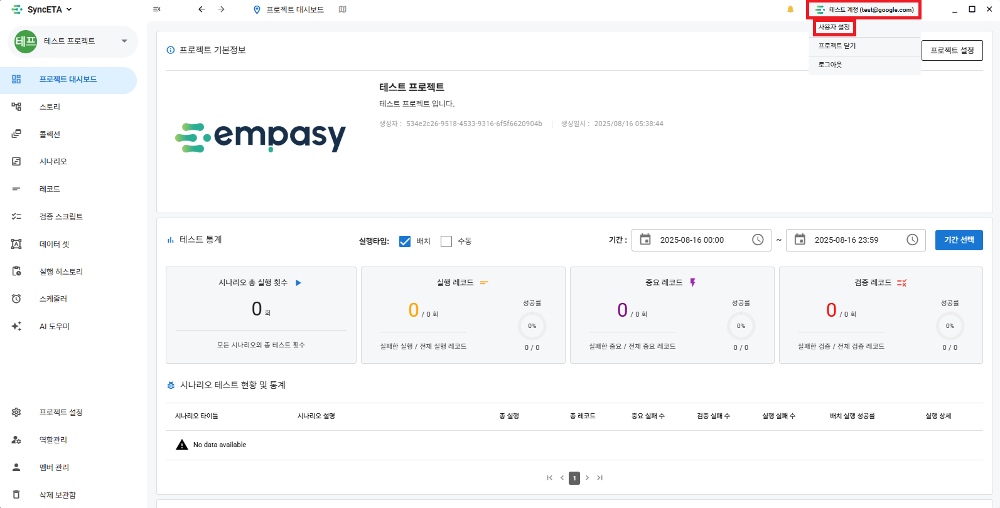

# アカウント

## 会員登録

#### 1. SyncETAのスタート画面の下部にある **_「アカウントを作成しますか？」_** をクリックします。

#### 2. メールアドレスとパスワードを入力後、 **_「認証コード送信」_** ボタンをクリックします。

::: info
入力したメールアドレスに認証コードを送信します。
:::

#### 3. メール認証コードを入力後、 **_「登録する」_** ボタンをクリックします。

::: info
正常に会員登録が完了すると、ログイン画面に移動します。
:::

#### 4. 登録したアカウントでの初回ログイン時に **_「プロフィール設定」_** 画面に移動します。

::: info
プロフィール写真と名前を設定してください。
:::

## プロフィール編集

#### 1. メインダッシュボードの右上にある **_「マイプロフィール」_** をクリックします。

::: info
ユーザー設定をクリックするとアカウント設定画面に移動します。
:::

#### 2. プロフィールを編集することができます。

::: info
サポート機能

- プロフィールの編集
- 言語
- テーマ(ダークモード)
- パスワードの変更
- プッシュ通知設定
  :::
  

## 開発中の機能

::: info

- アカウントの削除
  :::
