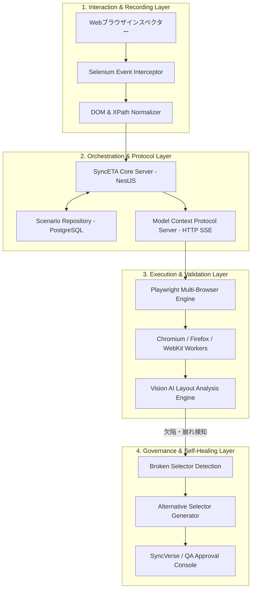

# システムアーキテクチャ・パイプライン

SyncETAは、ブラウザ操作の取得から分散実行、視覚検証、自己修復に至る全工程をモジュール化された4層アーキテクチャで処理します。

---

## 4層アーキテクチャダイアグラム

---

## 各層の仕様概要

- **第1層（操作記録）**: Seleniumエンジンによりクリック、入力、スクロールを傍受し、DOM階層情報とともにJSON/YAMLに変換。
- **第2層（オーケストレーション）**: NestJSサーバーおよびHTTP SSEベースのMCPサーバーにより外部CI/CD・AIと無状態通信。
- **第3層（実行・視覚検証）**: Playwrightコンテナによるマルチブラウザ並列実行およびVision AIによる画面レイアウト整合性検証。
- **第4層（ガバナンス・修復）**: 壊れたセレクターを自動検知し、代替パスを生成してQA管理者の承認キューに送信。
