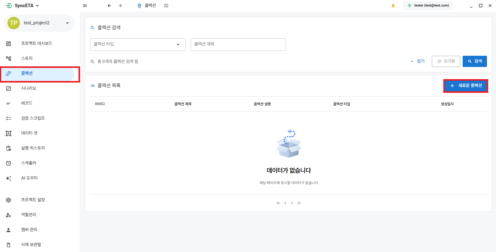

# コレクション

## コレクションの機能

#### 複数のシナリオを直列・並列で実行

::: tip コレクションの主な機能
**1. クロスブラウジングテスト**

- 多様なブラウザ環境で同時にテストを実行することで、ウェブサイトがChrome、Safari、Edgeなどの複数のブラウザで一貫して動作するかを確認できます。

**2. 順次的なシナリオ実行**

- 複数のテストシナリオを統合管理し、実行順序を最適化することでテストの効率を最大化できます。
  :::

## コレクションの作成

#### コレクションメニューへ移動

#### シナリオの選択

## コレクションの実行

<iframe width="100%" height="400" src="https://www.youtube.com/embed/dsb0XpGy7A0" frameborder="0" allowfullscreen allow="autoplay; encrypted-media"></iframe>
