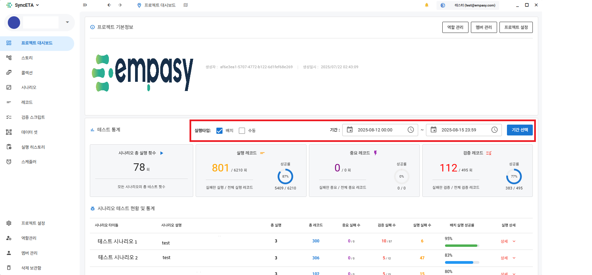
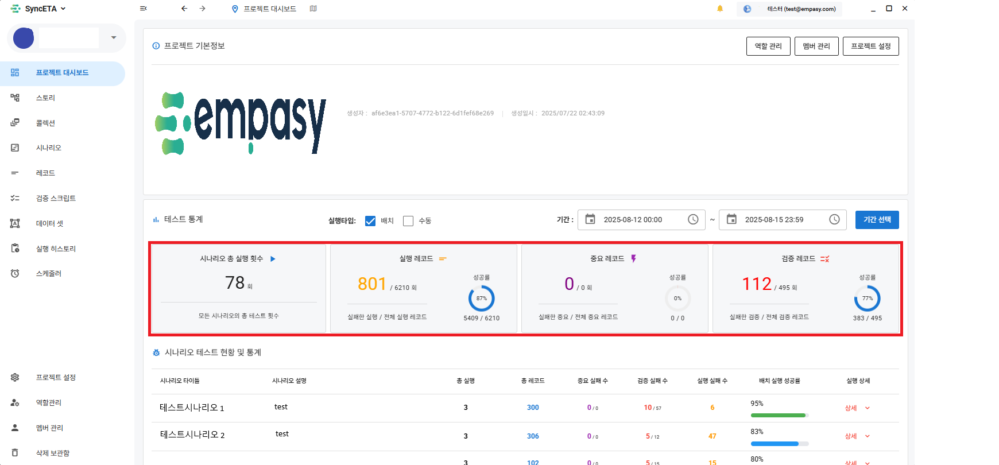
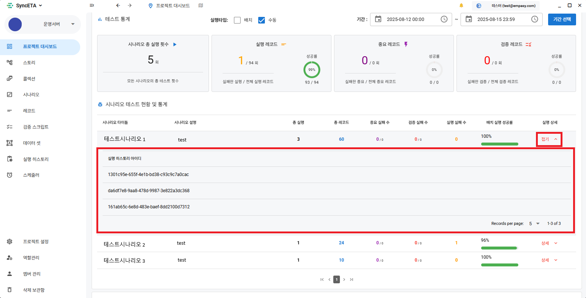
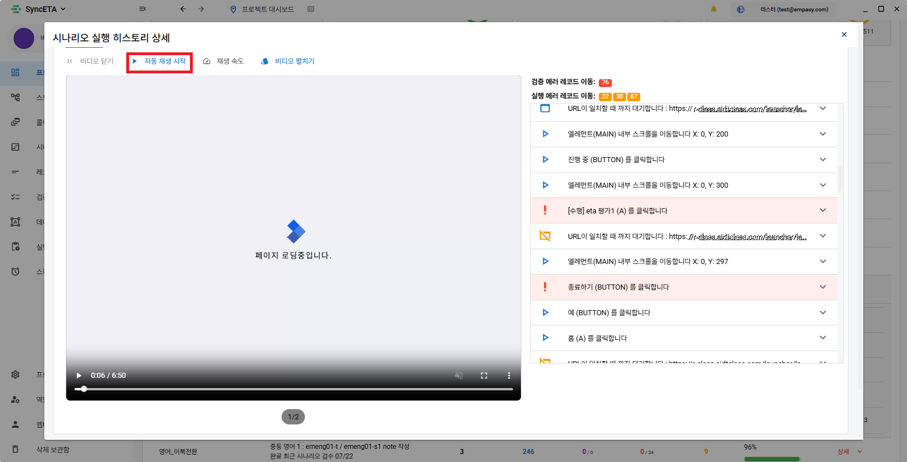
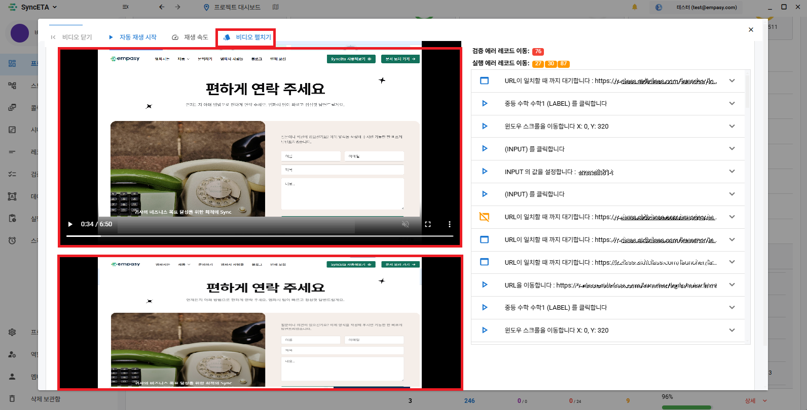
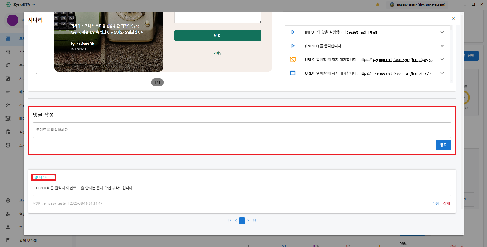
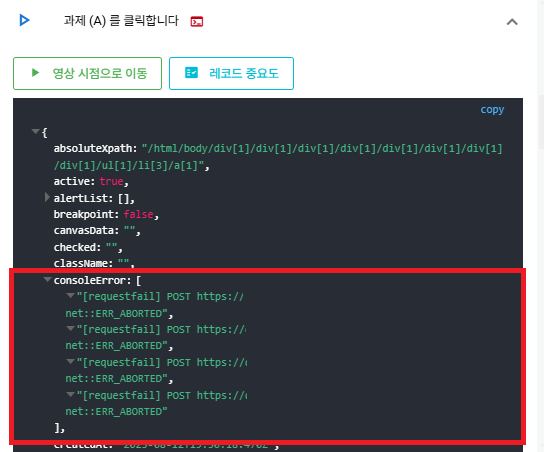

# ダッシュボード

## テスト結果

#### 実行タイプ / 期間を設定して結果を照会できます。

#### 照会期間内のテスト結果に対する統計を表示します。

::: info

1. シナリオの総実行回数
2. レコードの総実行回数
3. 重要度が「高」に設定されたレコードの実行成功率 (重要度設定は下記)
4. 検証レコードの検証成功率
   :::

#### シナリオ実行結果の詳細履歴を確認する方法

#### 自動再生

#### 映像の時点のレコードにフォーカスを当て、実行結果を簡単に確認できます。

#### 複数のタブの映像を一度に確認できます。

#### クリックすると、該当するエラーレコードにスクロール移動します。

#### レコード実行時点の映像に移動します。

#### テスト結果にコメントを書き込むことができます。

::: info

- @ を通じてチームメンバーをタグ付け可能
  :::

#### タグ付けされたコメントを確認できます。

## 収集情報

1. **独自情報の収集**  
    SyncETAは、録画時点で収集した情報を基に、回帰テスト時に関連情報を自動的に収集して提供します。
   ::: info
   ユーザーの行動に基づいてイベントが発生したdomの様々な情報を収集します。
   :::
   
2. **ConsoleErrorの収集**  
    テスト対象ページで発生するConsoleErrorを自動的に検知および収集して確認できます。
   ::: info
   テスト時に発生したコンソールエラーを収集して提供します。
   :::
   

3. **HTML5 構文チェック (機能追加中)**  
   回帰テスト時にW3CベースのHTML5構文チェックを自動的に進行し、その結果を収集してユーザーエクスペリエンスの改善に活用できます。

4. **SSL証明書のチェック**  
    テストが進行されたページのSSL証明書の有効期限を自動的に確認および収集し、有効期限が迫っている場合はメーリングサービスを通じて案内します。
   ::: info
   テストを進行したサービスのSSL証明書の有効期限を収集して提供します。

- SSL証明書自動更新機能追加中
  :::
  
