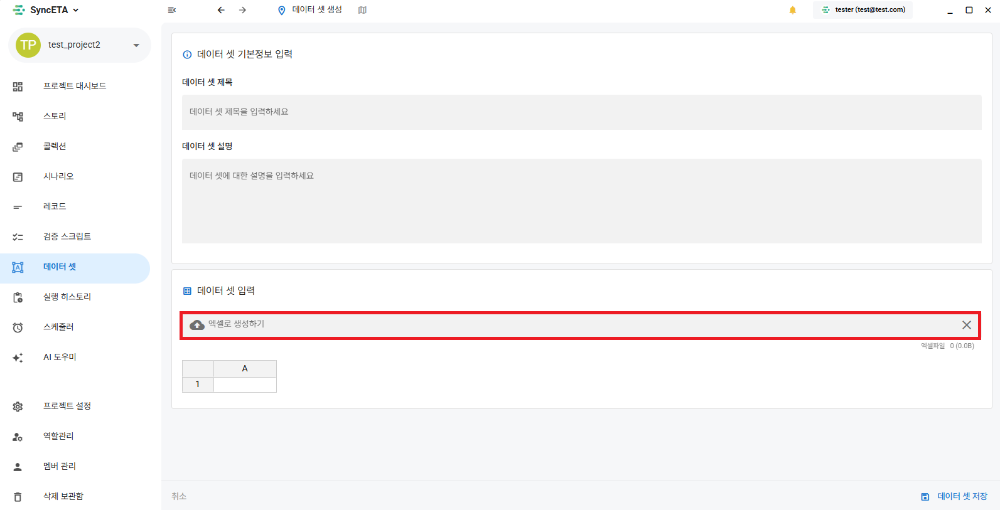

# データセット

## データセットとは？

データセットは、Key-Value構造で事前に生成されたモックアップデータを、シナリオに設定された変数と自動的にマッピングする役割を果たします。
事前に定義した変数に基づいてモックアップデータを生成することができ、AIを活用して変数に適したデータを自動的に生成してくれます。

## データセットの作成

データセットはExcelシートに似た構造で設計されており、ユーザーに馴染みがあり、簡単に作成および管理できます。

変数と行を自由に追加および削除でき、シナリオで事前に設定した変数値を呼び出す機能を提供します。
Excelファイルで事前に生成されたデータをインポートすることができ、変数設定後にAIを活用してモックアップデータを自動的に生成することができます。

::: info

- シートを右クリックしてください
  :::
  

## Excelで作成する

#### Excel form [ダウンロード](./image/dataset/dataset_form.xlsx)

## AIを活用した自動生成

変数設定後、「AIでデータを自動入力」をクリックすると、AIが変数に合ったモックアップデータを自動的に生成してくれます。

- ローディング
  
- データ生成後の画面
  

## データセットの適用

<iframe width="100%" height="400" src="https://www.youtube.com/embed/d2RU8aabXIQ" frameborder="0" allowfullscreen allow="autoplay; encrypted-media"></iframe>
