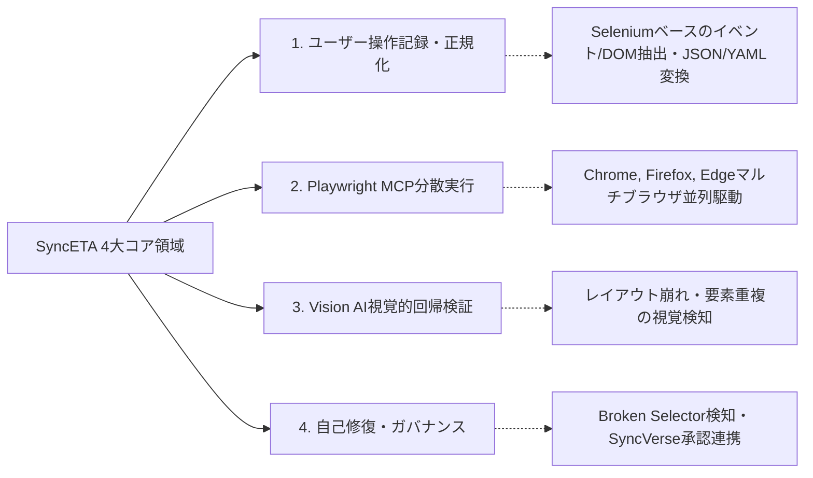

# SyncETA: 自律回帰テストおよび自己修復プラットフォーム

SyncETAは、Webアプリケーションにおけるユーザー操作を記録し、Model Context Protocol（MCP）標準インターフェースを介してテストを自動実行し、視覚的なレイアウト崩れの検知およびセレクターの自己修復（Self-Healing）を支援するエンタープライズQAプラットフォームです。

---

## 4大コア機能領域

1. **ユーザー操作記録およびシナリオ正規化**:
   - クリック、入力、ページ遷移、タブ切替などのブラウザ操作をリアルタイムに収集します。
   - 収集されたイベントはXPath、CSS Selector、DOM階層情報とともに標準JSON/YAML形式に正規化されます。

2. **Playwright MCPベースの分散テスト実行**:
   - Model Context Protocol（MCP）標準ツールを介して、マルチブラウザ（Chromium, Firefox, WebKit）環境でテストを並列実行します。
   - テスト失敗時には、DOMスナップショット、コンソールログ、同期録画ビデオ（MP4）を自動収集します。

3. **Vision AIベースの視覚的回帰検証**:
   - 単純なピクセル比較にとどまらず、ビジョンモデルを活用して要素の重なり、テキスト欠け、レスポンシブ崩れを人間認知レベルで検知します。
   - 動的領域（現在時刻、バナー広告等）のマスキング設定をサポートします。

4. **セレクター自己修復およびガバナンス**:
   - UI変更により既存のセレクターが無効になった場合、画面構造を解析して代替セレクターを算出します。
   - コードを勝手に上書きせず、管理者（SyncVerse/QA）の承認（Human-in-the-Loop）を経てテスト資産を更新します。

---

## ドキュメント目次

### 1. 概要・システムアーキテクチャ
- [システムアーキテクチャ・パイプライン](./architecture) - 4層アーキテクチャおよび通信構造
- [5分クイックスタートガイド](./quickstart) - ローカルコンテナ起動と初回テスト実行

### 2. 実務ユーザーガイド
- [アカウント・ワークスペース管理](./account) - アカウント作成・設定
- [プロジェクト・権限管理（RBAC）](./project) - プロジェクト作成・ロール権限
- [シナリオ記録・エディター](./scenario-create) - 録画、待機条件、検証条件、復旧スクリプト
- [シナリオ実行・スケジューラー](./scenario-run) - クロスブラウザ、並列実行、定期実行
- [コレクション管理](./collection) - 複数シナリオの一括順次/並列実行
- [ストーリーワークフロー](./story) - フローチャート連携シナリオチェーン
- [データセット管理](./dataset) - Excel連携、変数置換（Data-Driven Testing）
- [ダッシュボード・結果分析](./dashboard) - 統計、DOMスナップショット、録画ビデオ再生

### 3. 高度連携・エンタープライズ
- [視覚的回帰検証・自己修復](./self-healing-and-vision) - Vision AI検知およびセレクター修復手順
- [MCPプロトコル・CI/CD連携](./mcp-and-cicd) - HTTP SSE標準Toolスキーマおよびパイプライン連携
- [エンタープライズセキュリティ・オンプレミス](./enterprise-security) - ローカルLLM連携、閉域網対応、データマスキング
- [技術用語集](./glossary) - 主要用語定義
