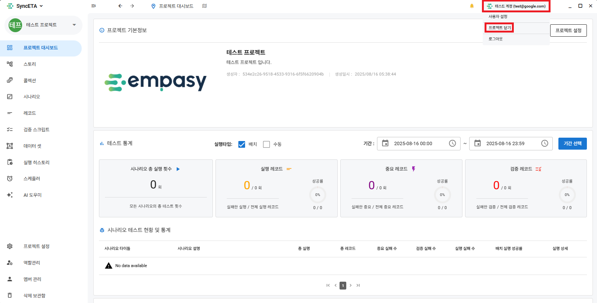
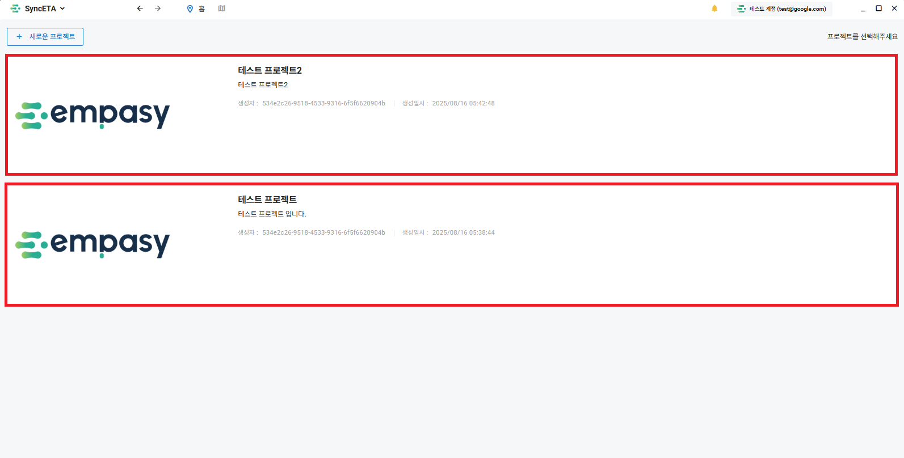

# プロジェクト

SyncETAを通じて多様な **_「単体テスト」_** と **_「統合テスト」_** を管理することになります。

**_「プロジェクト」_** は複数のテストを管理する最も大きな分類単位です。  
ユーザーはプロジェクトに **_「メンバー」_** として登録され、SyncETAソリューションを使用することになります。  
プロジェクトにメンバーを招待し、メンバーごとに作業権限を付与する方法を説明します。

## プロジェクト作成

::: info
以下の3つの場合においてプロジェクトを作成する方法

1. 所属しているプロジェクトがない場合
2. 所属しているプロジェクトが存在する場合
3. 他のプロジェクトで作業中の場合
   :::

#### 1. 所属しているプロジェクトがない場合にプロジェクトを作成する方法。

::: info
所属しているプロジェクトがない場合は、画面中央の **_「新しいプロジェクト」_** ボタンをクリックします。
:::

#### 2. 所属しているプロジェクトが存在する場合にプロジェクトを追加する方法。

::: info
所属しているプロジェクトがあり、プロジェクトを追加したい場合は、プロジェクトリストの左上にある **_「新しいプロジェクト」_** ボタンをクリックします。
:::

#### 3. 他のプロジェクトで作業中にプロジェクトを追加する方法。

::: info
画面左上のプロジェクトツールバーの **_「新しいプロジェクト」_** ボタンをクリックします。
:::

#### 4. プロジェクト作成

::: info
上記の3つの方法でプロジェクト作成画面に移動できます。  
プロジェクトのプロフィール画像、プロジェクト名、プロジェクトの説明を入力してプロジェクトを作成します。
:::

## プロジェクトリスト

#### 1. プロジェクトリストへ移動

::: info
右上の **_「プロジェクトを閉じる」_** ボタンをクリックして、現在所属しているプロジェクトリストを確認できます。
:::

#### 2. プロジェクトリスト照会

::: info
自分が所属しているプロジェクトリストを確認できます。
:::

## 役割 / 権限設定

::: info
プロジェクトごとに役割(role)を作成し、権限を付与することができます。
:::

#### 1. 役割作成

::: info
役割作成画面へ移動
:::

#### 2. 権限設定

::: info
役割に付与する権限を設定します。
:::

## メンバー管理

::: info
プロジェクトにメンバーを招待し、作業権限を付与します。
:::

#### 1. メンバー招待

::: info
メンバー招待画面へ移動
:::

#### 2. メンバー招待

::: info
プロジェクトに招待するメンバーを選択します。
:::

#### 3. 権限付与

::: info
招待したメンバーに権限を付与します。

- 該当の権限はプロジェクト内でのみ有効です。  
  ex) Aプロジェクトで管理者権限を持つユーザーが、Bプロジェクトではテスター(例)権限である可能性があります。
  :::
  
