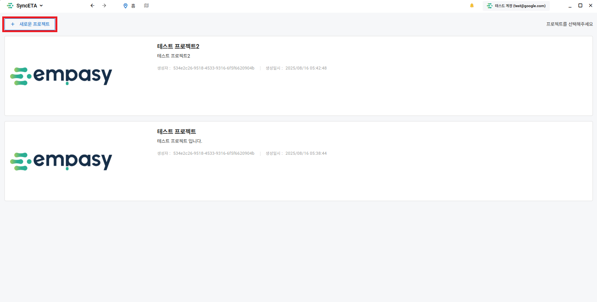
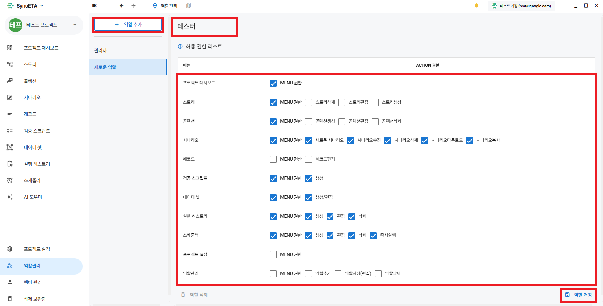

# プロジェクトおよび権限（RBAC）管理

**「プロジェクト」** はシナリオ、データセット、実行ログを隔離・管理する最上位の単位です。

---

## 1. プロジェクト作成

初期画面、一覧画面、またはツールバーから新規プロジェクトを作成できます。

---

## 2. ロールおよび権限設定

プロジェクトごとにロールを作成し、シナリオ作成・実行・APIキー発行等の権限を設定します。

---

## 3. メンバー招待

メールアドレスでメンバーを招待し、プロジェクト固有のロールを付与します。

