# シナリオ

SyncETAを使用して、複雑なテストコードを作成することなく、実際のUIを通じてテストケースを作成し管理できます。

## シナリオとは

#### **_「シナリオ」_** とは以下のような機能テストの単位を意味します。

##### [ **_「empasy」_** のホームページにアクセスして問い合わせを送信 ]

1. **_「empasy」_** のホームページにアクセス。
2. **_「お問い合わせ」_** をクリック。
3. 問い合わせ内容を入力。
4. 問い合わせを送信。
5. 正常な送信を確認。

## シナリオ作成

#### 1. シナリオメニューへ移動

::: info

1. 左側のサイドバーの **_「シナリオ」_** メニューをクリック
2. 右上の **_「新しいシナリオ」_** をクリック
3. シナリオ録画に必要な設定モーダルが表示されます。
   :::
   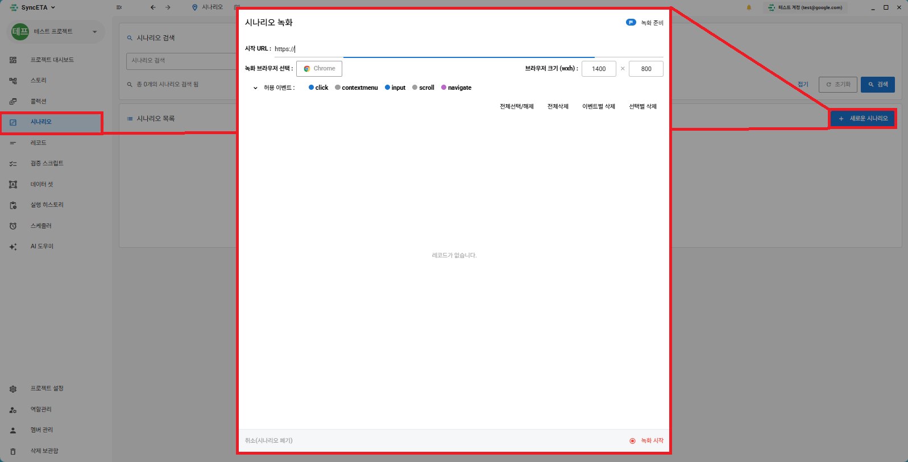

#### 2. 録画ブラウザの設定

::: info

1. シナリオを作成するウェブページのURLを入力します。
2. 録画を行うブラウザを選択します。

- 録画時はChrome -> 実行時はEdgeを選択可能 (クロスブラウジングテスト)

3. 録画を行うブラウザのサイズを設定します。

- 録画時は1400 x 800 -> 実行時は800 x 600が可能 (レスポンシブテスト)
  :::
  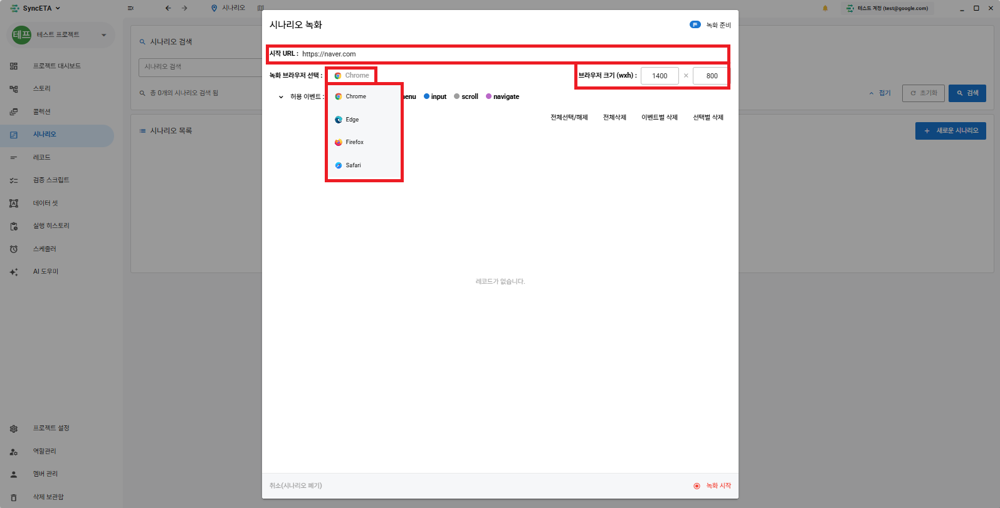

#### 3. 収集イベントの設定

::: info

- 収集するイベントタイプを選択した後、モーダル右下の録画開始ボタンを押してください。  
  基本設定で録画を進めることを推奨します。
  :::
  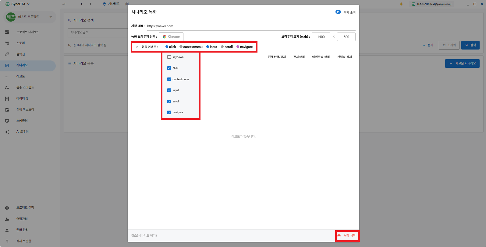

#### 4. 録画開始

::: info
録画を開始するとブラウザが画面に表示されます。  
該当のブラウザで実際のテストを進めてください。  
EX) Naverで **_「周辺の美味しい店」_** を検索

写真のようにレコードが収集されたことを確認できます。

1. URLへ移動
2. 検索バーをクリック
3. 検索ワード(**_「周辺の美味しい店」_**)を入力
4. 検索ボタンをクリック
   :::
   

#### 4. DOM情報の収集

::: info

- すべてのレコードはイベントが発生したDOMの情報を持っています。  
  EX) 検索ワード(**_「周辺の美味しい店」_**)を入力したinput要素の属性を収集
  :::
  

#### 5. 録画中に新しいタブが開いた場合

::: info
ブラウザで追加されたすべてのタブで、同様にシナリオの録画を続けることができます。
:::

## 待機レコード

::: info
レコードの実行間に、特定の条件を満たすまで待機時間を付与する機能です。

待機レコードの種類3つ

1. 時間待機 - 設定した時間だけ待機します。
2. 要素露出待機 - 画面に特定の要素が表示されるまで待機します。
3. 要素値一致待機 - 画面に特定の値が露出するまで待機します。

:::

#### 1. 時間待機条件の追加

::: info
レコード実行前に待機時間を付与します。

1. 待機が必要なレコードを右クリックします。
2. 待機条件追加をクリックした後、待機時間を設定します。(1000 = 1秒)
   :::
   レコードを右クリック
   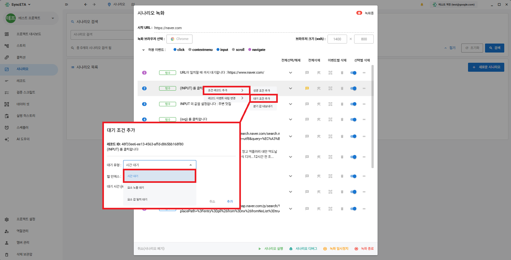
   待機時間の設定
   
   待機レコードの作成
   
   ::: info
   EX) URL移動後、画面の読み込み(ネットワーク状況を考慮して約3秒)時間待機した後、検索バーをクリックするように時間待機条件を追加
   :::

#### 2. 要素露出待機条件の追加

::: info
特定の要素が画面に露出するまで待機します。

1. 待機が必要なレコードを右クリックします。
2. 待機条件追加をクリックした後、要素露出待機を選択します。
   :::
   レコードを右クリック
   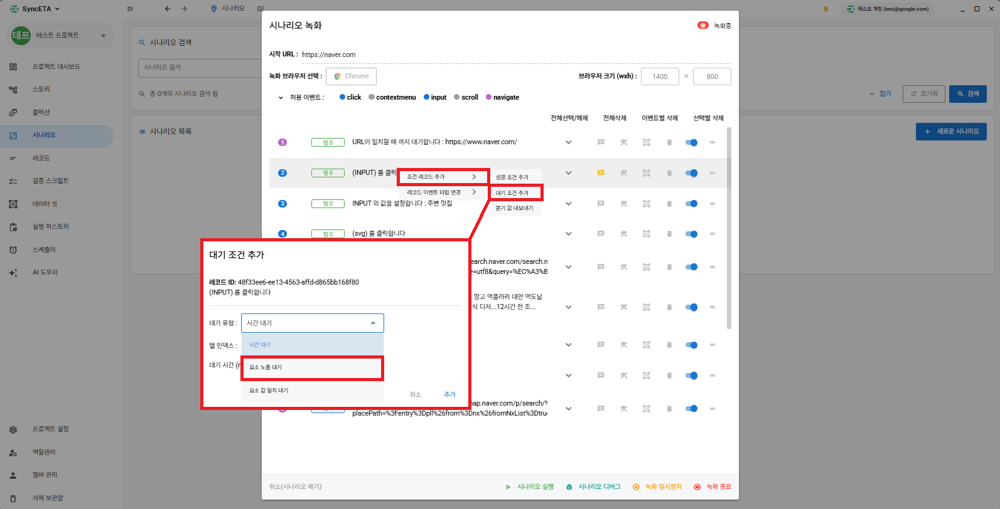
   録画中の画面で要素選択をクリックした後、  
   録画が進行中のブラウザで待機する要素を選択します。
   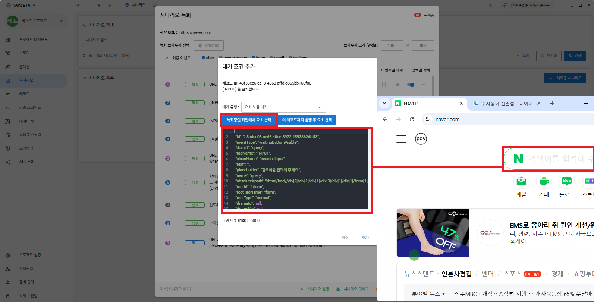
   要素露出待機レコードの作成
   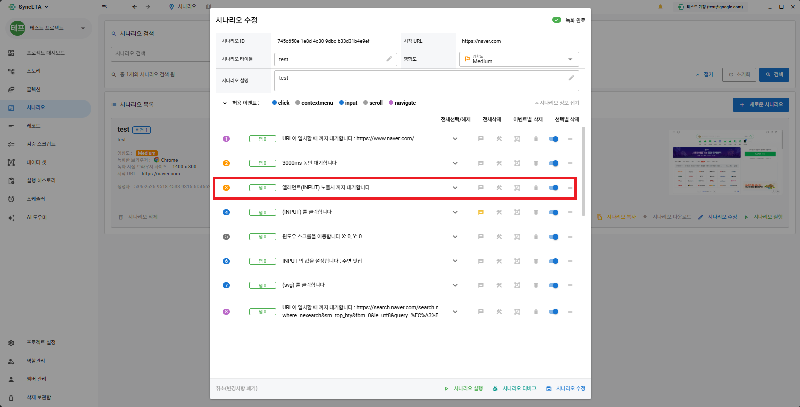
   ::: info
   EX) 検索バーをクリックする前に、実際に画面に検索バー(input)が読み込まれるまで待機
   :::

#### 3. 要素値一致待機条件の追加

::: info
特定の要素に設定した値が露出するまで待機します。
:::

レコードを右クリック
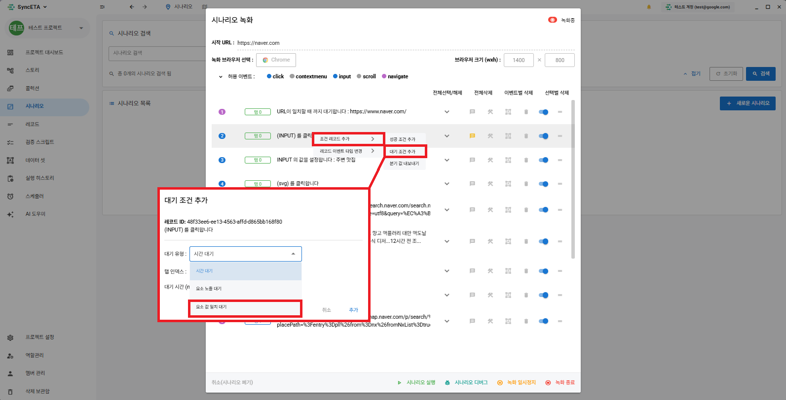
録画中の画面で要素選択をクリックした後、  
録画が進行中のブラウザで待機する要素を選択します。

::: info
EX) ニュースのカルーセルに **_「韓国経済ビジネス」_** が露出するまで待機します
:::

## 検証レコード

::: info
レコードの実行間に、特定の要素が露出するか、特定の値が露出するかを検証する機能です。

1. 特定の要素が画面に露出しているかを検証  
   EX) 美味しい店の検索後、画面に **_「美味しい店マップ」_** が露出しているかを確認
2. 特定の値が画面に露出しているかを検証  
    EX) **_「プレイス」_** の最上段に **_「OOレストラン」_** が露出するかを確認
   :::

#### 1. 要素露出検証レコードの追加

::: info
特定の要素が画面に露出しているかを検証します。
:::

レコードを右クリック

録画中の画面で要素選択をクリックした後、  
録画が進行中のブラウザで検証する要素を選択します。

検証レコードの作成

::: info
EX) Naverで **_「周辺の美味しい店」_** を検索後、**_「プレイス」_** が露出するかを検証します。
:::

#### 2. 要素値検証レコードの追加

::: info
特定の値が画面に露出しているかを検証します。
:::

レコードを右クリック
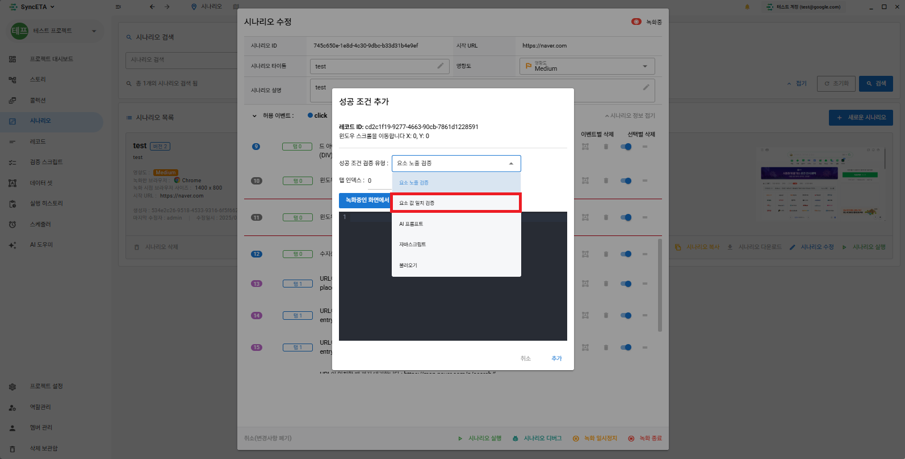
録画中の画面で要素選択をクリックした後、  
録画が進行中のブラウザで検証する要素を選択します。  
EX) プレイスの最上段に **_「ディアリスト延南」_** が露出するかを検証

検証レコードの作成
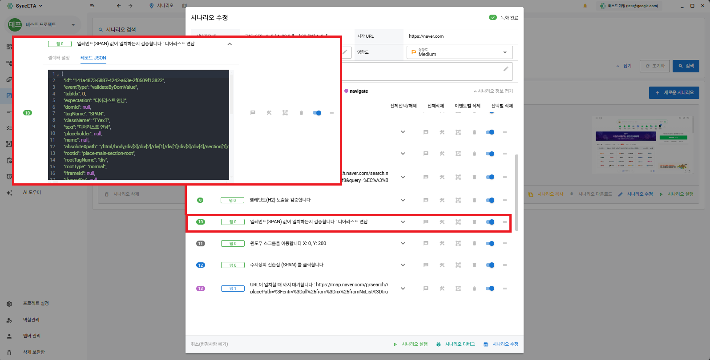
::: info
EX) **_「プレイス」_** の最上段に **_「ディアリスト延南」_**が露出するかを確認
:::

#### 3. AIによる画面検証

::: info
画面内の特定の値や要素の露出ではなく、画像ベースの検証が必要な場合に使用します。
:::

レコードを右クリック

AIプロンプトを選択した後、プロンプトを入力します。  
現在のブラウザの画面をSync-ETAエージェントが自動的にキャプチャし、AIで検証します。
::: info
AWS Bedrock - claude-3-haikuモデルを使用中
:::

::: info
EX) **_「周辺の美味しい店」_** を検索後、画面に **_「マップ」_** が正常に露出するかを確認
:::

## シナリオの修正

::: info
既存のシナリオの特定の部分から続けて録画を進める機能です。
:::

#### 1. 修正するシナリオの選択

シナリオ修正をクリック
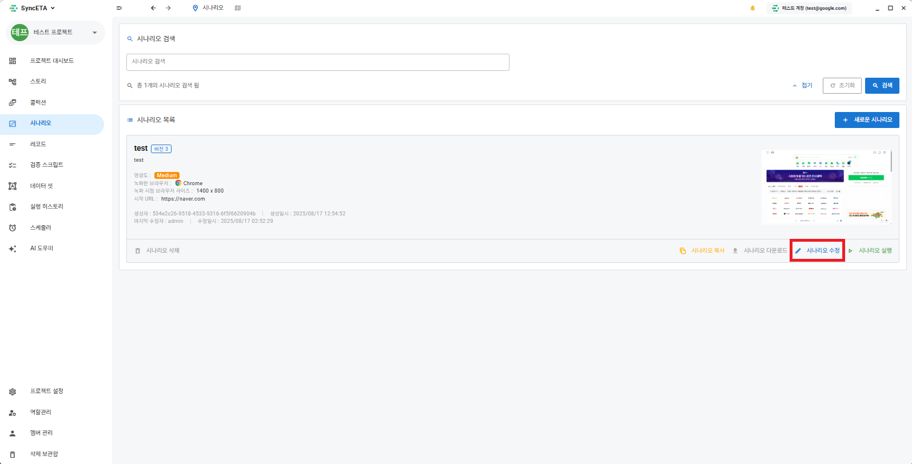
続けて録画するレコードを選択します。
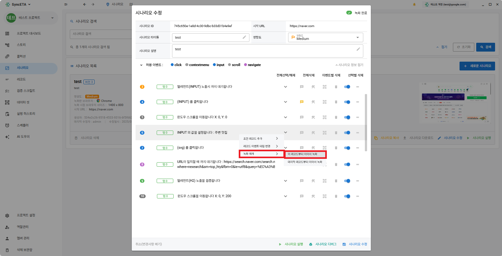
::: info

1. シナリオ作成と同様に録画ブラウザが表示されます。
2. 続けて録画を希望するレコードまでスクリプトが実行されます。
3. 設定したレコードに到達すると、その時点からブラウザで発生するイベントを収集します。
   :::
   

## 付加機能

#### 1. ノート機能

::: info
レコードの内容を入力します。
:::
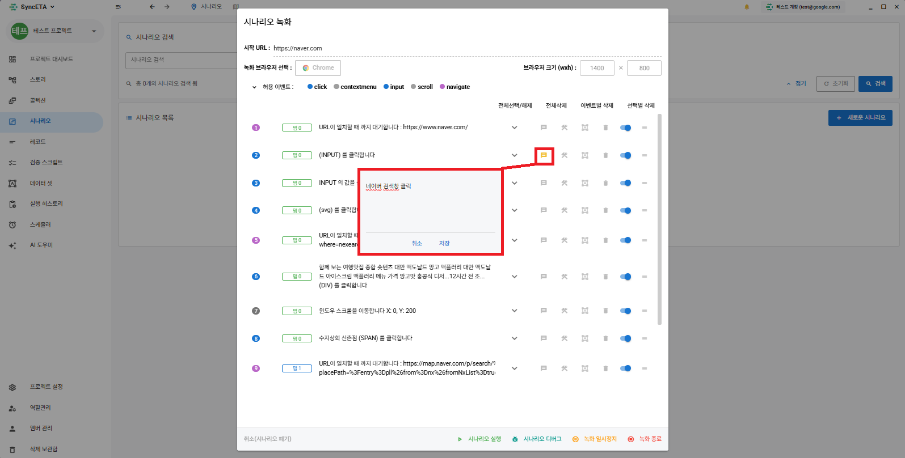

#### 2. 失敗復旧スクリプト

::: info
レコードが失敗した場合に復旧スクリプトが実行されます。
:::

#### 3. データセット

::: info
入力値を指定します。  
EX) 検索ワード(**_「周辺の美味しい店」_**)をユーザーが指定した値に置換します。  
** 詳細な説明は **_「データセット」_** を参照
:::
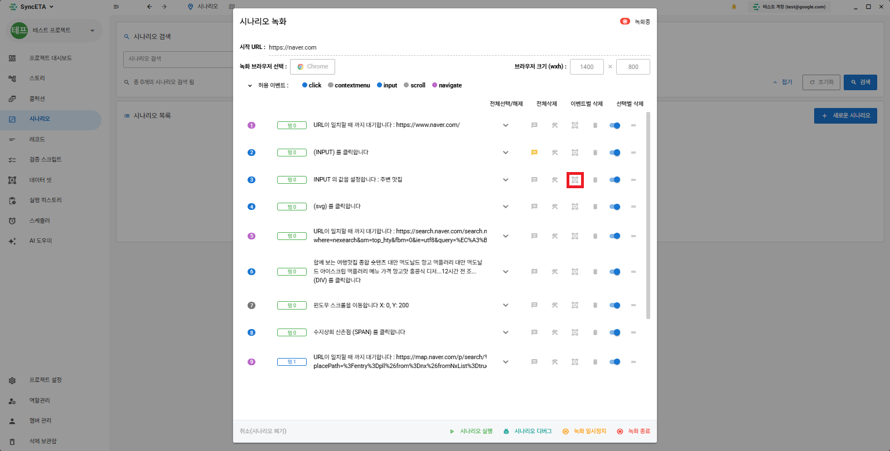

#### 4. 削除

::: info
収集したレコードを削除します。  
EX) 録画中に間違った部分をクリックした場合、該当のレコードを削除します。
:::
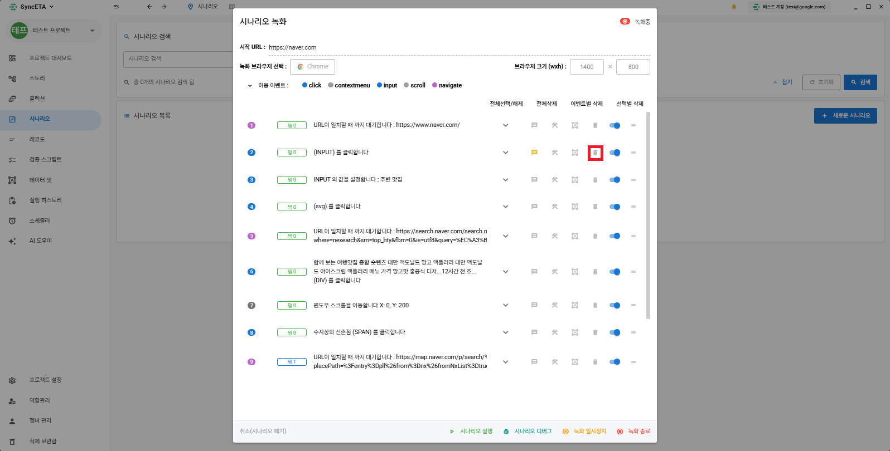

#### 5. 無効化

::: info
収集した情報を削除せずに、実行時に除外します。
:::

