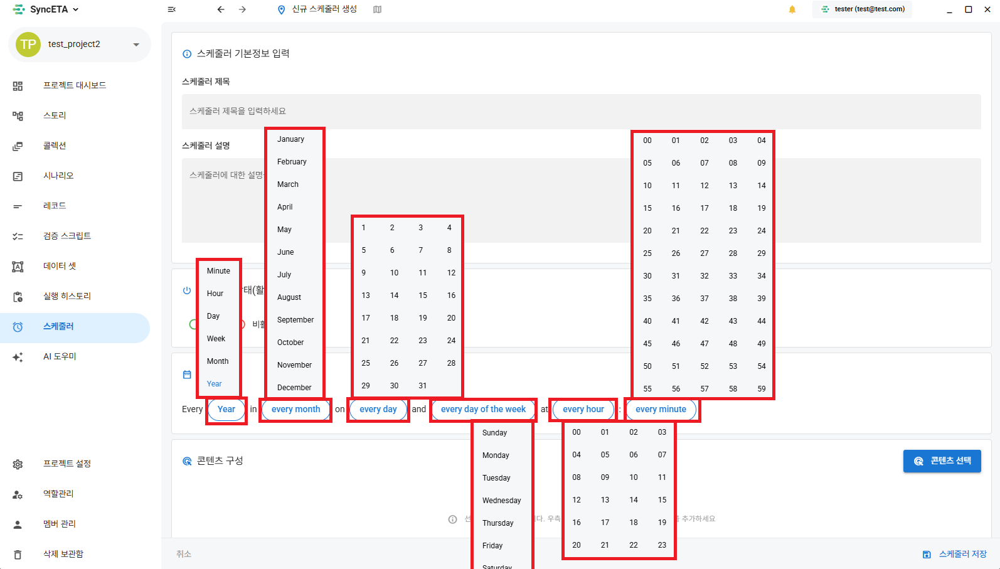

# 実行方法

#### SyncETAを通じて  E2Eテストを自動化する様々な方法を紹介します。

##### 1. シナリオを直接実行

##### 2. スケジューラを通じた自動実行

::: info

- 直接実行は、SyncETAがインストールされたPCから直接ブラウザを立ち上げてシナリオを実行します。
- スケジューラは、設定された時間に合わせてサーバーでシナリオを実行し、その結果を映像と共に提供します。
  :::

##### 3. **_「ストーリー」_** 機能を通じて複数のシナリオを組み合わせて統合テストを進行

##### 4. **_「コレクション」_** 機能を通じて複数のシナリオを直列/並列で実行

##### 5. **_「データセット」_** 機能を通じて入力値を設定してシナリオを実行

::: info

- **_「ストーリー」_**、**_「コレクション」_**、**_「データセット」_** 機能については、各メニューを参照してください。
  :::

## 直接実行

<iframe width="100%" height="400" src="https://www.youtube.com/embed/ZTwlHnBf3lY" frameborder="0" allowfullscreen allow="autoplay; encrypted-media"></iframe>

::: info

- シナリオの実行前に様々な設定が可能です。
  :::
  

##### 1. 該当機能は **_「データセット」_** 部分を参照してください。

##### 2. 実行するブラウザ - シナリオを実行するブラウザを選択します。

##### 3. ブラウザサイズ - ブラウザのサイズを設定します。

##### 4. 繰り返し回数 - シナリオの繰り返し回数を実行します。

直列: 同一のシナリオを計N回順次実行します。  
並列: 計N個のブラウザで同時にシナリオを実行します。

##### 5. ヘッドレスブラウザかどうかのチェック時: 実際のブラウザを立ち上げずにシナリオを実行します。(バックグラウンド実行)

##### 6. 実行後ブラウザ終了かどうかのチェック時: シナリオ終了後にブラウザを閉じます。

##### 7. 実行時動画保存かどうかのチェック時: ブラウザ画面を録画します。

##### 8. レコード実行間隔: 各レコード実行間のデフォルト待機時間を設定します。

## スケジューラ設定

##### 1-1. **_「スケジューラ」_** メニューへ移動します。

##### 1-2. スケジューラの実行時間を設定します。

##### 1-3. シナリオを選択します。

::: info

- 実行ブラウザタイプ、ブラウザサイズなどを設定できます。
  :::
  

##### 1-4. スケジューリング確認

::: info

- 時間帯別に実行されるシナリオを確認できます。
  :::
  
