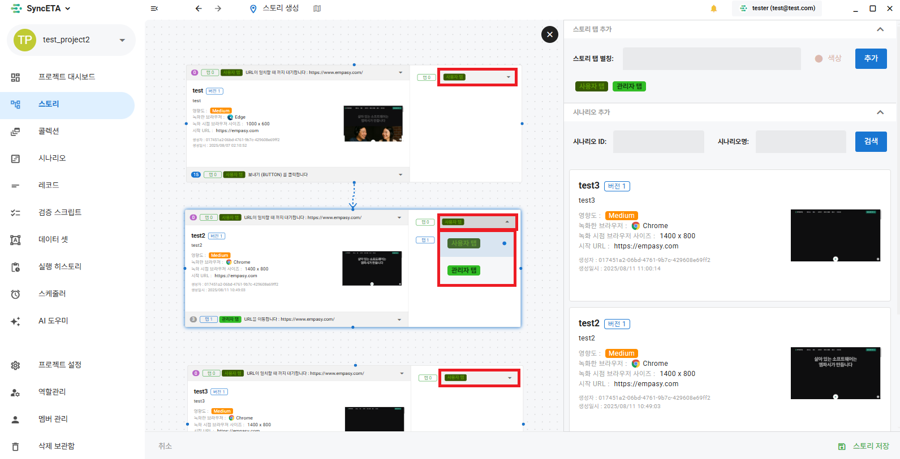

# ストーリー

## ストーリーの機能

#### 複数のシナリオを接続して1つのブラウザで統合して実行

## ストーリーの作成

#### 1. ストーリーメニューへ移動

#### 2. 右側のシナリオリストからストーリーとして作成するシナリオを選択してドラッグします。

#### 3. タブエイリアスを作成します。

::: tip

- それぞれのタブを一意に識別します。
  :::
  

#### 4. タブにエイリアスを適用します。

::: tip

- 同じエイリアスを持つタブごとにレコードが連続して実行されます。
  :::
  

#### 5. 続けて実行するシナリオを接続します。

#### 6. 選択されたシナリオの開始、終了レコードを選択します。

