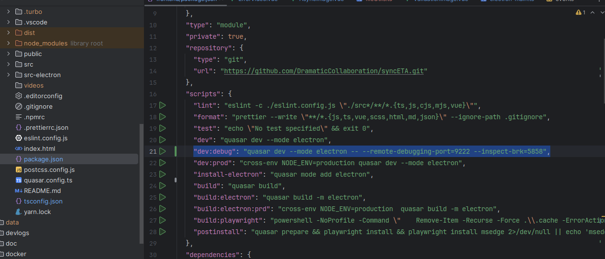
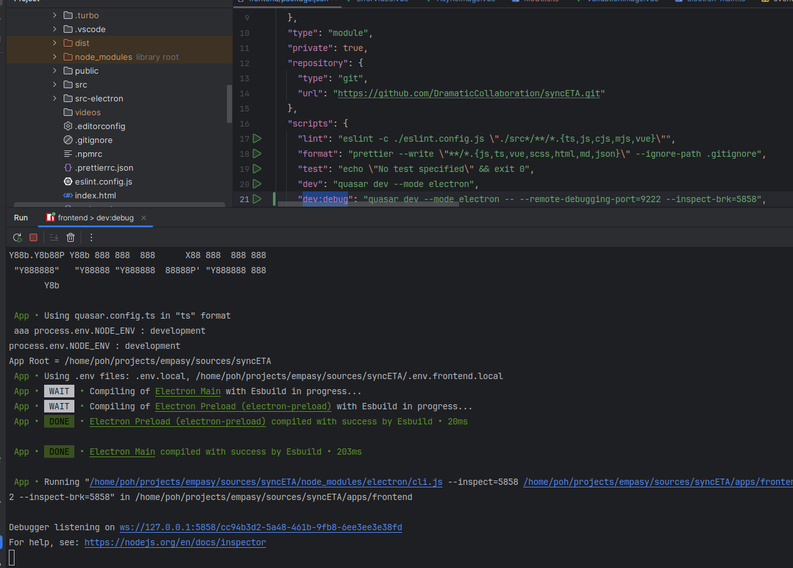
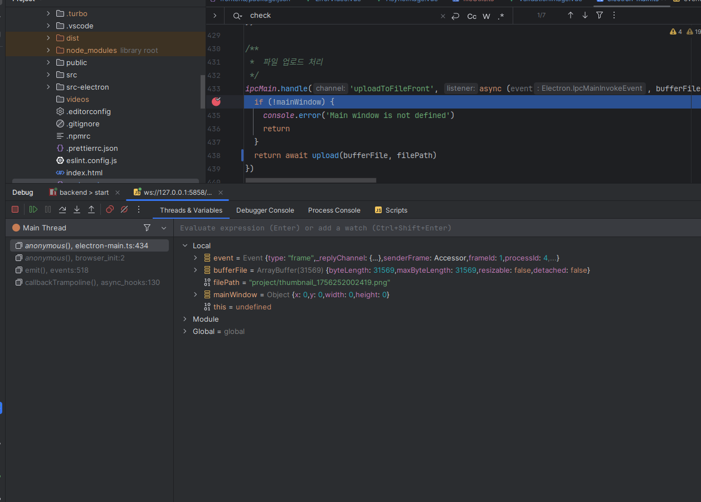

---
title: electron 디버깅
description: 분산 트랜잭션, 메모리 최적화 등 실무 이슈 분석 및 트러블슈팅 엔지니어링 로그입니다.
head:
  - - meta
    - name: keywords
      content: 공부 한것들을 적어 보아요
  - - meta
    - property: og:title
      content: 작업 로그 놀이터 - 자유로운 작업 기록 공간 🎪
  - - meta
    - property: og:description
      content: 이 곳은 팀원들이 자유롭게 작업 로그를 기록하고 공유하는 공간입니다. 강제 없이 필요할 때 편하게 추가할 수 있는 재미있는 작업 로그 시스템을 소개합니다.
  - - meta
    - property: og:image
      content: https://empasy.io/docs/images/favicon.png
  - - meta
    - property: og:url
      content: https://empasy.io/study/
sort: 300
---

# Intellij에서 electron 디버깅

1. dev:debug 실행
   

2. 디버거 실행

   - "Debugger listening on ws://127.0.0.1:5858/cc94b3d2-5a48-461b-9fb8-6ee3ee3e38fd" 부분 클릭
     

3. Breakpoint
   
