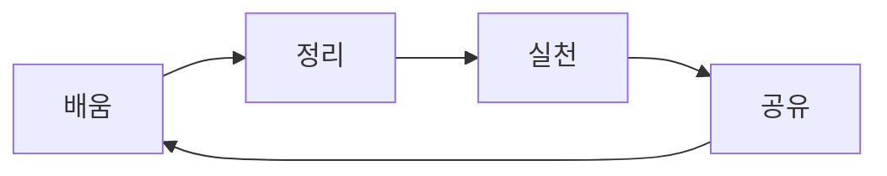

---
title: 공부 한것들을 적어 보아요
description: SyncSeries 엔지니어링 팀의 아키텍처 연구 및 기술 실증 지식 베이스입니다.
head:
  - - meta
    - name: keywords
      content: 공부기록, 학습일기, 지식저장소, 공부로그, 학습관리, 공부노트, 지식정리, 공부방법, 학습저장, 기억보조
  - - meta
    - property: og:title
      content: 📚 두뇌 저장소 - 재미있는 공부 기록 놀이터
  - - meta
    - property: og:description
      content: SyncSeries 엔지니어링 팀의 아키텍처 연구 및 기술 실증 지식 베이스입니다.
  - - meta
    - property: og:image
      content: https://empasy.io/docs/images/favicon.png
  - - meta
    - property: og:url
      content: https://empasy.io/study/
sort: 200
---

# 📚 나만의 지식 놀이터 🎪

## "가르치는 만큼 더 깊이 이해한다"

**"배운 것을 나누면 기쁨이 두 배!"**  
SyncSeries 엔지니어링 팀의 아키텍처 연구 및 기술 실증 지식 베이스입니다.

## 🎯 학습 사이클

**함께 배우고, 함께 성장해요!**  
여러분의 학습 여정도 응원합니다 

---

> ** 마지막 팁:** 배운 것을 정리하고 공유하는 습관이  
> **가장 강력한 학습 무기**가 될 거예요! 함께해요 
