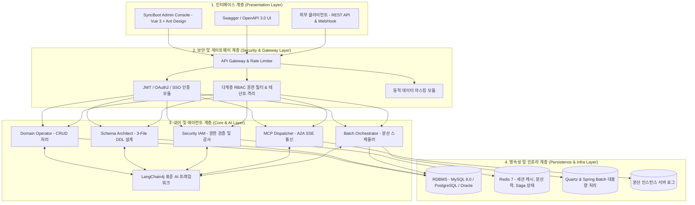

# 시스템 아키텍처 및 모듈 구성

SyncBoot는 안정적인 서비스 운영과 확장성을 위해 4계층 아키텍처와 5대 기능 모듈 협업 구조로 설계되었습니다.

---

## 4계층 시스템 아키텍처

---

## 5대 기능 모듈 상세 명세

### 1. Domain Operator (도메인 데이터 운영)
- **주요 역할**: 도메인 엔티티의 비즈니스 규칙을 기반으로 CRUD 및 비즈니스 트랜잭션 쿼리를 수행합니다.
- **제어 정책**: 소스코드나 DB 스키마 DDL을 직접 변경하지 않으며, 정의된 API 및 매퍼 범위 내에서만 동작합니다.

### 2. Schema Architect (스키마 설계)
- **주요 역할**: 도메인 요구사항을 분석하여 3-File 표준 DDL을 작성하고 ERD 구조를 도출합니다.
- **제어 정책**: 스키마 삭제나 타입 축소 등 영향도가 높은 변경을 사전에 감지하고, 개발자의 승인(HITL) 후에만 DDL을 반영합니다.

### 3. Security IAM (RBAC 권한 및 테넌트 격리)
- **주요 역할**: 사용자 역할에 따른 메뉴, 버튼, API 접근 제어를 처리하며 테넌트 간 데이터 격리를 유지합니다.
- **주요 기능**: 개인정보 컬럼의 동적 마스킹 및 행 단위(Row-Level Security) SQL 조건 주입을 지원합니다.

### 4. MCP Dispatcher (표준 프로토콜 연동)
- **주요 역할**: Model Context Protocol (MCP) 표준 사양을 준수하여 상위 시스템 및 외부 AI 클라이언트에 표준 도구를 HTTP SSE로 제공합니다.
- **로그 수집**: 장애 발생 시 분산 인스턴스의 에러 로그를 수집하여 전달합니다.

### 5. Batch Orchestrator (배치 및 작업 스케줄러)
- **주요 역할**: 대량 데이터 정산 및 주기적인 데이터 집계 작업을 Quartz와 Spring Batch 기반으로 분산 실행합니다.
- **장애 대응**: Redis 기반 분산 락을 확인하고 지수 백오프 방식의 재시도를 수행합니다.

---

## 기술 스택

| 구분 | 기술 요소 | 버전 및 상세 |
| :--- | :--- | :--- |
| **Backend Core** | Java, Spring Boot 3 | Java 17/21, Spring Boot 3.2.x |
| **AI Framework** | LangChain4j | langchain4j-spring-boot-starter v0.35 이상 |
| **ORM / Data** | MyBatis-Plus, Spring Data JPA | HikariCP, MySQL 8.0, PostgreSQL |
| **Protocol** | Model Context Protocol (MCP) | HTTP SSE / JSON-RPC 2.0 |
| **Frontend UI** | Vue 3, Vite, TypeScript | Ant Design Vue 4.x, Pinia, Vue Router |
| **Batch / Cache** | Spring Batch, Quartz, Redis | Redis 7.x, Lettuce |
