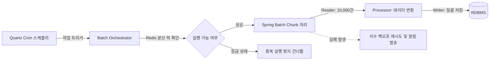

# 배치 & 작업 스케줄러

SyncBoot는 대량의 데이터 처리, 정산 및 주기적인 외부 시스템 연동 작업을 위해 **Quartz 스케줄러와 Spring Batch** 기반의 실행 환경을 제공합니다.

---

## 배치 아키텍처 및 처리 흐름



---

## 주요 기능

1. **스케줄러 설정**: Cron 표현식을 기반으로 주기적 실행 주기를 설정하고 실행 파라미터를 전달합니다.
2. **Chunk 기반 대용량 스트리밍**: 대용량 데이터를 청크 단위(예: 1,000~5,000건)로 분할 처리하여 메모리 사용량을 관리합니다.
3. **분산 락을 통한 중복 방지**: 다중 인스턴스 환경에서 동일 작업이 중복 실행되지 않도록 Redis 기반 분산 락을 적용합니다.
4. **재시도 및 장애 알림**: 일시적인 데이터베이스 지연이나 네트워크 오류 시 재시도를 수행하고, 복구 불가 시 담당 채널로 알림을 전파합니다.

---

## 배치 Job 설정 예시

```java
@Configuration
@RequiredArgsConstructor
public class SettlementBatchConfig {

    private final JobRepository jobRepository;
    private final PlatformTransactionManager transactionManager;

    @Bean
    public Job dailySettlementJob(Step settlementStep) {
        return new JobBuilder("dailySettlementJob", jobRepository)
                .incrementer(new RunIdIncrementer())
                .start(settlementStep)
                .build();
    }

    @Bean
    public Step settlementStep(
            ItemReader<OrderEntity> orderReader,
            ItemProcessor<OrderEntity, SettlementEntity> settlementProcessor,
            ItemWriter<SettlementEntity> settlementWriter) {
        return new StepBuilder("settlementStep", jobRepository)
                .<OrderEntity, SettlementEntity>chunk(5000, transactionManager)
                .reader(orderReader)
                .processor(settlementProcessor)
                .writer(settlementWriter)
                .faultTolerant()
                .retryLimit(3)
                .retry(DeadlockLoserDataAccessException.class)
                .build();
    }
}
```
