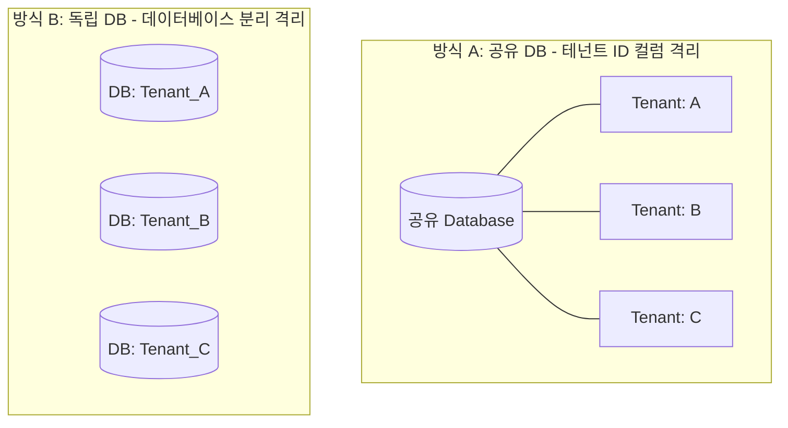

# 멀티테넌트 & RBAC 보안 (IAM)

SyncBoot의 보안 및 권한 모듈은 엔터프라이즈 환경에 맞춘 다계층 데이터 격리와 접근 제어를 제공합니다.

---

## 멀티테넌트 격리 방식

운영 환경과 보안 요구사항에 따라 두 가지 격리 방식을 구성할 수 있습니다.



1. **공유 데이터베이스 방식 (Shared Database)**:
   - 도메인 테이블의 `tenant_id` 컬럼을 기준으로, MyBatis-Plus 인터셉터가 실행되는 쿼리에 자동으로 `WHERE tenant_id = ?` 조건을 주입합니다.

2. **독립 데이터베이스 방식 (Dedicated Database)**:
   - 요청 시점의 테넌트 식별자에 따라 Dynamic DataSource를 전환하여 물리적으로 분리된 데이터베이스에 접속합니다.

---

## 4단계 권한 제어 체계 (RBAC Matrix)

| 구분 | 적용 대상 | 제어 방식 |
| :--- | :--- | :--- |
| **1. 메뉴 접근 제어** | 웹 관리자 콘솔 메뉴 | 사용자 역할(Role)에 인가된 메뉴만 렌더링 |
| **2. 기능 및 버튼 제어** | 등록, 수정, 삭제, 엑셀 다운로드 | `v-hasPermi` 디렉티브를 통한 버튼 활성화 제어 |
| **3. API 엔드포인트 제어**| 백엔드 REST API 경로 | Spring Security `@PreAuthorize` 애노테이션 검증 |
| **4. 데이터 수준 제어** | 행 단위(Row-Level) 및 컬럼 마스킹 | SQL 조건 자동 주입 및 민감정보 마스킹 애노테이션 적용 |

---

## 동적 데이터 마스킹

개인정보 등 민감 데이터는 백엔드 응답 단계에서 지정된 마스킹 규칙에 따라 처리할 수 있습니다.

```java
public class UserDetailDTO {

    private Long id;
    private String name;

    @Desensitize(type = DesensitizeType.PHONE) // 010-****-5678
    private String phoneNumber;

    @Desensitize(type = DesensitizeType.EMAIL) // qu***@empasy.com
    private String email;

    @Desensitize(type = DesensitizeType.ID_CARD) // 900101-1******
    private String residentNumber;
}
```
