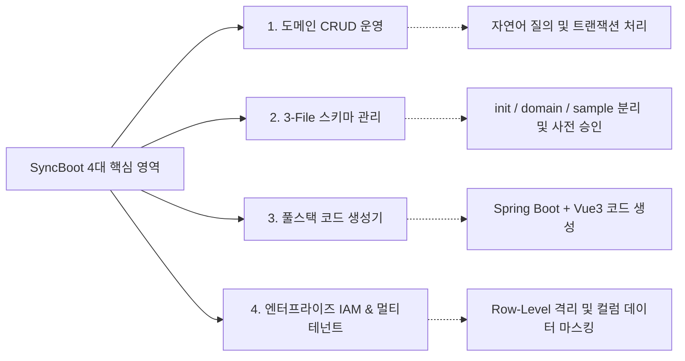

# SyncBoot: 디지털 백엔드 프레임워크 개요

SyncBoot는 비즈니스 도메인 맥락을 인지하여 데이터베이스 운영과 API 개발을 지원하는 Java 기반 엔터프라이즈 백엔드 플랫폼입니다.

Spring Boot 3, LangChain4j, Model Context Protocol (MCP) 표준을 기반으로 설계되었으며, 데이터 CRUD, 스키마 관리, 풀스택 코드 생성, 분산 로그 진단 기능을 제공합니다.

---

## 4대 핵심 기능 영역

1. **도메인 CRUD 운영 및 쿼리 실행 (Domain Operations)**:
   - 자연어 질의 및 표준 MCP 도구를 통해 도메인 데이터를 조회하고 조작할 수 있도록 지원합니다.
   - 인가된 트랜잭션 경계 내에서 데이터를 안전하게 처리합니다.

2. **스키마 설계 및 3-File DDL 표준 (Schema Governance)**:
   - 요구사항에 맞춰 3-File SQL(`init.sql`, `<domain>.sql`, `sample.sql`) 구조를 구성합니다.
   - 스키마 변경 시 영향도를 사전에 분석하고 관리자의 사전 승인(Human-in-the-Loop)을 거쳐 데이터베이스에 반영합니다.

3. **로우코드 풀스택 API & UI 생성기 (Low-Code Fullstack)**:
   - 데이터베이스 엔티티 메타데이터를 기반으로 Controller, Service, Mapper, DTO 및 Ant Design Vue 3 화면 코드를 생성합니다.

4. **멀티테넌트 및 RBAC 보안 (Enterprise Security)**:
   - 테넌트 데이터 격리(독립 DB 및 공유 DB 방식 지원), 컬럼 단위 동적 데이터 마스킹, 행 단위(Row-Level) 권한 필터링을 지원합니다.

---

## 5대 백엔드 워커 역할 체계

SyncBoot는 도메인 관리, 보안, 배치, 프로토콜 연동 역할을 모듈별로 나누어 운영합니다.

| 역할 명칭 | 주요 담당 업무 | 실행 방식 |
| :--- | :--- | :--- |
| **Domain Operator** | 도메인 데이터 모델 기반 CRUD 및 비즈니스 쿼리 처리 | 자율 처리 |
| **Schema Architect** | 3-File 표준 DDL 설계, ERD 다이어그램 생성 및 변경 영향도 분석 | 제안 후 개발자 승인 |
| **Security IAM** | RBAC 역할/메뉴 매핑, 행 단위 데이터 필터링, 민감정보 마스킹 감시 | 상시 정책 적용 |
| **MCP Dispatcher** | 외부 시스템 및 오케스트레이터와의 A2A 통신을 위한 표준 Tool/Resource 제공 | HTTP SSE 프로토콜 |
| **Batch Orchestrator**| 대용량 데이터 처리 및 주기적 Quartz/Spring Batch 작업 분산 스케줄링 | 스케줄러 기반 실행 |

---

## 도입 시 기대 효과

- **백엔드 개발 공수 절감**: 반복적인 CRUD API 작성과 관리자 UI 화면 구현 시간을 단축합니다.
- **안정적인 DB 마이그레이션**: 변경 영향도 사전 분석과 승인 콘솔을 통해 스키마 변경 시의 오류 위험을 낮춥니다.
- **로그 수집 및 분석 시간 단축**: 분산 서버의 최근 에러 로그를 수집하여 원인 파악을 돕습니다.
- **표준 프레임워크 준수**: Spring Boot 3, LangChain4j, OpenAPI 3.0, Model Context Protocol(MCP) 사양을 준수합니다.

---

## 문서 목차

- [5분 퀵스타트 가이드](./quickstart) - Docker Compose를 이용한 로컬 환경 실행
- [시스템 아키텍처 및 모듈 구성](./architecture) - 4계층 아키텍처 및 워커 체계
- [지능형 스키마 스튜디오](./schema-studio) - 3-File DB 표준 및 DDL 승인 절차
- [로우코드 풀스택 생성기](./lowcode-generator) - 백엔드 API 및 Vue 3 UI 코드 생성
- [멀티테넌트 및 RBAC 보안](./enterprise-security) - Row-level 보안 및 데이터 마스킹
- [배치 및 작업 스케줄러](./batch-and-scheduler) - Spring Batch 및 Quartz 작업 관리
- [LangChain4j 및 MCP 연동](./mcp-and-ai) - Model Context Protocol 도구 사양
- [프로덕션 배포 및 벤치마크](./production-guide) - 컨테이너 배포 및 성능 지표
- [H2 임베디드 데이터베이스 설정](./h2) - 로컬 개발 및 단위 테스트 환경 설정
