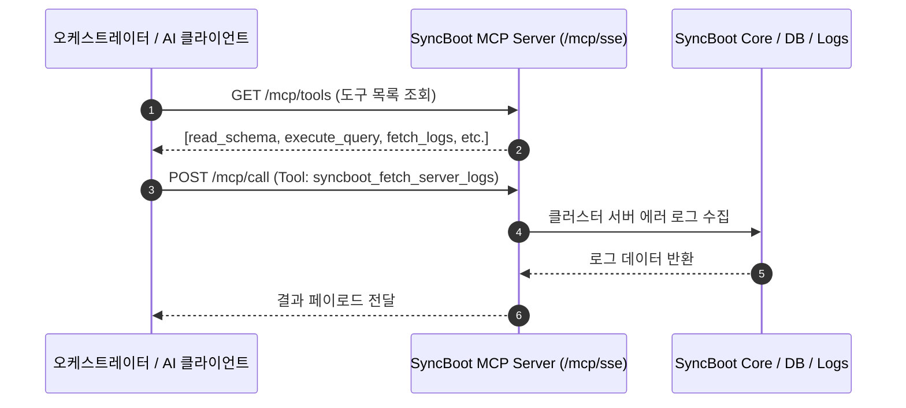

# LangChain4j & Model Context Protocol (MCP) 연동

SyncBoot는 표준 AI 프레임워크인 **LangChain4j**와 **Model Context Protocol (MCP)** 인터페이스를 내장하여 외부 오케스트레이터 및 클라이언트와의 연동을 지원합니다.

---

## MCP 연동 아키텍처

SyncBoot는 HTTP Server-Sent Events (SSE) 기반으로 도구(Tools)와 리소스(Resources)를 제공합니다.



---

## 기본 제공 MCP 도구 사양

| 도구 명칭 | 기능 설명 | 파라미터 | 반환 형식 |
| :--- | :--- | :--- | :--- |
| `syncboot_read_schema` | 특정 도메인의 테이블 구조 및 컬럼 메타데이터 조회 | `tableName` (String) | 컬럼명, 데이터 타입, 널 여부, 코멘트 JSON |
| `syncboot_execute_query` | 인가된 범위 내에서 도메인 CRUD 쿼리 실행 | `sql` (String), `params` (Map) | 실행 결과 레코드 목록 (최대 100건) |
| `syncboot_fetch_server_logs`| 분산 서버의 최근 에러 로그 수집 | `lines` (Int), `level` (ERROR) | 스택트레이스 텍스트 |
| `syncboot_get_table_list` | 관리 중인 전체 비즈니스 도메인 테이블 목록 조회 | `tenantId` (String) | 테이블 물리명 및 설명 배열 |

---

## Java 백엔드 MCP 도구 선언 예시 (LangChain4j)

```java
@Component
public class SyncBootMcpTools {

    @Autowired
    private SchemaService schemaService;

    @Autowired
    private LogInspectorService logInspectorService;

    @Tool("지정된 도메인 테이블의 DDL 및 컬럼 명세를 조회합니다.")
    public TableMetaDTO readSchema(
            @P("조회할 테이블 물리명 (예: TB_ORDER)") String tableName) {
        return schemaService.getTableMetadata(tableName);
    }

    @Tool("분석을 위해 최근 서버 에러 로그를 수집합니다.")
    public String fetchServerLogs(
            @P("가져올 로그 라인 수 (기본 100)") int lines) {
        return logInspectorService.getRecentErrorLogs(lines);
    }
}
```
