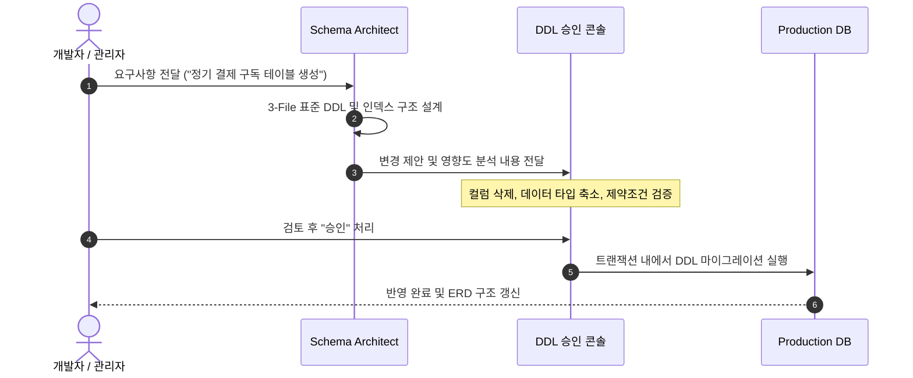

# 지능형 스키마 스튜디오 & 3-File DB 표준

SyncBoot는 데이터베이스 스키마 설계의 일관성과 안정성을 확보하기 위해 **3-File DB 스크립트 표준**과 **사전 승인(HITL) 체계**를 적용합니다.

---

## 3-File DB 스크립트 표준 구조

SyncBoot를 포함한 서비스 모듈의 데이터베이스 스크립트는 아래 3가지 파일로 구분하여 관리합니다.

```
Server/db/
├── 01. init.sql       # 1. 플랫폼 공통 시스템 테이블 DDL 및 기초 데이터
├── 02. syncboot.sql   # 2. 비즈니스 도메인 테이블 DDL 및 특화 메타데이터
└── 03. sample.sql     # 3. 개발 및 테스트를 위한 샘플 데이터
```

| 파일명 | 포함 내용 | 관리 주체 및 원칙 |
| :--- | :--- | :--- |
| **`01. init.sql`** | `sys_user`, `sys_role`, `sys_permission`, `sys_tenant` 등 시스템 기본 테이블 | 플랫폼 공통 표준 |
| **`02. syncboot.sql`** | `TB_ORDER`, `TB_PRODUCT` 등 각 비즈니스 도메인 테이블 DDL 및 인덱스 | **Schema Architect** 제안 후 개발자 승인 |
| **`03. sample.sql`** | 개발 및 테스트 환경용 기초 데이터 | 개발 및 QA 테스트용 |

---

## DDL 사전 승인 절차 (Human-in-the-Loop)

프로덕션 데이터베이스 스키마 변경 시 발생할 수 있는 오류를 줄이기 위해 단계별 검토 및 승인 절차를 거칩니다.



### 영향도 분석 및 변경 감지
- `DROP TABLE`, `DROP COLUMN`, 컬럼 길이 축소 등 기존 데이터에 영향을 미칠 수 있는 쿼리를 사전에 분류하여 알림을 제공합니다.
- 변경 취소가 필요한 경우를 대비해 롤백용 스크립트 생성을 함께 지원합니다.

---

## DDL 정의 예시

```sql
-- ===================================================
-- 02. syncboot.sql (도메인 특화 테이블 정의 예시)
-- ===================================================

CREATE TABLE IF NOT EXISTS `TB_SUBSCRIPTION` (
  `id` BIGINT NOT NULL AUTO_INCREMENT COMMENT '구독 ID (PK)',
  `tenant_id` VARCHAR(64) NOT NULL DEFAULT 'default' COMMENT '테넌트 식별자',
  `user_id` BIGINT NOT NULL COMMENT '사용자 ID',
  `plan_code` VARCHAR(32) NOT NULL COMMENT '구독 요금제 코드',
  `status` VARCHAR(20) NOT NULL DEFAULT 'ACTIVE' COMMENT '상태 (ACTIVE, CANCELED, PAUSED)',
  `started_at` DATETIME NOT NULL COMMENT '구독 시작 일시',
  `next_billing_at` DATETIME NULL COMMENT '다음 결제 예정일',
  `created_by` VARCHAR(64) NOT NULL COMMENT '생성자',
  `created_at` DATETIME NOT NULL DEFAULT CURRENT_TIMESTAMP COMMENT '생성 일시',
  `updated_at` DATETIME NOT NULL DEFAULT CURRENT_TIMESTAMP ON UPDATE CURRENT_TIMESTAMP COMMENT '수정 일시',
  PRIMARY KEY (`id`),
  INDEX `idx_sub_tenant_user` (`tenant_id`, `user_id`),
  INDEX `idx_sub_billing` (`status`, `next_billing_at`)
) ENGINE=InnoDB DEFAULT CHARSET=utf8mb4 COLLATE=utf8mb4_unicode_ci COMMENT='정기 결제 구독 마스터';
```
