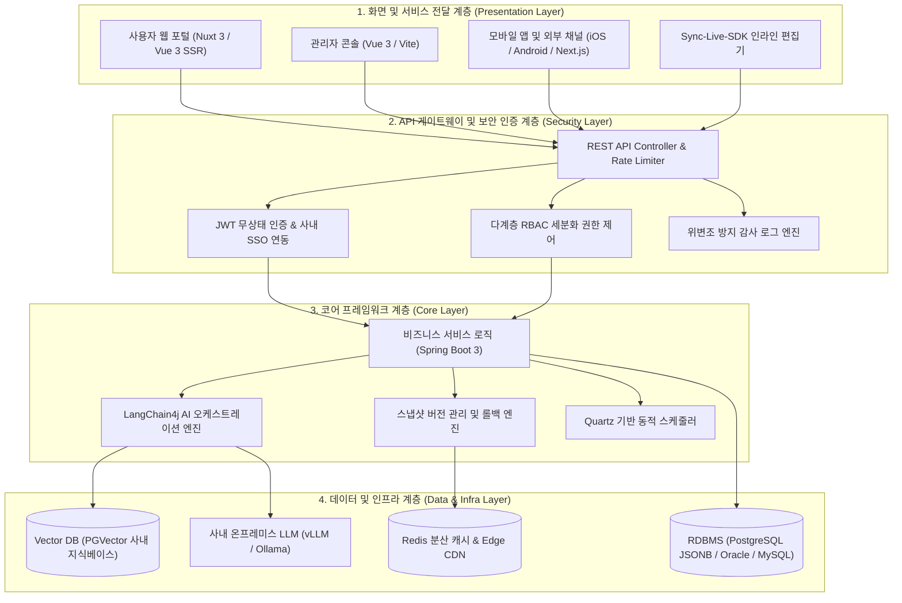
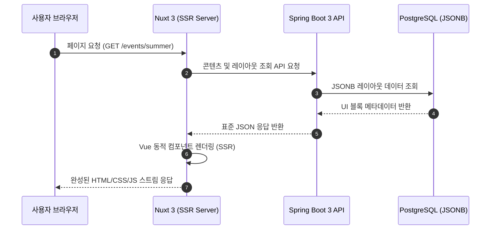

# SyncCMS 시스템 아키텍처

SyncCMS는 대규모 트래픽 처리와 엔터프라이즈 환경의 확장성을 보장하기 위해 **Clean Architecture 4계층 구조**로 설계되었습니다.

---

## 4계층 아키텍처 다이어그램

---

## 계층별 세부 기술 명세

### 1. 화면 및 서비스 전달 계층 (Presentation Layer)
- **사용자 웹 (Nuxt 3)**: SSR(Server-Side Rendering) 기반으로 백엔드 API로부터 전달받은 컴포넌트 트리를 서버에서 사전 렌더링하여 초기 로딩 속도와 검색엔진 최적화(SEO)를 달성합니다.
- **관리자 콘솔 (Vue 3 / Vite)**: TypeScript와 Ant Design 기반으로 메뉴 관리, UI 블록 레이아웃 빌더, Quartz 스케줄러 모니터링 콘솔을 제공합니다.
- **Sync-Live-SDK**: 실제 운영 화면 상에서 직접 콘텐츠를 선택하여 수정할 수 있는 프론트엔드 경량 SDK입니다.

### 2. API 게이트웨이 및 보안 인증 계층 (Security Layer)
- **무상태(Stateless) JWT 인증**: 분산 서버 환경에서 세션 동기화 오버헤드 없이 고속 처리를 지원합니다.
- **다계층 RBAC (Role-Based Access Control)**: 시스템 관리자, 사이트 운영자, 콘텐츠 작성자, 결재 승인자 등 역할별로 메뉴 및 API 엔드포인트 접근 권한을 제어합니다.
- **감사 로깅 (Audit Logging)**: 콘텐츠의 생성, 수정, 결재 승인, 배포, 롤백 등 모든 변경 이력을 사용자 ID, IP, 변경 diff와 함께 저장합니다.

### 3. 코어 프레임워크 계층 (Core Layer)
- **Spring Boot 3 & Java 17+**: 전사 표준 Java 프레임워크 기반으로 안정적인 트랜잭션 처리와 모듈식 확장을 지원합니다.
- **LangChain4j AI 엔진**: Java 환경에서 온프레미스 LLM 연동, 프롬프트 템플릿 제어, RAG(검색 증강 생성) 지식 베이스 검색을 단일 파이프라인으로 수행합니다.
- **스냅샷 롤백 엔진**: 배포 시점의 콘텐츠 상태를 버전별 스냅샷으로 저장하여 유사시 즉각적인 롤백을 수행합니다.
- **Quartz 스케줄러**: 정기 배치 작업 및 예약 배포를 실시간으로 제어합니다.

### 4. 데이터 및 인프라 계층 (Data & Infra Layer)
- **PostgreSQL JSONB 스토리지**: 비정형 UI 블록 데이터와 동적 폼 필드를 JSONB 구조로 저장하며, GIN 인덱스를 통해 고속 조회를 보장합니다.
- **Redis 분산 캐시**: 자주 호출되는 헤드리스 콘텐츠를 캐싱하여 백엔드 DB 부하를 분산하고 응답 지연을 최소화합니다.
- **사내 온프레미스 AI 인프라**: 망분리 환경에서 vLLM 또는 Ollama를 통해 오픈 가중치 모델을 구동합니다.

---

## 동적 페이지 렌더링 파이프라인

SyncCMS의 화면 구성은 고정된 템플릿 파일이 아닌, 데이터베이스의 JSON 구조를 통해 유연하게 생성 및 렌더링됩니다.

