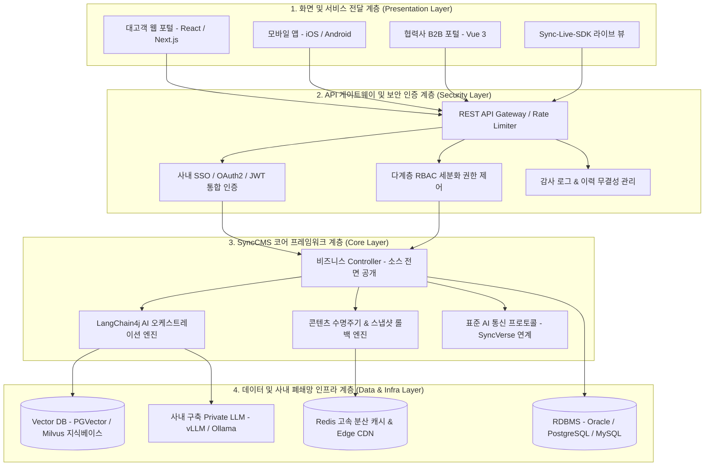

# SyncCMS 시스템 아키텍처

SyncCMS는 대규모 트래픽 환경에서도 안정적인 성능과 확장성을 보장하기 위해 **Clean Architecture 4계층 구조**로 설계되었습니다.

---

## 4계층 아키텍처 다이어그램

---

## 계층별 상세 기술 스택

### 1. 화면 및 서비스 전달 계층 (Presentation Layer)
- **하이브리드 헤드리스 전달**: 순수 JSON REST API와 `Sync-Live-SDK`를 동시에 지원하여 어떤 프론트엔드 환경이든 100% 수용합니다.
- **반응형 캔버스 뷰**: 데스크톱(1920px), 태블릿(768px), 모바일(375px) 렌더링을 실시간 전환 검증합니다.

### 2. API 게이트웨이 & 보안 인증 계층 (Security Layer)
- **무상태(Stateless) JWT 기반 인증**: 대규모 트래픽 환경에서도 세션 동기화 오버헤드 없이 고속 처리합니다.
- **다계층 RBAC (Role-Based Access Control)**: 사이트별 관리자, 기획자, 승인자, 뷰어 권한을 메뉴 및 API 단위로 정밀 제어합니다.
- **전자금융감독규정 대응 감사 로그**: 모든 콘텐츠 생성, 수정, 결재, 배포, 롤백 이력을 위변조 불가능한 감사 로그로 영구 기록합니다.

### 3. 코어 프레임워크 계층 (Core Layer)
- **Java Spring Boot 3**: 전사 표준 Java 프레임워크 기반으로 엔터프라이즈 백엔드의 신뢰성과 유지보수성을 극대화합니다.
- **LangChain4j 표준 AI 오케스트레이션**: Java 진영의 사실상 표준(De-facto standard) AI 프레임워크인 LangChain4j를 탑재하여 사내 LLM 연동, 프롬프트 템플릿 제어, RAG 지식 검색을 단일 파이프라인으로 처리합니다.
- **스냅샷 롤백 엔진**: 분산 트랜잭션 무결성을 보장하며 오배포 시 1클릭 복구를 지원합니다.

### 4. 데이터 및 인프라 계층 (Data & Infra Layer)
- **투명한 오픈 DB DDL 스키마**: Oracle 19c+, PostgreSQL 14+, MySQL 8.0+ 등 고객사의 기존 DB 인프라를 그대로 활용합니다.
- **하이브리드 RAG 벡터 스토어**: 사내 규정집, 매뉴얼 문서를 PGVector 또는 Milvus에 실시간 임베딩 색인합니다.
- **사내 프라이빗 LLM 인프라**: 외부 인터넷이 완전 차단된 환경에서도 vLLM/Ollama를 통해 온프레미스 오픈 가중치 모델(Llama-3, EXAONE, Solar)을 고속 연산합니다.
