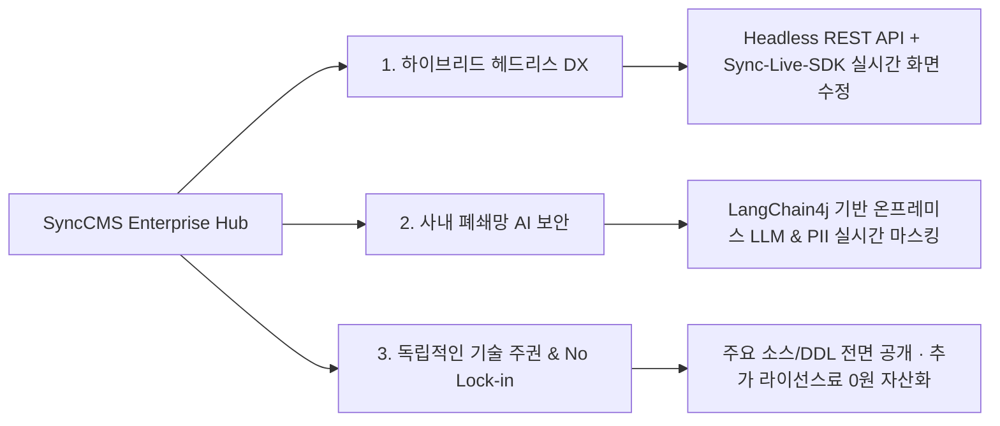

# SyncCMS: 엔터프라이즈 AI 하이브리드 헤드리스 CMS

**SyncCMS**는 대고객 웹 포털, 모바일 앱, 사내 인트라넷 등 기업의 모든 디지털 접점을 단일 허브에서 통제하는 **차세대 엔터프라이즈 AI 하이브리드 헤드리스 콘텐츠 관리 시스템**입니다.

외산 SaaS의 폐쇄성과 데이터 유출 위험, 국산 레거시 CMS의 노후화된 아키텍처를 극복하고, **주요 비즈니스 소스코드를 전면 공개하여 구축된 시스템 전체가 고객사의 영구적인 디지털 소프트웨어 자산으로 내재화**됩니다.

---

## SyncCMS 3대 핵심 차별화 가치

### 1. 하이브리드 헤드리스 (Hybrid Headless)
- **API-First 유연성**: React, Vue, Next.js, iOS, Android 등 모든 디지털 프론트엔드에 표준 REST API로 콘텐츠를 전달합니다.
- **Sync-Live-SDK**: 백오피스에 접속하지 않고도 실제 운영 중인 서비스 화면에서 텍스트와 배너를 직접 클릭하여 인라인 수정합니다.
- **노코드 다채널 빌더**: 드래그앤드롭으로 UI 블록을 배치하고 반응형(PC/태블릿/모바일) 화면을 즉시 구성합니다.

### 2. 사내 폐쇄망 AI & PII 보안 거버넌스
- **사내 구축 온프레미스 AI**: Llama-3, EXAONE, Solar 등 오픈 가중치 모델을 사내 인프라(vLLM/Ollama)에 연동하여 데이터 외부 유출을 누출 방지합니다.
- **개인정보(PII) 실시간 보호**: 주민등록번호, 신용카드번호, 계좌번호 등 민감 정보를 실시간 탐지하여 자동 비식별화 마스킹 처리합니다.
- **표시광고법 사전 스크리닝**: 과대·과장 광고 표현 및 사내 금칙어를 실시간 검증합니다.

### 3. 독립적인 기술 주권 (No Lock-in & 영구 자산화)
- **주요 비즈니스 소스코드 100% 투명 공개**: 블랙박스 바이너리 없이 Spring Boot 3 표준 프레임워크 소스와 DB DDL을 제공합니다.
- **추가 라이선스료 0원**: 트래픽 증가나 사용자 수 증가에 따른 추가 과금이 전혀 발생하지 않습니다.
- **고객사 맞춤 확장**: 사내 전자결재 승인선, 기간계 ERP, SSO 통합 인증과 자유롭게 결합할 수 있습니다.

---

## 📊 3대 CMS 아키텍처 비교표

| 비교 항목 | 글로벌 SaaS Headless (Contentful 등) | 국내 레거시 구축형 CMS | SyncCMS 엔터프라이즈 |
| :--- | :--- | :--- | :--- |
| **아키텍처 형태** | API-Only Headless (클라우드 종속) | 모놀리식 구축형 (JSP 레거시) | **하이브리드 헤드리스 (API + Live SDK)** |
| **사내 폐쇄망 지원** | ❌ 도입 불가 (해외 멀티테넌트) | ⭕ 온프레미스 지원 | **✅ 사내 폐쇄망 전면 공식 지원** |
| **AI 기능 & 기술 스택** | OpenAI 유료 연동 (종량 과금) | ❌ 미지원 또는 구형 규칙 엔진 | **✅ LangChain4j 사내 LLM/오픈모델** |
| **실시간 화면 직접 수정** | 제한적 / 복잡한 설정 필요 | ❌ 백오피스 이동 후 수정 (단절) | **✅ Sync-Live-SDK 1줄로 즉시 수정** |
| **비즈니스 소스코드** | ❌ 비공개 (Blackbox API) | ❌ 비공개 (바이너리 납품) | **✅ 주요 비즈니스 소스 전면 공개** |
| **긴급 장애 복구** | 수작업 백업 복구 필요 | DB 수작업 복구 (수시간 소요) | **✅ 스냅샷 기반 원클릭 무중단 롤백** |
| **총소유비용 (TCO)** | API 호출량/유저수 종량 과금 폭탄 | 고가의 영구/유지보수 라이선스 | **✅ 추가 라이선스료 0원 (영구 자산화)** |

---

## 공식 기술 문서 가이드 목차

SyncCMS의 상세 기술 스펙과 개발 가이드를 확인하세요:

1. [시스템 아키텍처 (Architecture)](/synccms/architecture) : Clean Architecture 4계층 및 기술 스택
2. [Sync-Live-SDK 연동 가이드 (Live SDK)](/synccms/live-sdk-guide) : 프론트엔드 1줄 스크립트 임베딩 및 인라인 편집
3. [사내 폐쇄망 AI & PII 보안 (AI & Security)](/synccms/onpremise-ai-security) : 온프레미스 LLM 연동 및 개인정보 보호
4. [기간계 연계 & 롤백 거버넌스 (Governance)](/synccms/integration-governance) : 전자결재/ERP 연계 및 스냅샷 롤백
5. [헤드리스 REST API 레퍼런스 (API Reference)](/synccms/api-reference) : REST API 규격 및 JSON 스키마
6. [엔터프라이즈 FAQ & 기술 백서 (FAQ)](/synccms/enterprise-faq) : 자주 묻는 질문 및 도입 컨설팅 신청
