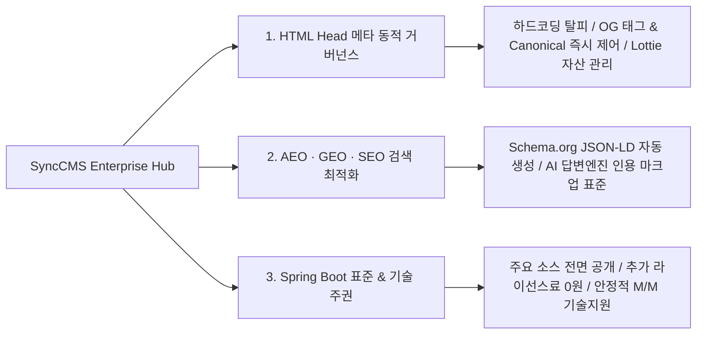

# SyncCMS: 엔터프라이즈 AI 하이브리드 헤드리스 CMS

**SyncCMS**는 대고객 웹 포털, 모바일 앱 등 기업의 모든 디지털 접점에서 **HTML Head 메타 정보의 동적 중앙 관리와 차세대 AI 검색(AEO/GEO) 최적화를 제공하는 엔터프라이즈 하이브리드 헤드리스 CMS**입니다.

외산 SaaS의 폐쇄성과 데이터 유출 위험, 국산 레거시 CMS의 노후화된 아키텍처를 극복하고, **Java Spring Boot 3 표준 프레임워크 소스코드를 전면 공개하여 구축된 시스템 전체가 고객사의 영구적인 디지털 소프트웨어 자산으로 내재화**됩니다.

---

## SyncCMS 3대 핵심 차별화 가치

### 1. HTML Head 메타 동적 거버넌스
- **하드코딩 완전 탈피**: 개발 배포 없이 백오피스에서 각 페이지별 Title, Description, OpenGraph(OG) 태그, Canonical URL을 마케터가 직접 설정 및 실시간 동기화합니다.
- **다채널 SNS 메타 프리뷰**: 카카오톡, 페이스북, X(트위터) 공유 썸네일 및 카피를 실시간 시뮬레이션합니다.
- **Lottie & 멀티 포맷 미디어 스트리밍**: Lottie 애니메이션 JSON, WebP, 멀티미디어 자산을 REST API로 안정적으로 서빙합니다.

### 2. AEO · GEO · SEO 검색 최적화
- **Schema.org JSON-LD 자동 생성**: 검색엔진(SEO) 및 AI 답변엔진(AEO)이 즉시 이해할 수 있는 구조화 데이터 스크립트를 CMS가 헤더에 자동 렌더링합니다.
- **생성형 AI(GEO) 인용 표준**: 제목-요약-H1~H3 계층-명확한 출처/작성자/검증일자 포맷을 제공하여 ChatGPT, Perplexity 등 AI 답변 인용을 극대화합니다.
- **선별적 점진 적용 (Phased Rollout)**: 전체 사이트 일괄 개편 부담 없이, 핵심 랜딩/이벤트 페이지부터 선별하여 단계별로 AI 최적화를 적용합니다.

### 3. Java Spring Boot 프레임워크 & 라이선스 0원
- **자바 표준 프레임워크 전면 공개**: 비즈니스 Controller 소스 및 DB DDL 전체를 투명하게 제공하여 사내 개발팀의 자유로운 확장을 보장합니다.
- **추가 솔루션 라이선스 비용 0원**: SI 구축비에 솔루션이 포함되어 트래픽/유저수 증가에 따른 추가 과금이 없습니다.
- **안정적인 전문 기술지원 (M/M)**: AI 모델 업데이트 및 검색 알고리즘 변화에 지속 대응하는 체계적인 유지보수 파트너십을 제공합니다.

---

## 📚 공식 기술 문서 가이드 목차

1. [시스템 아키텍처 (Architecture)](/synccms/architecture) : Clean Architecture 4계층 및 Spring Boot 3 기술 스택
2. [Sync-Live-SDK 연동 가이드 (Live SDK)](/synccms/live-sdk-guide) : 프론트엔드 1줄 스크립트 임베딩 및 인라인 편집
3. [사내 폐쇄망 AI & PII 보안 (AI & Security)](/synccms/onpremise-ai-security) : 온프레미스 LLM 연동 및 개인정보 보호
4. [기간계 연계 & 롤백 거버넌스 (Governance)](/synccms/integration-governance) : 전자결재/ERP 연계 및 스냅샷 롤백
5. [헤드리스 REST API 레퍼런스 (API Reference)](/synccms/api-reference) : REST API 규격 및 JSON 스키마
6. [엔터프라이즈 FAQ & 기술 백서 (FAQ)](/synccms/enterprise-faq) : 자주 묻는 질문 및 1:1 아키텍처 진단 신청
