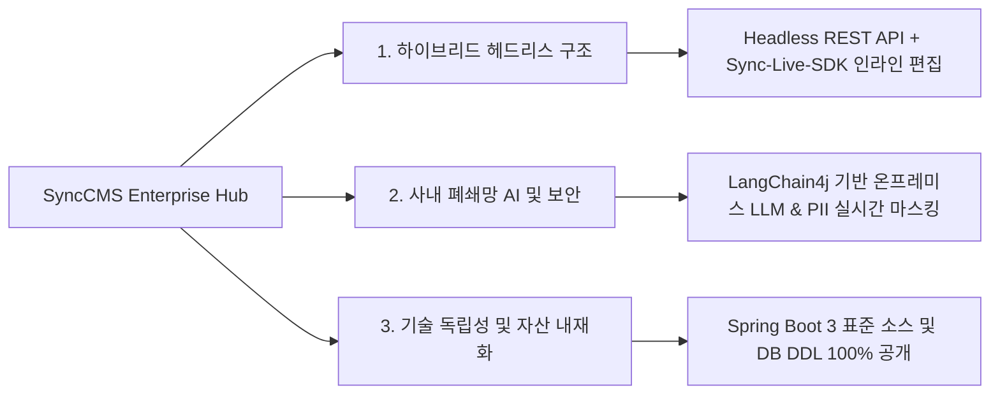

# SyncCMS: 엔터프라이즈 하이브리드 헤드리스 CMS

**SyncCMS**는 웹 포털, 모바일 앱, 사내 인트라넷 등 기업의 디지털 접점 콘텐츠를 단일 허브에서 통합 관리하는 **엔터프라이즈 하이브리드 헤드리스 콘텐츠 관리 시스템(Content Management System)**입니다.

백엔드(Spring Boot 3 REST API)와 프론트엔드(Vue 3 / Nuxt 3)의 명확한 관심사 분리(Separation of Concerns)를 구현하고, 프론트엔드 화면에서 즉시 수정 가능한 **Sync-Live-SDK**와 사내 폐쇄망 AI 오케스트레이션(**LangChain4j**)을 표준 제공합니다. 주요 비즈니스 소스코드와 표준 DDL을 전면 공개하여 고객사의 영구적인 IT 자산으로 내재화할 수 있도록 지원합니다.

---

## 핵심 아키텍처 특징



### 1. 하이브리드 헤드리스 (Hybrid Headless)
- **API-First 아키텍처**: React, Vue, Next.js, Nuxt, iOS, Android 등 다양한 클라이언트에 표준 JSON REST API로 콘텐츠를 제공합니다.
- **Sync-Live-SDK**: 백오피스에 별도 접속하지 않고도 실제 운영 화면에서 텍스트와 이미지를 직접 선택하여 인라인 수정할 수 있는 프론트엔드 SDK를 지원합니다.
- **동적 컴포넌트 렌더링**: PostgreSQL의 `JSONB` 컬럼을 활용하여 UI 레이아웃 및 블록 구조를 유연하게 저장하고 프론트엔드에서 서버 사이드 렌더링(SSR)합니다.

### 2. 사내 폐쇄망 AI 및 PII 보안 거버넌스
- **온프레미스 LLM 연동**: 외부 인터넷 통신 없이 사내 인프라(vLLM / Ollama)에 구축된 오픈 가중치 모델(Llama-3, EXAONE, Solar 등)을 LangChain4j를 통해 직접 연동합니다.
- **개인정보(PII) 실시간 비식별화**: 주민등록번호, 계좌번호, 카드번호, 휴대전화번호를 정규식 및 패턴 필터로 실시간 마스킹 처리합니다.
- **표시광고법 및 표준 용어 검증**: 법적 리스크가 있는 과장 표현 및 사내 금칙어를 초안 작성 단계에서 사전 스크리닝합니다.

### 3. 기술 독립성 및 영구 자산화
- **비즈니스 소스코드 공개**: Spring Boot 3 코어 Controller, Service 로직 및 RDBMS DDL 스키마를 투명하게 제공하여 고객사 자체 커스터마이징이 가능합니다.
- **단일 도입 라이선스**: API 호출량이나 사용자 수 증가에 따른 추가 과금 체계가 존재하지 않습니다.
- **엔터프라이즈 시스템 결합**: 사내 그룹웨어 전자결재 승인선, 기간계 ERP, 사내 SSO(OAuth2/SAML/JWT)와 유기적으로 결합할 수 있습니다.

---

## CMS 아키텍처 비교표

| 비교 항목 | 글로벌 SaaS Headless (Contentful 등) | 국내 레거시 구축형 CMS | SyncCMS 엔터프라이즈 |
| :--- | :--- | :--- | :--- |
| **아키텍처 형태** | API-Only Headless (클라우드 종속) | 모놀리식 구축형 (JSP/전자정부 레거시) | **하이브리드 헤드리스 (API + Live SDK)** |
| **사내 폐쇄망(망분리) 지원** | 미지원 (해외 멀티테넌트 SaaS) | 지원 (온프레미스 설치) | **지원 (온프레미스 / 폐쇄망 완벽 지원)** |
| **AI 연동 엔진** | 유료 퍼블릭 AI API (종량 과금) | 미지원 또는 단순 규칙 엔진 | **LangChain4j 기반 온프레미스 LLM 연동** |
| **실시간 화면 수정** | 복잡한 설정 필요 / 제한적 | 미지원 (백오피스 분리 작업) | **Sync-Live-SDK 기반 화면 내 직접 수정** |
| **비즈니스 소스코드** | 미제공 (블랙박스 API) | 미제공 (바이너리 납품 형태) | **주요 비즈니스 소스 및 DDL 전면 공개** |
| **장애 복구 방식** | 수작업 스토리지 백업 복원 | DB 수작업 복구 (수시간 소요) | **스냅샷 기반 3단계 무중단 롤백** |
| **라이선스 모델** | 트래픽/유저수 비례 종량제 | 영구 라이선스 + 연간 유지보수료 | **영구 자산화 (추가 라이선스료 없음)** |

---

## 로컬 개발 환경 빠른 시작 (Quick Start)

로컬 개발 환경(JDK 17+, Node.js 20+, pnpm, Docker)에서 SyncCMS를 3단계로 구동할 수 있습니다.

### 1단계: PostgreSQL 데이터베이스 실행
```bash
# Docker Compose를 이용한 로컬 PostgreSQL 기동
docker compose up -d postgres

# DB 기동 후 스키마 및 초기 데이터 적재 (data/synccms/synccms.sql 실행)
```

### 2단계: 백엔드 API 서버 실행 (Spring Boot 3)
```bash
cd backend
mvn clean install -DskipTests
mvn spring-boot:run
# 기본 API 엔드포인트: http://localhost:8080
```

### 3단계: 관리자 콘솔 및 사용자 웹 실행 (Vue 3 / Nuxt 3)
```bash
# 관리자 프론트엔드 (SyncCMS Admin)
cd frontend/admin
pnpm install
pnpm dev
# 관리자 콘솔: http://localhost:5666

# 사용자 웹 프론트엔드 (Nuxt 3)
cd frontend/web
pnpm install
pnpm dev
# 사용자 웹: http://localhost:3000
```

---

## 공식 기술 문서 목차

SyncCMS의 상세 기술 명세와 구현 가이드는 아래 문서를 참조하십시오:

1. [시스템 아키텍처 (Architecture)](/synccms/architecture): Clean Architecture 4계층 및 기술 스택 상세
2. [Sync-Live-SDK 연동 가이드 (Live SDK)](/synccms/live-sdk-guide): 프론트엔드 스크립트 임베딩 및 인라인 편집 바인딩
3. [사내 폐쇄망 AI 및 보안 컴플라이언스 (AI & Security)](/synccms/onpremise-ai-security): 온프레미스 LLM 연동 설정 및 PII 비식별화
4. [기간계 연계 및 스냅샷 롤백 거버넌스 (Governance)](/synccms/integration-governance): 전자결재 승인선 연계 및 3단계 스냅샷 롤백
5. [헤드리스 REST API 레퍼런스 (API Reference)](/synccms/api-reference): REST API 규격, JSON 스키마 및 cURL 예제
6. [엔터프라이즈 운영 및 기술 FAQ (FAQ)](/synccms/enterprise-faq): 인프라 권장 사양, JSONB 인덱싱 튜닝 및 기술 지원 안내
