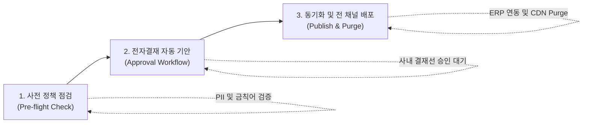

# 기간계 연계 및 스냅샷 롤백 거버넌스

SyncCMS는 기업의 사내 그룹웨어 전자결재, ERP, SSO와 안전하게 연동되며, 긴급 장애 발생 시 **스냅샷 기반의 3단계 무중단 롤백**을 통해 운영 안정성을 보장합니다.

---

## 3단계 배포 승인 파이프라인



1. **사전 정책 점검 (Pre-flight Check)**
   - 콘텐츠 배포 요청 시 PII 노출 여부, 표시광고법 위반 가능성, 깨진 링크(Broken Link)를 자동 검사합니다.
2. **전자결재 자동 기안 (Approval Workflow)**
   - 사내 그룹웨어 API 규격에 맞추어 기안 양식과 변경 diff를 자동 생성하고 준법감시인 및 부서장 승인선으로 전달합니다.
3. **동기화 및 전 채널 배포 (Publish & Purge)**
   - 승인 웹훅이 수신되면 대상 RDBMS 트랜잭션을 커밋하고, ERP 프로모션 마스터와 동기화한 뒤 분산 캐시와 엣지 CDN을 갱신합니다.

---

## 스냅샷 기반 3단계 무중단 롤백

잘못된 콘텐츠 게시나 시스템 오류 발생 시, 1클릭으로 이전 정상 버전의 스냅샷으로 무중단 복구합니다.

```
[1단계: RDBMS 스냅샷 복구]
 └── DB 트랜잭션 내에서 지정된 snapshot_id의 상태로 데이터 레코드 복원

[2단계: Redis 분산 캐시 갱신]
 └── 연결된 모든 API 서버의 로컬/분산 캐시 키 일괄 무효화 및 신규 데이터 적재

[3단계: 전 채널 엣지 CDN Purge]
 └── Cloudflare / CloudFront / Akamai 등의 엣지 캐시 무효화 API 일괄 호출
```

---

## 감사 로그 (Audit Log) 데이터베이스 스키마

전자금융감독규정 및 사내 감사 대응을 위해 모든 변경 이력을 영구 보존합니다.

```sql
CREATE TABLE sys_cms_audit_log (
    audit_id        BIGSERIAL PRIMARY KEY,
    site_key        VARCHAR(50) NOT NULL,
    content_id      VARCHAR(100) NOT NULL,
    action_type     VARCHAR(30) NOT NULL,    -- CREATE, UPDATE, APPROVE, PUBLISH, ROLLBACK
    actor_id        VARCHAR(50) NOT NULL,    -- 사용자 계정 ID
    actor_ip        VARCHAR(45) NOT NULL,    -- 접속 IP
    previous_state  JSONB,                   -- 변경 전 스냅샷 (JSONB)
    current_state   JSONB,                   -- 변경 후 스냅샷 (JSONB)
    diff_summary    TEXT,                    -- 변경 요약
    approval_doc_no VARCHAR(100),            -- 사내 전자결재 문서번호
    created_at      TIMESTAMP WITH TIME ZONE DEFAULT CURRENT_TIMESTAMP NOT NULL
);

-- 고속 조회를 위한 인덱스 구성
CREATE INDEX idx_cms_audit_content ON sys_cms_audit_log(site_key, content_id);
CREATE INDEX idx_cms_audit_created ON sys_cms_audit_log(created_at DESC);
```
