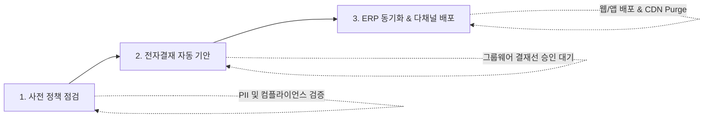

# 기간계 연계 & 스냅샷 롤백 거버넌스

SyncCMS는 사내 기존 기간계 시스템(그룹웨어 전자결재, ERP, 사내 SSO)과 유기적으로 결합되며, 긴급 장애 발생 시 **스냅샷 기반 원클릭 즉시 무중단 롤백**을 보장합니다.

---

## 사내 기간계 3단계 안전 연동 파이프라인



1. **1단계: 사전 정책 점검 (Pre-Flight Check)**
   - 기안 상신 전 표시광고법 위반 여부 및 PII 노출 여부를 자동 검증합니다.
2. **2단계: 그룹웨어 전자결재 자동 기안 (Approval Workflow)**
   - 사내 결재 양식 규격에 맞춰 기안 문서를 자동 생성하고 준법감시인/부서장 승인선으로 전달합니다.
3. **3단계: 기간계 ERP 동기화 & 배포 (Publishing & Sync)**
   - 최종 승인 웹훅을 수신하는 즉시 ERP 프로모션 DB와 동기화하고 전세계 엣지 CDN 캐시를 무효화(Purge)합니다.

---

## 스냅샷 기반 3단계 분산 무결성 롤백

오배포나 잘못된 콘텐츠 게시 사고가 발생했을 때, 단 한 번의 클릭으로 이전 정상 시점 스냅샷으로 무중단 롤백합니다:

```
[1단계] RDBMS 스냅샷 복구  ➔  트랜잭션 무결성 검증 및 이전 정상 데이터 복원
[2단계] Redis 분산 캐시 무효화 ➔  연결된 모든 백엔드 서버 캐시 키 일괄 갱신
[3단계] 전세계 엣지 CDN 퍼지   ➔  Cloudflare/CloudFront/Akamai 캐시 즉시 무효화
```

- **안전성**: 분산 트랜잭션 락을 통해 데이터 유실이나 뷰 불일치(View Desync)를 누출 방지합니다.
- **감사 추적성**: 누가, 언제, 어떤 사유로 롤백했는지 전자금융감독규정 준수 감사 리포트를 자동 생성합니다.
