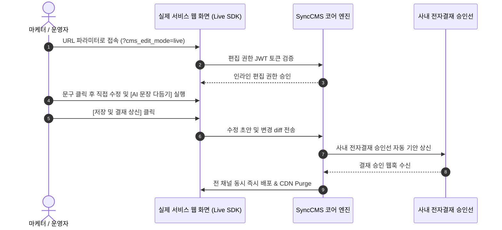

# Sync-Live-SDK 실시간 라이브 수정 가이드

**Sync-Live-SDK**는 마케터와 운영자가 관리자 백오피스로 이동할 필요 없이, **실제 서비스 웹/모바일 화면을 보면서 텍스트와 배너를 직접 클릭하여 인라인 수정**할 수 있게 해주는 실용적인 프론트엔드 SDK입니다.

---

## 빠른 시작 (Quick Start : 1줄 임베딩)

고객사의 기존 프론트엔드(React, Vue, Next.js, HTML 등) `<body>` 최하단에 스크립트 1줄만 추가하면 라이브 편집 모드가 즉시 활성화됩니다.

```html
<!-- 고객사 웹/앱 서비스 HTML -->
<!DOCTYPE html>
<html lang="ko">
<head>
    <title>고객사 서비스 메인</title>
</head>
<body>
    <!-- 기존 서비스 컴포넌트 -->
    <div id="main-banner" data-sync-content-id="BANNER_2026_01">
        <h1>올여름 가장 특별한 2배 포인트 적립 페스티벌</h1>
        <p>신규 회원 가입 시 웰컴 쿠폰팩 즉시 지급</p>
    </div>

    <!-- Sync-Live-SDK 1줄 임베딩 -->
    <script src="https://cms.empasy.com/sdk/sync-live-sdk.js" 
            data-sync-cms-endpoint="https://cms.empasy.com/api/v1"
            data-sync-site-key="YOUR_SITE_KEY" async></script>
</body>
</html>
```

---

## 동작 원리 및 핵심 기능



### 1. 인라인 위지윅 & AI 문장 다듬기 (AI Rewriter)
- 화면의 텍스트를 드래그하고 플로팅 툴바에서 **AI 문장 다듬기**를 클릭하면:
  - `"더 간결하게"` : 모바일 화면에 맞춘 임팩트 있는 1줄 카피로 변환
  - `"더 친근하게"` : 2030 타깃의 친근한 톤앤매너로 변환
  - `"전문적인 비즈니스 톤"` : B2B 고객사 공지용 격식 있는 문체로 변환

### 2. 안전한 결재 승인선 거버넌스 (No Unauthorized Publishing)
- 실무자가 화면에서 수정한 내용은 **실서버에 즉시 무단 반영되지 않습니다.**
- 수정 즉시 사내 전자결재 승인선으로 기안이 상신되며, **승인권자의 결재가 완료된 후에만 실제 서비스 화면에 무중단 배포**됩니다.

---

## React / Next.js 컴포넌트 바인딩 예제

React / Next.js 프로젝트에서는 커스텀 훅(`useSyncLive`)을 사용하여 더욱 깔끔하게 바인딩할 수 있습니다:

```tsx
import React from 'react';
import { useSyncContent } from '@empasy/sync-live-react';

export default function PromotionBanner() {
  const { content, isEditMode } = useSyncContent({
    contentId: 'PROMO_HERO_BANNER',
    defaultData: {
      headline: '2026 하반기 멤버십 페스타',
      subText: '지금 가입하고 최대 50% 혜택을 누리세요.'
    }
  });

  return (
    <section className={`hero-banner ${isEditMode ? 'sync-editable' : ''}`}>
      <h1 data-sync-field="headline">{content.headline}</h1>
      <p data-sync-field="subText">{content.subText}</p>
    </section>
  );
}
```
