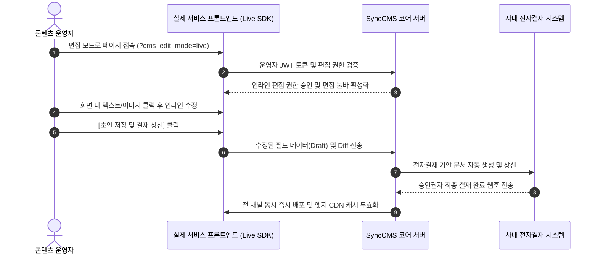

---
title: Sync-Live-SDK 프론트엔드 연동 가이드 | SyncCMS
description: 실제 운영 화면에서 직접 텍스트와 배너를 선택하여 인라인 수정할 수 있는 Sync-Live-SDK의 설치, 바인딩 및 전자결재 승인 연계 방법을 안내합니다.
head:
  - - meta
    - name: keywords
      content: Sync-Live-SDK, 인라인 편집, 프론트엔드 SDK, React 연동, Vue 연동, Next.js, Nuxt 3, 전자결재 승인, Headless CMS
  - - meta
    - property: og:title
      content: Sync-Live-SDK 프론트엔드 연동 가이드 | SyncCMS
  - - meta
    - property: og:description
      content: 실제 운영 화면에서 직접 텍스트와 배너를 인라인 수정하는 Sync-Live-SDK 연동 가이드
sort: 3
---

# Sync-Live-SDK 연동 가이드

**Sync-Live-SDK**는 운영자 및 마케터가 별도의 백오피스 관리 화면으로 이동하지 않고, **실제 서비스 웹/모바일 화면에서 텍스트와 이미지를 직접 선택하여 인라인 수정**할 수 있도록 지원하는 프론트엔드 경량 SDK입니다.

수정된 내용은 즉시 운영 환경에 노출되지 않으며, 사내 전자결재 승인 프로세스를 거친 후 무중단 배포됩니다.

---

## 동작 흐름 및 시퀀스



---

## 1. 기본 HTML 환경 연동 (Vanilla HTML)

HTML 파일의 `<body>` 태그 하단에 SDK 스크립트를 추가하고, 수정 대상 DOM 요소에 식별 속성을 정의합니다.

```html
<!DOCTYPE html>
<html lang="ko">
<head>
    <meta charset="UTF-8">
    <title>프로모션 페이지</title>
</head>
<body>
    <!-- 수정 대상 콘텐츠 블록 -->
    <div id="hero-section" data-sync-content-id="PROMO_2026_FALL">
        <h1 data-sync-field="headline">2026 하반기 신규 회원 멤버십 혜택</h1>
        <p data-sync-field="description">지금 가입하고 웰컴 쿠폰팩과 포인트 적립 혜택을 확인하세요.</p>
    </div>

    <!-- Sync-Live-SDK 스크립트 임베딩 -->
    <script src="https://empasy.io/sdk/sync-live-sdk.js"
            data-sync-cms-endpoint="https://empasy.io/api/v1"
            data-sync-site-key="SITE_PORTAL_KO"
            async></script>
</body>
</html>
```

### 필수 데이터 속성 (Data Attributes)
- `data-sync-content-id`: 콘텐츠 그룹의 고유 식별자.
- `data-sync-field`: 콘텐츠 그룹 내 세부 필드명(예: headline, description, bannerUrl 등).

---

## 2. React / Next.js 연동

React 환경에서는 `@empasy/sync-live-react` 패키지 또는 커스텀 훅을 통해 상태와 바인딩할 수 있습니다.

```tsx
import React from 'react';
import { useSyncContent } from '@empasy/sync-live-react';

interface PromoContent {
  headline: string;
  description: string;
  ctaText: string;
}

export default function HeroBanner() {
  const { content, isEditMode } = useSyncContent<PromoContent>({
    contentId: 'PROMO_2026_FALL',
    defaultData: {
      headline: '2026 하반기 신규 회원 멤버십 혜택',
      description: '지금 가입하고 웰컴 쿠폰팩과 포인트 적립 혜택을 확인하세요.',
      ctaText: '혜택 신청하기'
    }
  });

  return (
    <section className={`hero-container ${isEditMode ? 'sync-live-active' : ''}`}>
      <h1 data-sync-field="headline">{content.headline}</h1>
      <p data-sync-field="description">{content.description}</p>
      <button data-sync-field="ctaText">{content.ctaText}</button>
    </section>
  );
}
```

---

## 3. Vue 3 / Nuxt 3 연동

Vue 3 환경에서는 플러그인 등록 후 디렉티브(`v-sync-editable`)를 활용하여 템플릿과 연동합니다.

```vue
<template>
  <div class="banner-wrapper" :class="{ 'edit-mode': isEditMode }">
    <h2 v-sync-editable="{ contentId: 'BANNER_MAIN', field: 'title' }">
      {{ bannerData.title }}
    </h2>
    <p v-sync-editable="{ contentId: 'BANNER_MAIN', field: 'summary' }">
      {{ bannerData.summary }}
    </p>
  </div>
</template>

<script setup lang="ts">
import { ref } from 'vue';
import { useSyncLive } from '@empasy/sync-live-vue';

const { isEditMode } = useSyncLive();

const bannerData = ref({
  title: '데이터 기반 통합 운영 솔루션',
  summary: '기업 인프라와 콘텐츠를 단일 플랫폼에서 통제합니다.'
});
</script>
```

---

## 4. 안전 배포 및 권한 거버넌스

1. **토큰 기반 권한 통제**: 편집 모드는 유효한 관리자 세션 또는 서명된 JWT 토큰이 파라미터(`?cms_token=...`)로 전달된 경우에만 활성화됩니다.
2. **초안(Draft) 격리**: 인라인 편집 중인 데이터는 임시 초안 테이블에 저장되며, 실 운영 서비스의 API 조회 응답에는 영향을 주지 않습니다.
3. **승인 후 무중단 반영**: 승인권자의 결재가 완료되면 백엔드에서 PostgreSQL 트랜잭션 커밋과 동시에 Redis 캐시 갱신 및 CDN 무효화 웹훅이 트리거됩니다.
