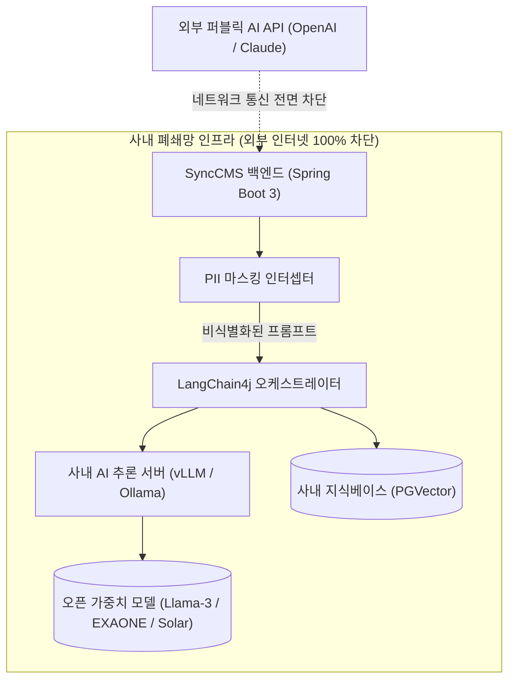

# 사내 폐쇄망 AI 및 PII 보안 컴플라이언스

SyncCMS는 금융권, 공공기관, 대기업의 **망분리 보안 규정 및 개인정보보호법**을 충족할 수 있도록 사내 폐쇄망 전용 AI 파이프라인과 실시간 보안 필터를 제공합니다.

---

## 사내 폐쇄망 AI 아키텍처



---

## 1. LangChain4j 기반 온프레미스 AI 설정

Spring Boot 백엔드에서 사내 GPU 서버의 vLLM 또는 Ollama 엔드포인트를 표준 `ChatLanguageModel` 빈(Bean)으로 구성합니다.

### `application.yml` 설정 예시
```yaml
langchain4j:
  open-ai:
    chat-model:
      base-url: http://internal-vllm-cluster.local:8000/v1
      api-key: none  # 사내망 내부 통신 시 필요에 따라 토큰 지정
      model-name: meta-llama/Llama-3-70b-Instruct
      temperature: 0.2
      timeout: PT60S
      max-retries: 2
```

### Java Configuration 예시
```java
package com.empasy.synccms.config;

import dev.langchain4j.model.chat.ChatLanguageModel;
import dev.langchain4j.model.openai.OpenAiChatModel;
import org.springframework.beans.factory.annotation.Value;
import org.springframework.context.annotation.Bean;
import org.springframework.context.annotation.Configuration;

import java.time.Duration;

@Configuration
public class AiModelConfiguration {

    @Value("${langchain4j.open-ai.chat-model.base-url}")
    private String baseUrl;

    @Value("${langchain4j.open-ai.chat-model.model-name}")
    private String modelName;

    @Bean
    public ChatLanguageModel onPremiseChatModel() {
        return OpenAiChatModel.builder()
                .baseUrl(baseUrl)
                .apiKey("internal-key")
                .modelName(modelName)
                .temperature(0.2)
                .timeout(Duration.ofSeconds(60))
                .maxRetries(2)
                .build();
    }
}
```

---

## 2. 개인정보(PII) 실시간 비식별화 인터셉터

AI 보조 작성기 호출 또는 콘텐츠 저장 전, 민감한 개인식별정보(PII)를 자동으로 탐지하여 마스킹합니다.

```java
package com.empasy.synccms.security;

import java.util.regex.Pattern;

public class PiiMaskingInterceptor {

    // 주민등록번호 패턴 (900101-1234567 -> 900101-1******)
    private static final Pattern RRN_PATTERN = 
        Pattern.compile("\\b(\\d{6})-[1-4]\\d{6}\\b");

    // 신용카드 번호 패턴 (1234-5678-9012-3456 -> 1234-****-****-3456)
    private static final Pattern CARD_PATTERN = 
        Pattern.compile("\\b(\\d{4})-\\d{4}-\\d{4}-(\\d{4})\\b");

    // 휴대전화 번호 패턴 (010-1234-5678 -> 010-****-5678)
    private static final Pattern PHONE_PATTERN = 
        Pattern.compile("\\b(01[016789])-\\d{3,4}-(\\d{4})\\b");

    public static String maskSensitiveData(String input) {
        if (input == null || input.isBlank()) {
            return input;
        }

        String masked = RRN_PATTERN.matcher(input).replaceAll("$1-*******");
        masked = CARD_PATTERN.matcher(masked).replaceAll("$1-****-****-$2");
        masked = PHONE_PATTERN.matcher(masked).replaceAll("$1-****-$2");

        return masked;
    }
}
```

---

## 3. 표시광고법 및 기업 표준 용어 사전 검증

- **법적 리스크 단어 탐지**: `최초`, `최고`, `100% 보장`, `무조건`, `완전 무료` 등 근거 제시가 필요한 단어 입력 시 확인 플래그를 생성합니다.
- **사내 표준 용어집(Glossary) 주입**: 회사의 공식 브랜드 명칭, 띄어쓰기 규정 및 금칙어 룰셋을 AI 프롬프트 System Prompt에 자동 주입하여 일관된 톤앤매너를 유지합니다.

---

## 4. 컴플라이언스 준수 체크리스트

| 점검 항목 | 기준 및 법적 근거 | SyncCMS 대응 방안 |
| :--- | :--- | :--- |
| **망분리 보안** | 금융감독원 전자금융감독규정 제15조 | 외부 인터넷 통신이 단절된 사내 인프라 내 vLLM/Ollama 모델 구동 |
| **개인정보 보호** | 개인정보보호법 제29조 (안전조치의무) | PII 인터셉터를 통한 실시간 비식별화 및 로그 저장 시 마스킹 |
| **변경 이력 보존** | 전자금융감독규정 제20조 (기록보존) | 모든 콘텐츠 등록, 결재, 배포 이력 불변 테이블 영구 저장 |
