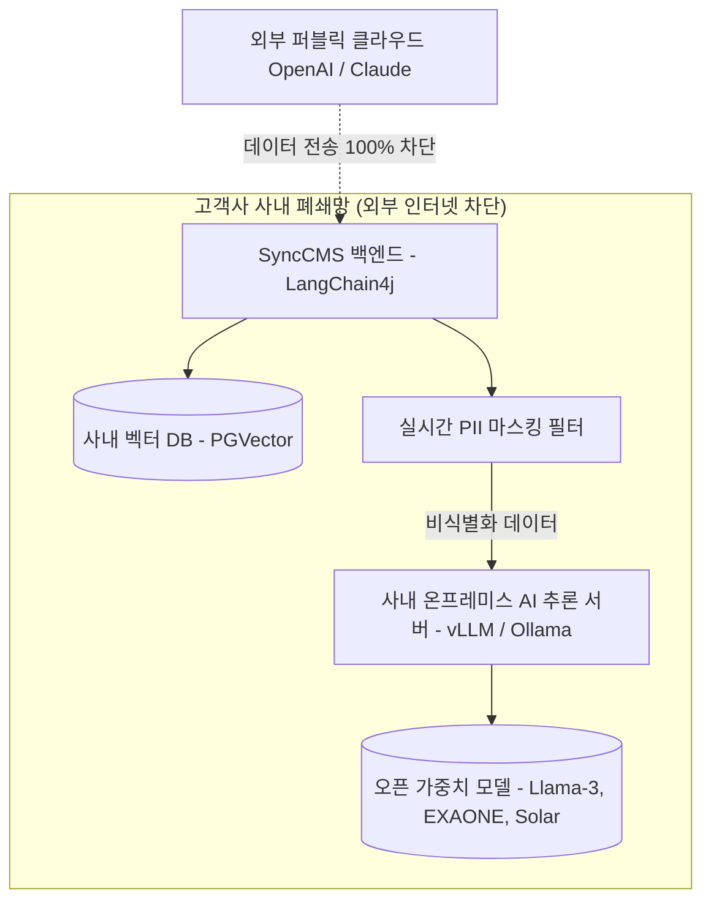

# 사내 폐쇄망 AI & PII 보안 컴플라이언스

SyncCMS는 금융권, 공공기관, 대기업의 엄격한 **망분리 보안 규정 및 개인정보보호법**을 안정성하게 충족하도록 설계되었습니다.

---

## 사내 폐쇄망 AI 아키텍처



---

## 3대 보안 컴플라이언스 보장 체계

### 1. 사내 구축 온프레미스 LLM 지원 (Zero Data Leakage)
- 외부 퍼블릭 AI API(OpenAI, Anthropic) 호출 없이, 사내 GPU 인프라에 배포된 **vLLM / Ollama** 엔진과 직접 통신합니다.
- **지원 모델**: Llama-3-70B/8B, LG EXAONE 3.0, Upstage Solar, Qwen 등 최신 오픈 가중치 모델을 공식 호환 지원합니다.

### 2. 개인정보(PII) 실시간 자동 마스킹 (PII Shield)
콘텐츠 작성 및 AI 프롬프트 전송 전 단계에서 정규식 및 NER(개체명 인식) 모델이 민감 정보를 실시간 감지하여 자동 마스킹합니다:

```java
// LangChain4j PII 마스킹 인터셉터 동작 규격
public class PiiMaskingInterceptor {
    public static String sanitize(String input) {
        // 주민등록번호 마스킹 (예: 900101-1******)
        input = input.replaceAll("\b(\d{6})-[1-4]\d{6}\b", "$1-*******");
        // 신용카드번호 마스킹 (예: 9410-****-****-1234)
        input = input.replaceAll("\b(\d{4})-\d{4}-\d{4}-(\d{4})\b", "$1-****-****-$2");
        // 휴대폰번호 마스킹 (예: 010-****-5678)
        input = input.replaceAll("\b(01[016789])-\d{3,4}-(\d{4})\b", "$1-****-$2");
        return input;
    }
}
```

### 3. 표시광고법 위반 사전 스크리닝 & 브랜드 가이드라인 주입
- **과대·과장 광고 표현 실시간 경고**: `최초`, `최고`, `100% 보장`, `무조건` 등 법적 리스크가 있는 단어를 작성 즉시 감지하여 수정 권고합니다.
- **사내 표준 용어집(Glossary) 자동 주입**: 회사 공식 표준 명칭, 띄어쓰기, 금칙어 룰셋이 AI 초안 작성 프롬프트에 자동 적용됩니다.
