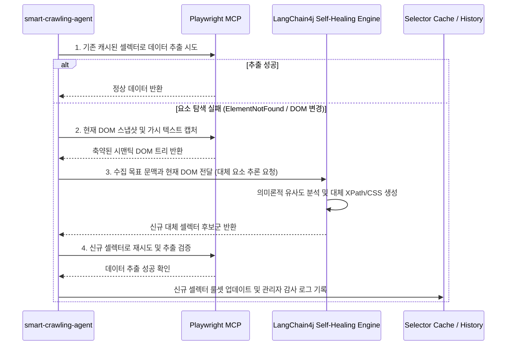

# 적응형 크롤링 & AI 자율 복구 엔진

웹 크롤링 시스템 운영 시 발생하는 유지보수 이슈의 상당 부분은 **수집 대상 웹사이트의 UI 개편 및 HTML/CSS 구조 변경**으로 인해 발생합니다. SyncCrawl은 **Playwright MCP**와 **Self-Healing 셀렉터 복구 알고리즘**을 통해 구조 변경에 유연하게 대응합니다.

---

## 기존 크롤러와 SyncCrawl 적응형 엔진 비교

| 비교 항목 | 기존 크롤러 (Scrapy, Puppeteer 등) | SyncCrawl 적응형 크롤링 엔진 |
| :--- | :--- | :--- |
| **셀렉터 방식** | 고정된 CSS/XPath 셀렉터 의존 | **시맨틱 의미론(Semantics) 및 다중 가중치 분석** |
| **UI 개편 시 대응** | 크롤링 파이프라인 중단 및 수동 수정 필요 | **대체 요소를 탐색하여 셀렉터 자율 재구성** |
| **동적 SPA 지원** | 고정 대기 시간(Sleep) 설정으로 실패 가능성 존재 | **DOM Mutation 및 네트워크 유휴(Network Idle) 기반 동기화** |
| **복합 상호작용** | 개별 클릭/입력 스크립트 작성 필요 | **자연어 시나리오 빌더 기반 액션 시퀀스 생성** |

---

## Self-Healing 셀렉터 복구 프로세스

SyncCrawl은 타깃 요소 추출 실패 시 다음과 같은 단계로 복구 과정을 진행합니다.



---

## 자율 복구 기술 세부사항

### 1. 시맨틱 DOM 축약 (Semantic DOM Pruning)
브라우저 전체 HTML의 불필요한 `<script>`, `<style>`, `<svg>` 등을 정리하고, 가시적인 텍스트 노드, 입력 폼, 테이블, 시맨틱 태그(`article`, `section`, `nav` 등)를 중심으로 경량 DOM 트리를 구성하여 처리합니다.

### 2. 다중 가중치 휴리스틱 (Multi-weight Heuristics)
다음 요소를 종합적으로 분석하여 대체 요소를 판단합니다:
- **텍스트 레이블 유사도**: 요소 주변 레이블(예: "공고일자", "작성자", "가격")의 의미적 일치도
- **상대적 DOM 계층 구조**: 이전 성공 시점의 부모/자식 노드 패턴과의 구조적 유사성
- **접근성(Accessibility) 트리 정보**: `aria-label`, `role`, `name` 속성을 활용한 시맨틱 검증

### 3. 성공 이력 기반 룰셋 갱신
대체 셀렉터를 통해 데이터 추출이 확인되면 데이터베이스에 해당 사이트의 셀렉터 버전이 갱신되어, 다음 실행 주기에는 추가 추론 비용 없이 직접 추출을 수행합니다.

---

## 동적 상호작용 및 복합 시나리오

SyncCrawl은 페이지 읽기 외에도 다양한 사용자 브라우징 액션을 지원합니다.

```typescript
// SyncCrawl Scenario Agent 상호작용 예시 (Playwright MCP 브리지)
await scenarioRunner.execute([
  { action: 'NAVIGATE', url: 'https://partner.portal.com/login' },
  { action: 'FILL_CREDENTIALS', userField: '#loginId', passField: '#passwd' },
  { action: 'WAIT_FOR_NAVIGATION', waitUntil: 'networkidle' },
  { action: 'HANDLE_MODAL', selector: '.popup-close-btn', optional: true },
  { action: 'INFINITE_SCROLL', maxRounds: 5, scrollDelayMs: 800 },
  { action: 'EXTRACT_LIST', targetSelector: '.data-row', schema: ContentSchema }
]);
```

- **팝업 및 쿠키 배너 처리**: 오버레이 팝업이나 쿠키 동의 안내가 나타났을 때 닫기/수락 버튼을 감지하여 처리 후 작업을 이어갑니다.
- **가상 스크롤 및 페이징**: 스크롤에 따라 비동기 로딩되는 요소를 탐지하여 누적 수집합니다.
