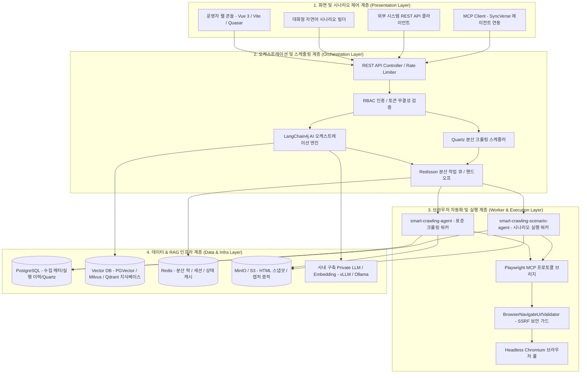

# SyncCrawl 시스템 아키텍처

SyncCrawl은 대규모 크롤링 워크로드 처리와 안정적인 운영, AI 지식 파이프라인 연계를 위해 **분산 에이전트 Clean Architecture 4계층 구조**로 설계되었습니다.

---

## 4계층 아키텍처 다이어그램

---

## 4대 핵심 분산 컨테이너 이미지

SyncCrawl은 무중단 배포와 독립적 스케일아웃을 위해 4개의 분산 컨테이너 이미지로 구성됩니다.

| 컨테이너 이미지 | 기술 스택 | 핵심 역할 및 기능 |
| :--- | :--- | :--- |
| **`smart-crawling-server`** | Java 21, Spring Boot 3.5, LangChain4j, Flyway | API 엔드포인트 제공, 수집 작업 스케줄링(Quartz), AI 작업 계획 수립, RAG 벡터 인덱싱 오케스트레이션 |
| **`smart-crawling-agent`** | Java 21, Playwright Java, MCP SDK | 정규 웹 수집 작업 실행, DOM 파싱, 데이터 추출, HTML 스냅샷 저장 |
| **`smart-crawling-scenario-agent`** | Java 21, Node.js/Playwright MCP, Chromium | 로그인, 다단계 폼 입력, 무한 스크롤, SPA 상호작용 등 복합 시나리오 실행 |
| **`smart-crawling-console`** | Vue 3, TypeScript, Vite, Quasar | 수집 작업 모니터링, 자연어 시나리오 빌더 UI, 수집 데이터 검증 및 RAG 질의응답 테스트 콘솔 |

---

## 계층별 상세 설계

### 1. 화면 및 시나리오 제어 계층 (Presentation Layer)
- **자연어 시나리오 빌더**: 사용자가 자연어로 수집 목표를 입력하면 백엔드 LangChain4j 에이전트와 대화형으로 상호작용하여 시나리오 스텝을 자동 생성합니다.
- **실시간 실행 모니터링**: WebSocket 및 SSE(Server-Sent Events)를 통해 브라우저 실행 스크린샷과 단계별 로그를 실시간으로 중계합니다.

### 2. 오케스트레이션 및 스케줄링 계층 (Orchestration Layer)
- **LangChain4j AI 엔진**: 사용자 질의와 타깃 페이지 구조를 분석하고 적절한 크롤링 도구(Playwright Tool)를 동적으로 바인딩합니다.
- **Quartz 분산 스케줄러**: 다수의 주기적 크롤링 배치를 데이터베이스 클러스터링 기반으로 분산 실행합니다.
- **Redisson 분산 큐 & 락**: 다중 워커 노드 간의 작업 분배(Handoff) 및 동시성 제어를 담당합니다.

### 3. 브라우저 자동화 및 실행 계층 (Worker & Execution Layer)
- **Playwright MCP 연동**: Model Context Protocol 표준 규격을 준수하여 브라우저를 제어합니다.
- **SSRF 보안 가드 (`BrowserNavigateUrlValidator`)**: 로컬 루프백(`127.0.0.1`, `localhost`) 접근 및 내부 사내망 침투를 사전에 검증하여 차단합니다.
- **셀렉터 자율 복구 엔진**: DOM 트리가 변경되었을 때 페이지 텍스트 문맥과 시맨틱 태그를 대조하여 대체 셀렉터를 탐색합니다.

### 4. 데이터 & RAG 인프라 계층 (Data & Infra Layer)
- **PostgreSQL & Flyway**: 수집 메타데이터, 사용자 스키마, 실행 이력을 관리하며 마이그레이션을 지원합니다.
- **Vector DB & 임베딩**: 수집된 비정형 텍스트를 청킹하여 PGVector, Milvus, Qdrant 등에 저장하며, 엔터프라이즈 RAG 질의응답을 위한 시맨틱 검색을 제공합니다.
- **MinIO / S3 오브젝트 스토리지**: 수집 시점의 원본 HTML과 증적 캡처 이미지를 스토리지에 보관합니다.
