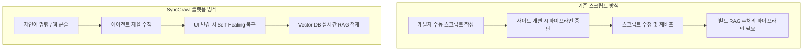

# 엔터프라이즈 FAQ & 도입 가이드

SyncCrawl 도입을 검토 중인 IT 의사결정권자 및 엔지니어를 위한 주요 질문과 답변입니다.

---

## Q1. 오픈소스 크롤러(Scrapy, Selenium, Puppeteer) 대비 SyncCrawl의 차별점은 무엇인가요?

일반 오픈소스 도구는 스크립트 작성을 위한 라이브러리이므로, 실제 운영 환경에서는 분산 스케줄링, 데이터베이스 파이프라인, 모니터링 UI, RAG 벡터화, 그리고 **사이트 개편에 따른 스크립트 유지보수**를 자체 구현해야 합니다.

SyncCrawl은 **Self-Healing 셀렉터 복구 엔진**, **RAG 지식화 파이프라인**, **분산 아키텍처**를 통합 제공하여 크롤링 시스템 유지보수에 필요한 공수를 대폭 줄입니다.

---

## Q2. 타깃 사이트의 봇 탐지 및 접근 제한에는 어떻게 대응하나요?

SyncCrawl은 안정적인 수집을 위해 다음과 같은 제어 기능을 지원합니다:

1. **브라우저 환경 에뮬레이션**: Playwright 기반으로 실제 브라우저의 캔버스 핑거프린트, WebGL 렌더링, User-Agent, 화면 해상도를 설정합니다.
2. **동적 요청 간격 조절**: 고정된 주기가 아닌 임의의 지연 시간(Jittering)과 마우스 동작을 시뮬레이션할 수 있습니다.
3. **엔터프라이즈 프록시 연동**: 사내 게이트웨이 또는 상용 프록시 풀과 연동하여 IP 순환을 지원합니다.

---

## Q3. 대규모 데이터 수집 시 시스템 확장성은 어떻게 지원되나요?

SyncCrawl은 **Kubernetes 환경에서의 탄력적 확장(HPA)**을 지원합니다.

- **마이크로서비스 분리**: `smart-crawling-server`(관리)와 `smart-crawling-agent`(수집 워커)가 분리되어 있어, 대규모 배치 작업 시 워커 노드 Pod를 유연하게 확장할 수 있습니다.
- **Redisson 분산 큐 기반 부하 분산**: 분산 락과 큐를 통해 대규모 작업이 여러 워커에 분배되며, 워커 장애 시에도 작업 인계를 지원합니다.

---

## Q4. 수집 데이터의 법적 컴플라이언스 및 개인정보 보호 기능이 있나요?

SyncCrawl은 기업의 컴플라이언스 관리를 위한 기능을 제공합니다.

- **Robots.txt 준수 정책**: 타깃 도메인의 `robots.txt` 규칙을 파싱하고 우선 준수하는 옵션을 제공합니다.
- **개인식별정보(PII) 마스킹 필터**: 수집된 텍스트에서 주민등록번호, 이메일, 전화번호 등 개인정보 패턴을 감지하여 비식별화 처리할 수 있습니다.
- **수집 목적 감사 증적**: 모든 크롤링 요청에 대해 작업 등록 사유, 담당자, 승인 이력을 보관합니다.

---

## Q5. 사내 폐쇄망(온프레미스) 환경 배포를 지원하나요?

SyncCrawl은 **Air-Gapped 온프레미스 환경**을 지원합니다.

- **폐쇄망 설치 지원**: 외부 인터넷 연결 없이 사내 Kubernetes 또는 Linux VM 환경에 컨테이너 이미지로 배포할 수 있습니다.
- **사내 LLM 연동**: 외부 클라우드 통신 없이 사내 vLLM, Ollama 및 온프레미스 Vector DB와 직접 연동하여 외부 데이터 유출 위험을 방지합니다.
- **기술 지원**: 기업별 싱글사인온(SSO) 연동 및 맞춤형 수집 시나리오 설정을 위한 기술 가이드를 제공합니다.
