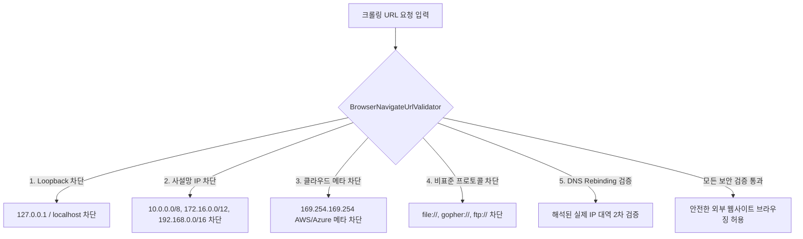
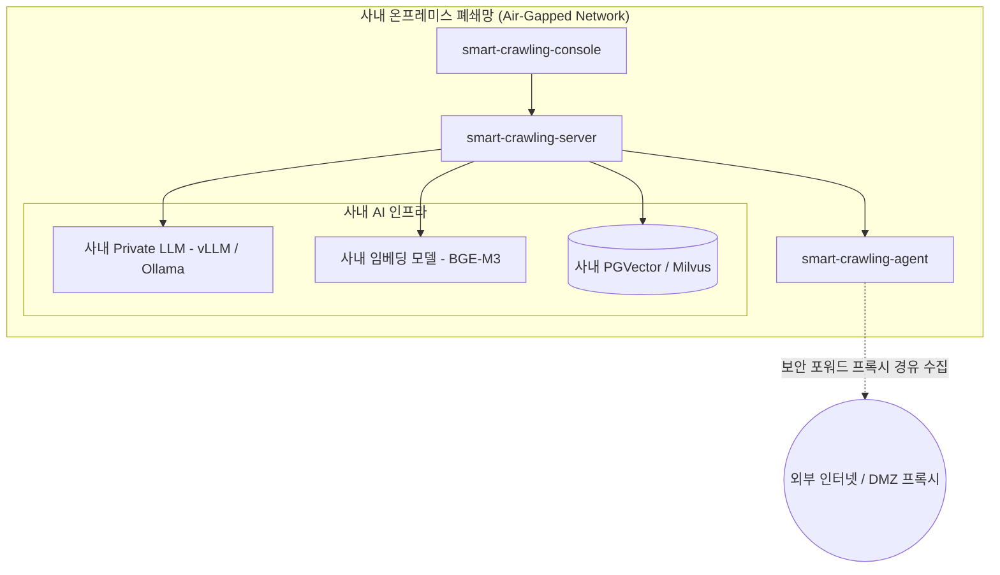

# 엔터프라이즈 보안 & 폐쇄망 거버넌스

기업 인프라 환경에서 웹 크롤러를 운영할 때 요구되는 보안성과 규제 준수 요건을 충족하기 위한 SyncCrawl의 보안 아키텍처를 소개합니다.

---

## SSRF(Server-Side Request Forgery) 방어 구조

웹 크롤러는 외부 URL을 방문하여 데이터를 수집하므로, 비인가 요청이나 악의적인 내부 IP 접근 시도로부터 시스템을 보호해야 합니다.

SyncCrawl은 자체 개발된 URL 검증 모듈인 **`BrowserNavigateUrlValidator`**를 통해 다계층 차단 정책을 적용합니다.

### 주요 SSRF 방어 정책
- **루프백 및 사설망 차단**: `localhost`, `127.0.0.1`, RFC 1918 사설 IP 대역 접근을 사전에 차단합니다.
- **클라우드 인스턴스 메타데이터 보호**: AWS/Azure/GCP의 메타데이터 엔드포인트(`169.254.169.254`) 접근을 제한합니다.
- **DNS Rebinding 방어**: 도메인 해석 후 확인된 실제 목적지 IP가 사설망 대역인지 연결 직전에 이중 검증합니다.
- **프로토콜 제한**: `http://` 및 `https://` 외의 비표준 스키마(`file://`, `jar://`, `dict://`)를 배제합니다.

---

## 사내 폐쇄망(Air-Gapped) 인프라 지원

외부 인터넷과 격리된 온프레미스 폐쇄망 환경에서도 SyncCrawl은 독립적으로 동작할 수 있습니다.

- **사내 Private LLM 연동**: 외부 SaaS API 호출 없이, 사내 서버에 구축된 `vLLM`, `Ollama`, `LocalAI`와 연동하여 외부 데이터 유출 위험을 줄입니다.
- **보안 프록시 연계**: 외부 사이트 수집이 필요한 경우 DMZ의 인가된 포워드 프록시(Forward Proxy)를 통해서만 트래픽을 송출합니다.
- **Air-Gapped 빌드 지원**: 사내 폐쇄망 레지스트리(Harbor, Nexus)에서 컨테이너 이미지와 패키지를 공급받을 수 있도록 구성되어 있습니다.

---

## 다계층 RBAC 및 실행 감사 추적 (Audit Trail)

모든 크롤링 작업과 수집 데이터 열람은 역할 기반 접근 제어와 감사 로그로 관리됩니다.

### 1. 역할 기반 접근 제어 (RBAC)
- **크롤링 엔지니어 (Admin)**: 시나리오 작성, 스케줄링 등록, 셀렉터 룰셋 관리
- **현업 분석가 (Analyst)**: 데이터 조회, RAG 검색 테스트, 결과 리포트 다운로드
- **보안 관리자 (Auditor)**: 크롤링 접속 이력, IP 접근 로그, 보안 정책 모니터링

### 2. 실행 감사 로그 기록
수집 작업이 수행될 때 다음 정보가 데이터베이스에 보관됩니다:
- 실행 작업 ID 및 요청자 계정/IP
- 대상 URL 및 최종 도달 URL (리다이렉트 추적)
- 수집 시각, 소요 시간, HTTP 응답 코드
- 수집된 파일 및 HTML의 SHA-256 해시값과 저장 경로
- 셀렉터 복구(Self-Healing) 발생 여부 및 변경 전후 셀렉터 차이점(Diff)
