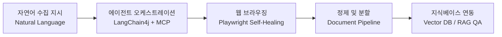

# SyncCrawl™: 웹 크롤링 및 RAG 지식 구축 플랫폼

SyncCrawl™은 데이터 수집과 자연어 처리(NLP), **Playwright MCP 기반 브라우저 자동화**, 그리고 **RAG(검색 증강 생성) 지식 파이프라인**을 연계한 기업용 웹 수집 플랫폼입니다.

수집 대상 웹사이트의 UI 및 DOM 구조가 변경되었을 때 맥락을 분석하여 셀렉터를 재구성(Self-Healing)하며, 수집된 비정형 웹 데이터를 정제·임베딩하여 기업 내 벡터 지식 저장소로 변환합니다.

---

## 주요 기능 및 구성

웹사이트 개편에 따른 수집 파이프라인 중단 문제를 줄이고, 수집 데이터의 벡터 인덱싱 과정을 일원화합니다.

### 1. 적응형 크롤링 (Self-Healing Crawling)
- **자연어 명령 해석**: "주요 기관 공지사항 최근 10건 및 본문 내용 수집"과 같은 비즈니스 질의 형태로 크롤링 작업을 등록합니다.
- **적응형 셀렉터 복구**: 사이트 개편으로 CSS/XPath 셀렉터가 변경되어도 DOM 구조와 텍스트 문맥을 분석하여 데이터를 재탐색합니다.

### 2. RAG 지식 파이프라인 (Knowledge Base)
- **문맥 보존 분할**: HTML 태그 구조를 파싱하여 문맥을 유지한 채 시맨틱 청크(Chunk)로 분할합니다.
- **다국어 및 한국어 임베딩**: 한국어 및 업무 도메인 용어 처리에 적합한 임베딩 모델을 지원합니다.
- **벡터 데이터베이스 연동**: PGVector, Milvus, Qdrant, Weaviate 등 주요 벡터 데이터베이스와 연동하여 실시간 인덱싱을 지원합니다.

### 3. 분산 런타임 및 보안 구성 (Production Architecture)
- **분산 마이크로서비스**: `Server`, `Agent`, `Scenario-Agent`, `Console` 4개 독립 컨테이너로 구성되어 대규모 수집 작업의 확장을 지원합니다.
- **SSRF 방어 메커니즘**: 내부 네트워크 접근 및 비인가 리다이렉트를 검증하는 URL 검증기(`BrowserNavigateUrlValidator`)를 내장하고 있습니다.
- **폐쇄망(Air-Gapped) 지원**: 외부 인터넷 연결이 제한된 온프레미스 환경에서도 사내 Private LLM(vLLM, Ollama)과 연동하여 동작합니다.

---

## 기술 사양 요약

| 구분 | 지원 기술 및 사양 |
| :--- | :--- |
| **코어 백엔드** | Java 21, Spring Boot 3.5, LangChain4j, Flyway |
| **브라우저 자동화** | Playwright MCP, Headless Chromium, 분산 Worker |
| **스토리지 및 캐시** | PostgreSQL, Redis, MinIO / S3 오브젝트 스토리지 |
| **벡터 데이터베이스** | PGVector, Milvus, Qdrant, Weaviate |
| **운영 콘솔** | Vue 3, Vite, TypeScript, Quasar Design System |
| **배포 인프라** | Docker Multi-Arch (amd64/arm64), Kubernetes(AKS), Air-Gapped Runner |

---

## 세부 문서 안내

- [시스템 아키텍처 & Clean Architecture](./architecture.md): 4계층 분산 아키텍처와 컴포넌트별 상호작용
- [적응형 크롤링 & AI 자율 복구 엔진](./adaptive-crawling-engine.md): Playwright MCP 연동 및 셀렉터 복구 동작 원리
- [RAG 지식 구축 & 벡터 저장소 연동](./rag-knowledge-pipeline.md): 데이터 정제, 청킹, 임베딩 및 Vector DB 파이프라인
- [엔터프라이즈 보안 & 폐쇄망 거버넌스](./enterprise-security-governance.md): SSRF 차단, Air-Gapped 배포 및 RBAC 감사 추적
- [REST API & MCP Tool 레퍼런스](./api-reference.md): 작업 제어, 쿼리, 결과 조회를 위한 API 명세
- [엔터프라이즈 FAQ & 도입 가이드](./enterprise-faq.md): 사이트 차단 대응, 스케일링 및 주요 질의응답