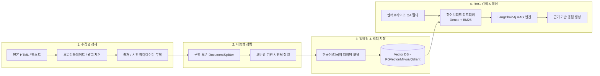

# RAG 지식 파이프라인 & 벡터 저장소 연동

SyncCrawl은 수집한 웹 데이터를 정제하여 생성형 AI 애플리케이션에서 활용할 수 있는 **RAG(Retrieval-Augmented Generation) 지식베이스**로 변환합니다.

---

## 지식화 파이프라인 구성



---

## 주요 RAG 처리 단계

### 1. 노이즈 제거 및 구조화 (Boilerplate Stripping)
웹 페이지에는 내비게이션 바, 푸터, 광고 배너, 저작권 문구 등 질의응답에 불필요한 요소가 포함될 수 있습니다.
- **본문 추출 알고리즘**: 텍스트 밀도와 태그 패턴을 분석하여 주요 콘텐츠 본문을 추출합니다.
- **메타데이터 보존**: 원본 페이지 URL, 수집 시각, 문서 제목, 카테고리 태그 등을 청크 메타데이터로 함께 인덱싱하여 검색 시 출처(Citation)를 제공합니다.

### 2. 문맥 보존 시맨틱 청킹 (Context-Preserving Chunking)
- **구조 인식 분할**: HTML 헤딩(`<h1>`~`<h6>`), 문단(`<p>`), 리스트(`<ul>`, `<ol>`), 표(`<table>`) 경계를 고려하여 분할합니다.
- **오버랩 설정**: 청크 간 적정 오버랩(예: 100~200 토큰)을 유지하여 문맥 단절을 방지합니다.

### 3. 임베딩 모델 지원
LangChain4j 프레임워크와의 표준 인터페이스를 통해 다양한 임베딩 모델을 교체하여 적용할 수 있습니다.

| 모델 구분 | 지원 임베딩 모델 | 주요 특징 및 적합 환경 |
| :--- | :--- | :--- |
| **사내 폐쇄망 (On-Premise)** | `BGE-M3`, `KoSimCSE`, `Snowflake-Arctic` | 외부 통신이 차단된 온프레미스 환경, 한국어 검색 |
| **상용 클라우드 (API)** | `OpenAI text-embedding-3-large`, `Cohere v3` | 글로벌 다국어 RAG 환경 |
| **경량 CPU 런타임** | `all-MiniLM-L6-v2`, `ONNX Runtime` | 저비용 인프라 및 엣지 서버 환경 |

---

## 지원 벡터 데이터베이스 (Vector DB)

SyncCrawl은 기업의 인프라 환경에 맞춰 다양한 Vector DB 드라이버를 제공합니다.

```java
// LangChain4j 기반 Vector DB 연동 예시 (Spring Boot Bean 설정)
@Bean
public EmbeddingStore<TextSegment> embeddingStore(PgVectorProperties properties) {
    return PgVectorEmbeddingStore.builder()
            .host(properties.getHost())
            .port(properties.getPort())
            .database(properties.getDatabase())
            .user(properties.getUsername())
            .password(properties.getPassword())
            .table("synccrawl_knowledge_vectors")
            .dimension(1024) // BGE-M3 기준
            .build();
}
```

- **PostgreSQL (pgvector)**: 별도의 전용 DB 추가 없이 기존 RDBMS 인프라에서 관계형 데이터와 벡터를 함께 관리
- **Milvus / Qdrant**: 대규모 벡터 데이터셋의 분산 처리 및 고속 검색 지원
- **Elasticsearch / OpenSearch**: 키워드 BM25 검색과 벡터 Dense Retrieval을 결합한 하이브리드 검색 지원

---

## 지식 동기화 및 라이프사이클 관리

- **증분 업데이트(Incremental Sync)**: 웹 페이지 내용이 변경된 경우에 한해 청크를 갱신하고 벡터를 계산합니다.
- **TTL 기반 자동 만료**: 유효 기간이 지난 공지사항이나 일회성 데이터는 설정된 주기(TTL)에 따라 정리할 수 있습니다.
- **도메인 신뢰도 가중치**: 공식 출처와 일반 웹사이트 간 가중치를 설정하여 검색 시 우선순위를 제어합니다.
