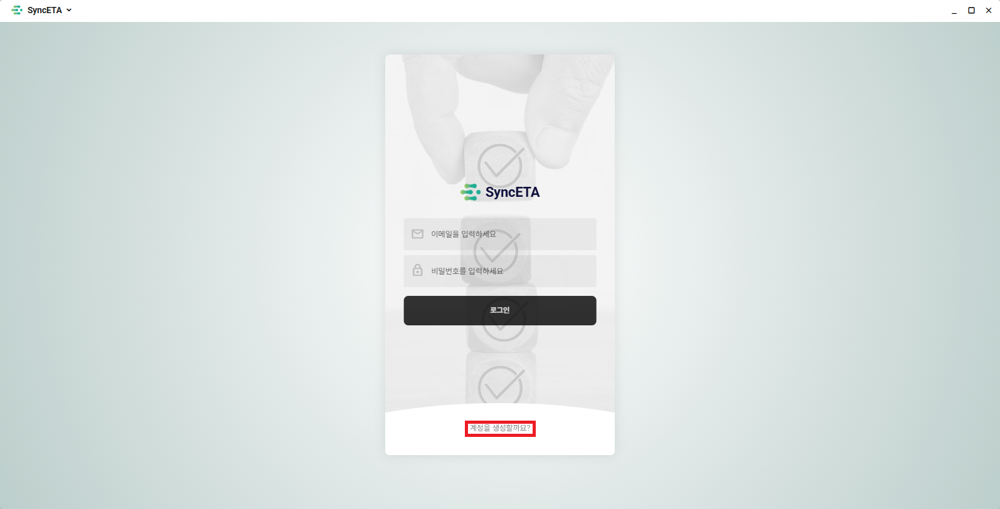
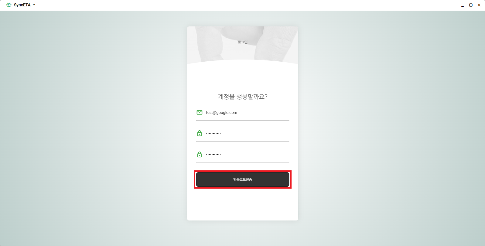
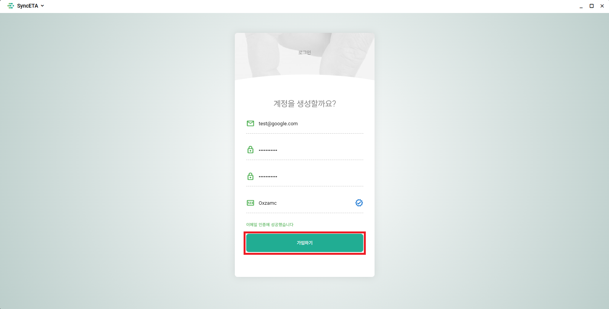
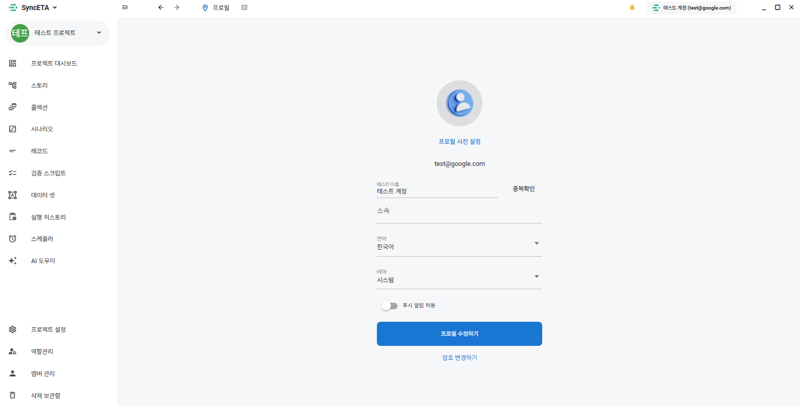

# 계정 및 워크스페이스 관리

SyncETA 플랫폼에 접속하여 테스트 프로젝트를 생성하고 협업하기 위한 계정 관리 및 개인 환경설정 가이드입니다.

---

## 1. 회원가입 및 이메일 인증

### 1단계: 계정 생성 메뉴 진입
SyncETA 로그인 화면 하단의 **'계정을 생성할까요?'** 링크를 클릭합니다.

### 2단계: 인증 코드 발송
이메일 주소와 사용할 비밀번호를 입력한 후 **'인증코드전송'** 버튼을 클릭합니다. 시스템은 입력된 이메일 주소로 6자리 일회용 인증 코드를 발송합니다.

### 3단계: 인증 코드 확인 및 가입 완료
수신한 이메일의 인증 코드를 입력란에 기입하고 **'가입하기'** 버튼을 클릭합니다. 인증이 완료되면 로그인 화면으로 자동 전환됩니다.

### 4단계: 초기 프로필 구성
첫 로그인 시 사용자 이름과 프로필 이미지를 등록하는 설정 화면이 표시됩니다.

---

## 2. 사용자 프로필 및 환경 설정

대시보드 우측 상단의 **'내 프로필'** 아이콘을 클릭하여 개인화 설정을 변경할 수 있습니다.

### 지원 환경설정 항목
- **프로필 정보**: 표시 이름 및 아바타 이미지 수정
- **다국어 설정**: 한국어, 영어, 일본어 인터페이스 전환
- **테마 모드**: 라이트 모드 / 다크 모드 전환
- **보안 설정**: 비밀번호 변경
- **알림 설정**: 테스트 실패 및 스케줄 실행 결과에 대한 이메일/웹훅 알림 수신 여부

