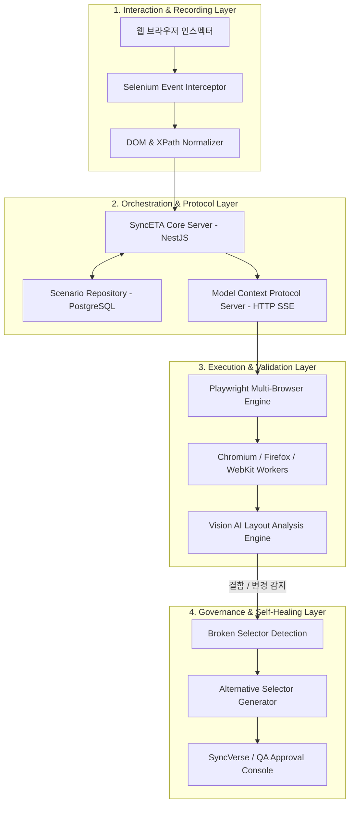

# 시스템 아키텍처 및 파이프라인

SyncETA는 브라우저 이벤트 캡처부터 분산 실행, 시각적 검증, 자가 치유에 이르는 전 과정을 모듈화된 4계층 아키텍처로 처리합니다.

---

## 4계층 아키텍처 다이어그램

---

## 계층별 상세 기능 및 기술 스택

### 1. Interaction & Recording Layer (상호작용 및 녹화 계층)
- **Selenium Event Interceptor**: 사용자가 웹 화면에서 수행하는 클릭(`click`), 텍스트 입력(`input/change`), 스크롤(`scroll`), 탭 전환(`tab switch`) 이벤트를 실시간으로 가로채어 기록합니다.
- **DOM Normalizer**: 이벤트 발생 대상 노드의 절대/상대 XPath, 고유 CSS ID, Class 조합, 계층 경로를 수집하여 유연한 선택자 배열을 구성합니다.
- **표준 포맷 직렬화**: 수집된 데이터는 플랫폼 독립적인 JSON/YAML 시나리오 포맷으로 직렬화됩니다.

### 2. Orchestration & Protocol Layer (오케스트레이션 및 프로토콜 계층)
- **NestJS 기반 코어 서버**: 시나리오 버전 관리, 프로젝트별 격리, 데이터셋 매핑 및 실행 스케줄을 총괄 관리합니다.
- **MCP (Model Context Protocol) Server**: 외부 AI 오케스트레이터(SyncVerse) 및 CI/CD 파이프라인과 HTTP Server-Sent Events(SSE) 기반으로 무상태(Stateless) 통신을 수행합니다.
- **JWT 기반 인가(AuthZ)**: 시스템 간 통신 시 테넌트 및 역할 클레임을 검증하여 인가되지 않은 테스트 실행 요청을 차단합니다.

### 3. Execution & Validation Layer (실행 및 시각 검증 계층)
- **Playwright MCP Engine**: 수집된 시나리오를 바탕으로 Chromium, Firefox, WebKit 브라우저 컨테이너를 구동하여 병렬 테스트를 수행합니다.
- **비디오 & 스냅샷 캡처**: 각 테스트 스텝 실행 전후의 DOM 트리와 스크린샷을 캡처하며, 실패 시점에는 전후 5초 분량의 화면 녹화본(MP4)을 아카이빙합니다.
- **Vision AI Layout Engine**: 렌더링된 스크린샷을 분석하여 컴포넌트 겹침(Overlapping), 텍스트 잘림(Clipping), 반응형 뷰포트 레이아웃 붕괴를 검출합니다.

### 4. Governance & Self-Healing Layer (거버넌스 및 자가 치유 계층)
- **Broken Selector Detection**: 웹 애플리케이션의 배포로 인해 기존 DOM 선택자가 일치하지 않을 경우, 즉시 실패 처리하지 않고 비전 모델을 통해 대상 요소의 시각적 위치를 탐색합니다.
- **대체 선택자 생성**: 탐색된 UI 요소의 새로운 DOM 경로를 추출하여 대체 선택자 후보군을 생성합니다.
- **Human-in-the-Loop 거버넌스**: AI가 임의로 테스트 코드를 덮어쓰지 않고, 관리자 콘솔 및 SyncVerse에 변경 승인 요청을 전송하여 신뢰성을 담보합니다.

---

## 데이터 흐름 사양 (Data Flow Lifecycle)

| 단계 | 데이터 주체 | 데이터 포맷 | 설명 |
| :--- | :--- | :--- | :--- |
| **1. Capture** | Browser ➔ Recorder | `Raw Event Object` | 좌표, 타임스탬프, 이벤트 타입, 원시 DOM 스니펫 |
| **2. Store** | Recorder ➔ PostgreSQL | `Scenario JSON` | 정규화된 스텝 목록, 변수 바인딩 키, 대기/검증 조건 |
| **3. Dispatch** | CI/CD ➔ MCP Server | `MCP Tool Call (JSON)` | `scenario_id`, `browser_type`, `viewport`, `dataset_id` |
| **4. Execute** | MCP Server ➔ Playwright | `Headless Context` | 격리된 브라우저 인스턴스에서 스크립트 실행 |
| **5. Collect** | Playwright ➔ Storage | `Result Payload` | 통과 여부, 소요 시간, 실패 DOM, 콘솔 로그, MP4 비디오 |
| **6. Analyze** | Storage ➔ Vision Engine | `Visual Diff Request` | 기준 이미지와 현재 이미지 간의 시각적 오차 분석 |
