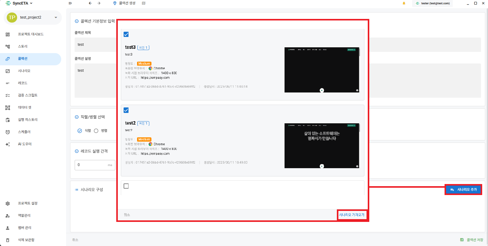

# 컬렉션 관리 및 일괄 실행

**'컬렉션(Collection)'**은 연관된 복수의 테스트 시나리오를 그룹화하여 하나의 테스트 스위트(Test Suite) 단위로 관리하고 일괄 실행하는 기능입니다.

---

## 1. 컬렉션의 주요 용도

- **엔드투엔드 시나리오 일괄 순차 실행**: 로그인 ➔ 상품 탐색 ➔ 주문 결제 ➔ 주문 취소와 같은 개별 시나리오를 연속해서 순차적으로 검증합니다.
- **다중 브라우저 동시 병렬 실행**: 동일한 시나리오 세트를 Chrome, Firefox, Edge 등 여러 브라우저 환경에서 동시에 병렬 구동하여 크로스 브라우징 호환성을 점검합니다.

---

## 2. 컬렉션 생성 절차

### 1단계: 컬렉션 메뉴 이동 및 신규 생성
좌측 메뉴의 **'컬렉션'**으로 이동한 후 우측 상단의 **'새로운 컬렉션'** 버튼을 클릭합니다.

### 2단계: 포함할 시나리오 및 실행 순서 선택
컬렉션에 포함할 시나리오 목록을 체크하고, 드래그 앤 드롭을 통해 실행 순서를 구성합니다.

---

## 3. 컬렉션 실행 및 결과 집계

컬렉션 실행 시 각 시나리오별 통과/실패 상태가 실시간으로 집계되며, 전체 컬렉션 실행 완료 후 종합 결과 리포트가 대시보드에 기록됩니다.

<iframe width="100%" height="400" src="https://www.youtube.com/embed/dsb0XpGy7A0" frameborder="0" allowfullscreen allow="autoplay; encrypted-media"></iframe>
