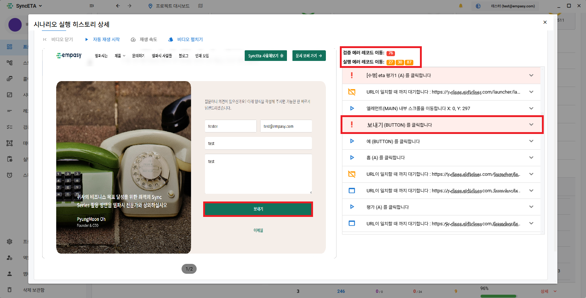
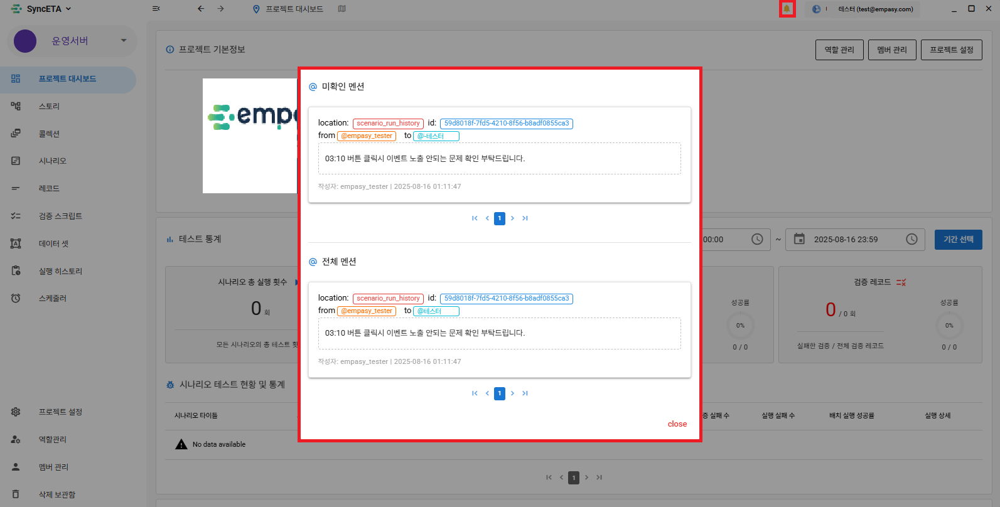
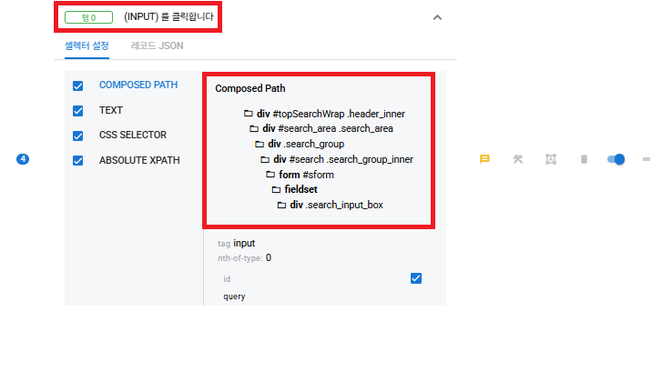
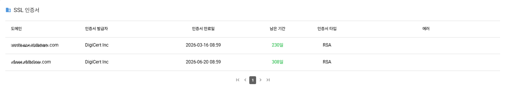

# 대시보드 및 결과 분석 가이드

SyncETA 대시보드는 전체 프로젝트의 테스트 성공률 및 실패 원인을 한눈에 파악할 수 있는 종합 관제 인터페이스를 제공합니다.

---

## 1. 실행 통계 및 트렌드 분석

실행 기간 및 테스트 유형(직접 실행, 스케줄러, CI/CD)별로 필터링하여 종합적인 품질 지표를 조회할 수 있습니다.

### 주요 모니터링 지표
- **총 실행 횟수**: 시나리오 및 개별 레코드의 누적 실행 횟수
- **우선순위별 성공률**: '높음' 등급의 핵심 시나리오 성공률 분리 집계
- **검증 레코드 통과율**: Assertions(DOM/값/Vision)의 단계별 검증 일치율

---

## 2. 실패 시점 정밀 진단 및 동기화 영상 재생

실패한 테스트 케이스를 클릭하면 에러 발생 당시의 브라우저 상태를 정밀하게 분석할 수 있습니다.

### 타임라인 동기화 비디오 재생
테스트 실행 시 녹화된 비디오와 스텝별 레코드 타임라인이 동기화되어, 특정 레코드를 클릭하면 해당 동작이 수행되던 시점의 영상 위치로 즉시 점프합니다.

### 에러 레코드 위치 이동
오류 로그 클릭 시 해당 오류를 발생시킨 레코드 목록 위치로 자동 스크롤됩니다.

---

## 3. 팀 협업 및 코멘트 기능

테스트 결과의 특정 스텝에 이슈 코멘트를 작성하고 팀원(`@사용자명`)을 멘션하여 빠른 결함 공유와 커뮤니케이션을 지원합니다.

---

## 4. 자동 수집 진단 정보

SyncETA는 테스트 실행 과정에서 브라우저 및 인프라 레벨의 부가 진단 데이터를 자동으로 수집합니다.

| 수집 항목 | 설명 |
| :--- | :--- |
| **DOM 계층 스냅샷** | 이벤트 발생 당시의 전체 DOM 트리 및 노드 속성 정보 보존 |
| **브라우저 Console Error** | 실행 중 웹페이지 콘솔에 출력된 JavaScript 런타임 오류 및 경고 자동 수집 |
| **SSL 인증서 만료일** | 대상 서비스 도메인의 SSL/TLS 인증서 유효기간 점검 및 만료 임박 알림 |

