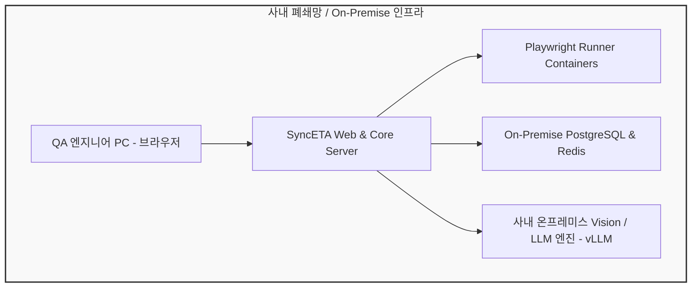

# 엔터프라이즈 보안 및 온프레미스 배포

SyncETA는 금융, 공공, 대기업의 엄격한 보안 요건을 충족하기 위해 **완전한 온프레미스 망분리(Air-Gapped) 배포**와 **데이터 거버넌스 기능**을 제공합니다.

---

## 1. 망분리 환경 및 온프레미스 아키텍처

외부 퍼블릭 클라우드 연결이 불가능한 폐쇄망 환경에서도 SyncETA의 모든 기능(레코딩, 실행, 시각 분석)을 완결적으로 운영할 수 있습니다.

### 사내 로컬 Vision / LLM 엔진 연동
- **오픈소스 Vision 모델**: Qwen2-VL, LLaVA 등을 사내 GPU 인프라(vLLM, Ollama)에 배포하여 외부 API 통신 없이 시각적 회귀 분석을 수행합니다.
- **표준 OpenAI 호환 인터페이스**: 엔드포인트 URL(`http://local-vllm.internal:8000/v1`)과 API 키 설정만으로 로컬 인스턴스를 손쉽게 전환할 수 있습니다.

---

## 2. 민감 데이터 마스킹 (PII Data Masking)

테스트 실행 중 화면에 노출되는 개인정보(주민등록번호, 전화번호, 신용카드 번호, 비밀번호 등)의 유출을 방지하기 위한 다단계 마스킹을 적용합니다.

- **DOM 레벨 텍스트 마스킹**: 비밀번호(`type="password"`) 필드 및 지정된 정규식 패턴과 일치하는 텍스트는 레코드 수집 시 `********`로 즉시 마스킹 처리됩니다.
- **스크린샷/비디오 시각적 블러(Blur)**: 지정된 마스킹 영역(CSS Selector)에 해당하는 렌더링 영역은 화면 캡처 및 비디오 저장 전 픽셀화 블러 처리됩니다.

---

## 3. 역할 기반 접근 제어 (RBAC) 및 테넌트 격리

프로젝트 단위로 최소 권한 원칙(Principle of Least Privilege)을 적용하여 안전한 협업 환경을 보장합니다.

| 기본 역할 | 시나리오 생성/수정 | 테스트 실행 | 데이터셋 수정 | CI/CD API 키 발급 | 사용자 초대/권한 |
| :--- | :---: | :---: | :---: | :---: | :---: |
| **System Admin** | O | O | O | O | O |
| **Project Lead** | O | O | O | O | O |
| **QA Engineer** | O | O | O | X | X |
| **Viewer / Tester**| X | O (조회/실행) | X | X | X |

---

## 4. 감사 로그 및 추적성 (Audit Trail)

- **선택자 자가 치유 승인 로그**: 언제, 누가, 어떤 사유로 시나리오 선택자 변경을 승인했는지에 대한 전체 이력을 영구 보존합니다.
- **테스트 실행 기록 보존**: 테스트 실행자 ID, 실행 일시, 대상 URL, 브라우저 환경, 결과 통과 여부 및 오류 스택트레이스를 1년간 아카이빙합니다.
