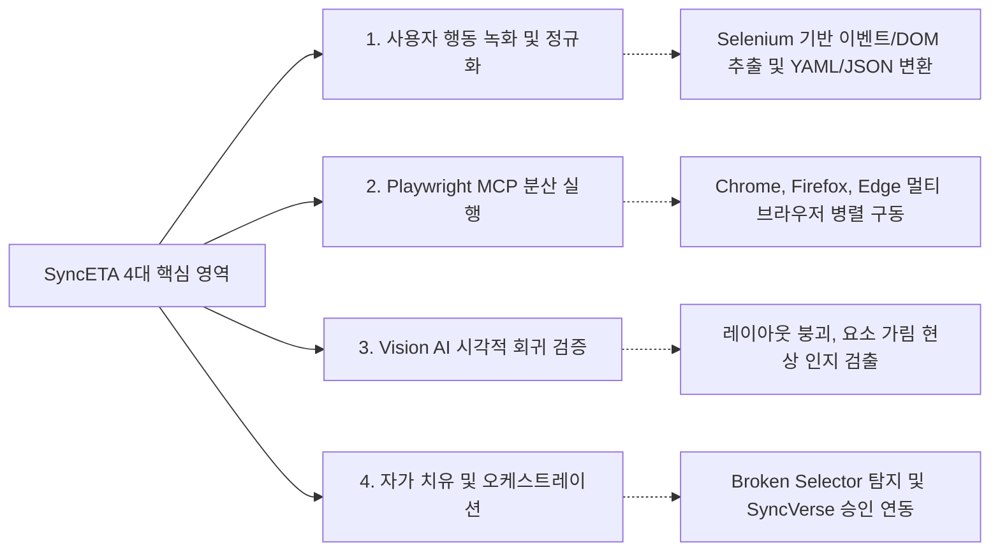
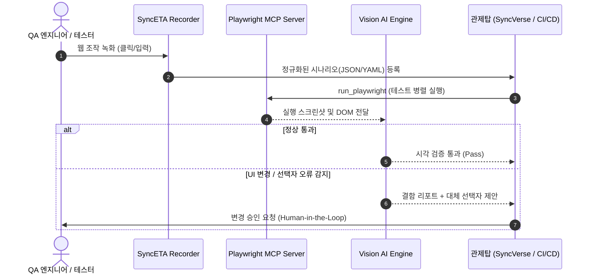

---
title: "SyncETA: 자율 회귀 테스트 및 자가 치유 플랫폼"
description: "웹 브라우저 인터랙션 녹화, Playwright 기반 분산 병렬 실행, Vision AI 시각적 회귀 검증 및 선택자 자가 치유(Self-Healing)를 제공하는 엔터프라이즈 테스트 자동화 솔루션입니다."
head:
  - - meta
    - name: keywords
      content: SyncETA, 테스트 자동화, 회귀 테스트, Playwright, MCP, Model Context Protocol, Visual Regression, Self-Healing, CI/CD, 엔터프라이즈 QA
  - - meta
    - property: og:title
      content: "SyncETA: 자율 회귀 테스트 및 자가 치유 플랫폼"
  - - meta
    - property: og:description
      content: "웹 동작 녹화, Playwright MCP 실행, Vision AI 시각 검증 및 자가 치유 파이프라인을 지원합니다."
  - - meta
    - property: og:image
      content: https://empasy.io/images/favicon.png
  - - meta
    - property: og:url
      content: https://empasy.io/synceta/
sort: 10
---

# SyncETA: 자율 회귀 테스트 및 자가 치유 플랫폼

SyncETA는 웹 애플리케이션의 사용자 인터랙션을 기록하고, Model Context Protocol(MCP) 표준 인터페이스를 통해 테스트를 자동 실행하며, 시각적 변형 감지 및 선택자 자가 치유(Self-Healing)를 지원하는 엔터프라이즈 QA 플랫폼입니다.

---

## 4대 핵심 기능 영역

1. **사용자 행동 녹화 및 시나리오 정규화 (Recording & Normalization)**:
   - 실제 브라우저 조작(클릭, 입력, 페이지 이동, 탭 전환)을 실시간으로 수집합니다.
   - 수집된 이벤트는 XPath, CSS Selector, DOM 계층 구조와 함께 표준 JSON/YAML 포맷으로 정규화됩니다.

2. **Playwright MCP 기반 분산 테스트 실행 (Test Execution)**:
   - Model Context Protocol(MCP) 표준 도구를 통해 멀티 브라우저(Chromium, Firefox, WebKit) 환경에서 테스트를 병렬 실행합니다.
   - 테스트 실행 중 오류 발생 시 실패 시점의 DOM 스냅샷, 콘솔 로그, 비디오 녹화본을 수집합니다.

3. **Vision AI 기반 시각적 회귀 검증 (Visual Regression AI)**:
   - 단순 픽셀 비교의 한계를 넘어, 비전 모델을 통해 컴포넌트 겹침 현상, 텍스트 잘림, 레이아웃 깨짐을 검출합니다.
   - 동적 렌더링 영역에 대한 마스킹(Ignored Regions) 설정을 지원합니다.

4. **선택자 자가 치유 및 관제탑 연동 (Self-Healing & Governance)**:
   - UI 변경으로 인해 기존 식별자가 깨질 경우, 화면 구조를 분석하여 최적의 대체 선택자를 산출합니다.
   - 임의로 코드를 변경하지 않고, SyncVerse 관제탑 및 QA 엔지니어의 승인(Human-in-the-Loop)을 거쳐 테스트 자산을 갱신합니다.

---

## 5단계 엔드투엔드 테스트 파이프라인

---

## 도입 시 기대 효과

- **테스트 스크립트 유지보수 공수 절감**: UI 변경 시 발생하는 스크립트 깨짐 현상을 자가 치유 파이프라인을 통해 신속하게 보정합니다.
- **크로스 브라우징 검증 시간 단축**: Playwright MCP 기반 병렬 실행을 통해 회귀 테스트 전체 소요 시간을 단축합니다.
- **정밀한 시각적 무결성 확보**: 픽셀 노이즈에 영향을 받지 않는 Vision AI 검증으로 릴리즈 전 레이아웃 오류를 사전에 차단합니다.
- **표준 프로토콜 호환**: HTTP SSE 기반 MCP 인터페이스를 제공하여 사내 CI/CD(Jenkins, GitHub Actions) 및 AI 오케스트레이터와 유기적으로 연동됩니다.

---

## 문서 목차

### 1. 개요 및 시스템 아키텍처
- [시스템 아키텍처 및 파이프라인](./architecture) - 4계층 아키텍처 및 컴포넌트 통신 구조
- [5분 퀵스타트 가이드](./quickstart) - 로컬 컨테이너 구동 및 첫 테스트 실행

### 2. 실무 사용자 가이드
- [계정 및 워크스페이스 관리](./account) - 회원가입, 프로필 설정 및 환경 관리
- [프로젝트 관리](./project) - 프로젝트 생성, 역할/권한(RBAC) 및 멤버 초대
- [시나리오 녹화 및 에디터](./scenario-create) - 브라우저 녹화, 대기 조건, 검증 조건, 복구 스크립트
- [시나리오 실행 옵션](./scenario-run) - 크로스 브라우저, 멀티 해상도, 백그라운드 병렬 실행 및 스케줄러
- [컬렉션 관리](./collection) - 복수 시나리오 일괄 순차/병렬 실행 구성
- [스토리 워크플로우](./story) - 플로우차트 기반 시나리오 조건부 분기 및 동적 Chaining
- [데이터셋 관리](./dataset) - Excel 연동, 입력값 치환(Data-Driven Testing), 경계값 데이터 세트
- [대시보드 및 결과 분석](./dashboard) - 실행 통계, 콘솔 에러 수집, 실패 시점 DOM 스냅샷 및 녹화 영상 분석

### 3. 고급 연동 및 엔터프라이즈
- [시각적 회귀 및 자가 치유](./self-healing-and-vision) - Vision AI 레이아웃 검증 및 선택자 보정 절차
- [MCP 프로토콜 및 CI/CD 연동](./mcp-and-cicd) - HTTP SSE 표준 Tool Schema 및 파이프라인 연동 규격
- [엔터프라이즈 보안 및 온프레미스](./enterprise-security) - 로컬 LLM 연동, 사내 망분리 지원, 데이터 마스킹
- [기술 용어 사전](./glossary) - Record, Scenario, Collection, Story, MCP 등 용어 정의
