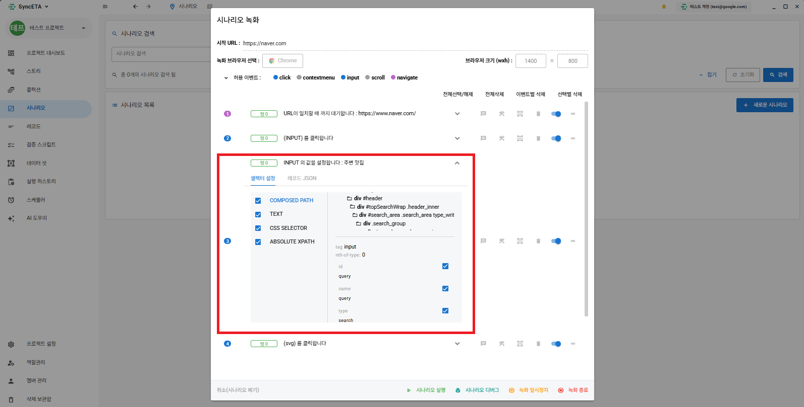
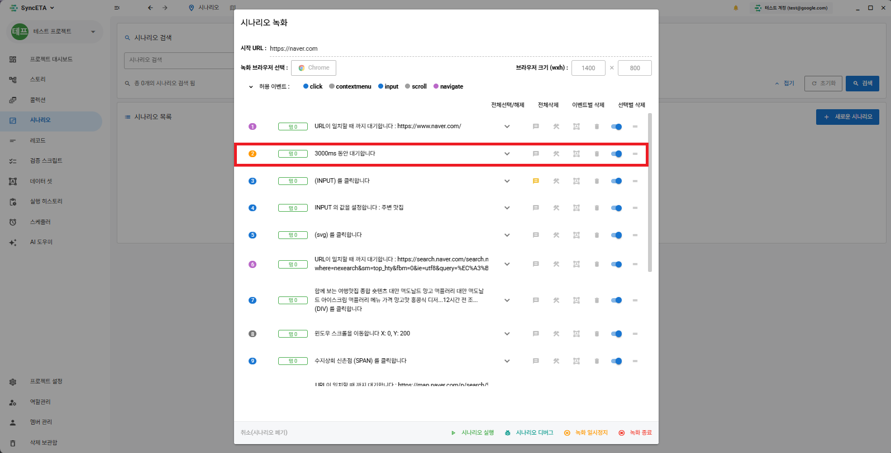
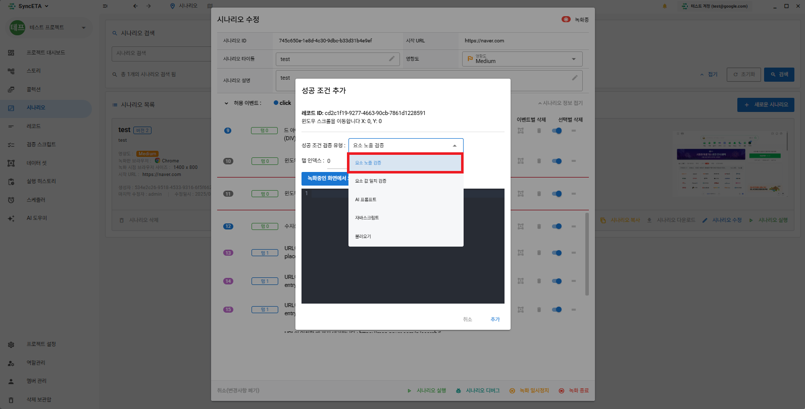
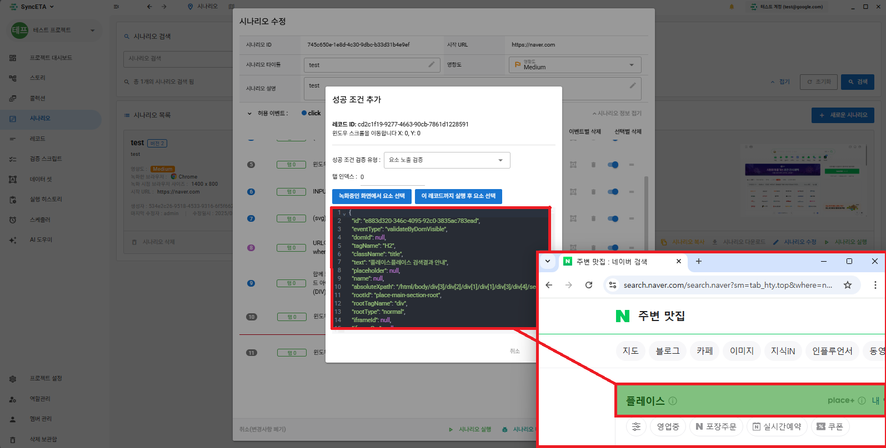
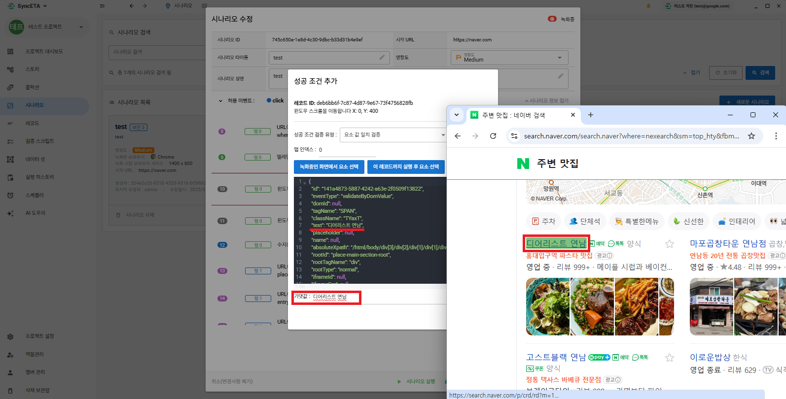
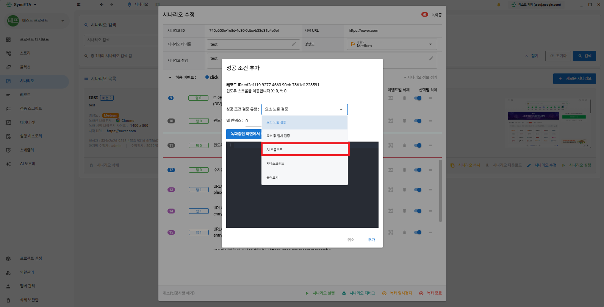
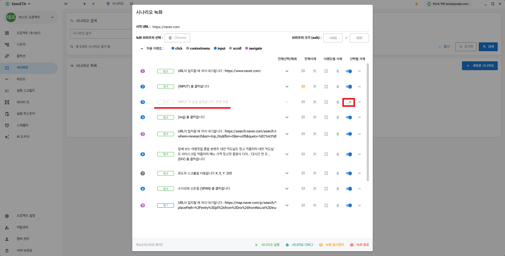

# 시나리오 녹화 및 에디터 가이드

SyncETA 에디터는 브라우저 조작(클릭, 텍스트 입력, 페이지 이동 등)을 실시간으로 캡처하고, 이벤트 발생 시점의 DOM 정보(XPath, CSS Selector, 태그 속성)를 구조화하여 테스트 케이스를 생성합니다.

---

## 1. 시나리오의 정의 및 단위

**'시나리오(Scenario)'**는 특정 비즈니스 흐름을 완결하는 테스트 단위입니다.

예시: `쇼핑몰 상품 검색 및 장바구니 담기`
1. 메인 홈페이지 접속
2. 검색창 클릭 및 검색어(`무선 마우스`) 입력
3. 검색 실행 및 결과 목록 로딩
4. 첫 번째 상품 클릭 후 상세 페이지 이동
5. '장바구니 담기' 버튼 클릭 및 완료 모달 검증

---

## 2. 시나리오 생성 및 녹화 절차

### 1단계: 시나리오 메뉴 진입
1. 좌측 사이드바의 **'시나리오'** 메뉴를 클릭합니다.
2. 우측 상단의 **'새로운 시나리오'** 버튼을 클릭하여 녹화 설정 모달을 엽니다.

### 2단계: 녹화 브라우저 및 해상도 설정
- **대상 URL**: 테스트를 수행할 웹 페이지의 기본 주소를 입력합니다.
- **녹화 브라우저**: 녹화를 진행할 브라우저 엔진(Chrome, Edge 등)을 선택합니다.
- **뷰포트 해상도**: 녹화 시 적용할 브라우저 해상도를 설정합니다 (예: 1920x1080, 1400x800).

### 3단계: 수집 이벤트 필터 설정
수집할 이벤트 타입(클릭, 키보드 입력, 마우스 오버, 스크롤 등)을 지정합니다. 일반적인 웹 테스트의 경우 기본 권장 설정을 유지합니다.

### 4단계: 실시간 녹화 진행
녹화가 시작되면 전용 브라우저 창이 표시됩니다. 브라우저에서 실제 사용자 흐름에 맞추어 조작을 진행하면, 하단 목록에 이벤트 레코드가 순차적으로 수집됩니다.

### 5단계: DOM 정보 수집 확인
수집된 각 레코드는 이벤트가 발생한 대상 노드의 태그, ID, Class, 절대/상대 XPath 정보를 포함합니다.

### 6단계: 멀티 탭 상호작용 지원
녹화 중 신규 탭 또는 팝업 창이 열릴 경우, 탭 전환 이벤트를 자동으로 인식하여 다중 탭 시나리오를 연속해서 녹화합니다.

---

## 3. 대기 조건 (Wait Conditions) 추가

비동기 네트워크 통신(AJAX/Fetch)이나 화면 렌더링 지연으로 인한 테스트 불안정성을 방지하기 위해 3가지 대기 레코드를 지원합니다.

| 대기 유형 | 설명 | 권장 사용 시점 |
| :--- | :--- | :--- |
| **시간 대기 (Fixed Timeout)** | 지정된 시간(밀리초) 동안 일시 중지합니다. | 외부 시스템 API 응답 지연 대기 |
| **요소 노출 대기 (DOM Visible)** | 특정 DOM 엘리먼트가 화면에 렌더링될 때까지 대기합니다. | 비동기 레이어 팝업 로딩 대기 |
| **요소 값 일치 대기 (Value Match)** | 대상 요소의 텍스트 또는 속성이 특정 값으로 변경될 때까지 대기합니다. | 처리 상태('완료') 또는 주문번호 생성 대기 |

### 시간 대기 조건 추가 방법
1. 대기가 필요한 레코드를 마우스 우클릭합니다.
2. **'대기 조건 추가' ➔ '시간 대기'**를 선택하고 대기 시간(ms)을 입력합니다.

### 요소 노출 대기 조건 추가 방법
1. 레코드 우클릭 후 **'대기 조건 추가' ➔ '요소 노출 대기'**를 선택합니다.
2. 녹화 브라우저 창에서 대기 대상이 될 DOM 요소를 직접 클릭하여 지정합니다.

### 요소 값 일치 대기 조건 추가 방법
1. 레코드 우클릭 후 **'대기 조건 추가' ➔ '요소 값 일치 대기'**를 선택합니다.
2. 브라우저에서 대상 요소를 선택하고 기대하는 일치 텍스트를 입력합니다.

---

## 4. 검증 조건 (Assertions) 추가

테스트의 성공/실패 여부를 객관적으로 판정하기 위해 3가지 검증 레코드를 제공합니다.

| 검증 유형 | 설명 |
| :--- | :--- |
| **요소 노출 검증** | 특정 UI 컴포넌트(버튼, 배너, 모달 등)가 화면에 올바르게 존재하는지 검증 |
| **요소 값 검증** | 특정 요소의 텍스트, 금액, 상태 문자열이 기대치와 일치하는지 검증 |
| **AI 화면 검증 (Vision AI)** | 브라우저 화면 캡처 이미지를 기반으로 시각적 이상 유무(레이아웃 깨짐, 가림 현상) 검증 |

### 요소 노출 및 값 검증 추가
레코드를 우클릭한 후 **'검증 조건 추가'** 메뉴에서 원하는 검증 방식을 선택하고 대상 요소를 지정합니다.

### AI 화면 검증 (Vision AI)
텍스트 매칭만으로 확인하기 어려운 복합 그래픽이나 반응형 레이아웃 정상 여부를 검증할 때 사용합니다. 검증 프롬프트(예: "검색 결과 지도 영역이 가려짐 없이 정상 노출되는지 확인")를 입력하면, 실행 시 화면 캡처를 기반으로 시각 검증을 수행합니다.

---

## 5. 시나리오 수정 및 이어서 녹화

기존에 작성된 시나리오의 특정 단계 이후부터 추가 동작을 이어서 녹화할 수 있습니다.

1. 시나리오 목록에서 대상 시나리오를 선택하고 **'수정'** 버튼을 클릭합니다.
2. 이어서 녹화를 시작할 기준 레코드를 선택합니다.
3. 브라우저가 실행되어 기준 레코드까지 자동 재생된 후, 대기 상태에서 추가 사용자 조작을 기록합니다.

---

## 6. 부가 기능

- **레코드 노트 (Comments)**: 각 스텝에 테스트 목적 및 참고 사항 메모 작성
  
- **실패 복구 스크립트 (Recovery Script)**: 특정 스텝 실패 시 세션 종료를 방지하기 위한 예외 처리 JavaScript 스크립트 지정
  
- **데이터셋 변수 바인딩**: 입력 텍스트를 하드코딩하지 않고 데이터셋 변수(`{{username}}` 등)로 치환
  
- **스텝 삭제 및 비활성화**: 불필요한 레코드 삭제 또는 실행 대상에서 일시 제외
  
  
