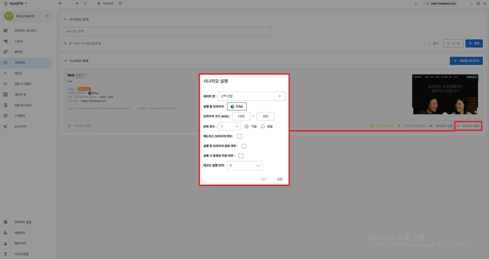
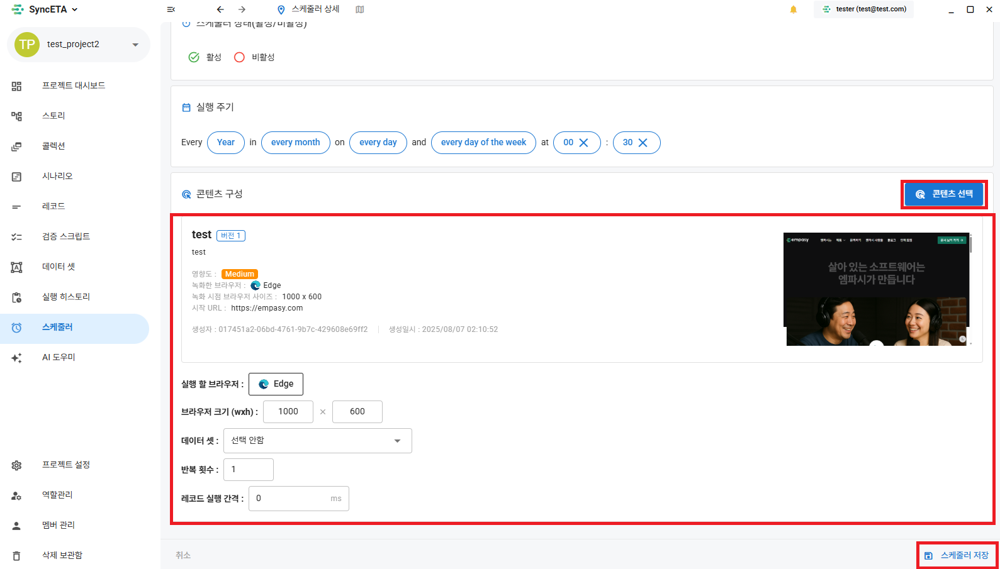
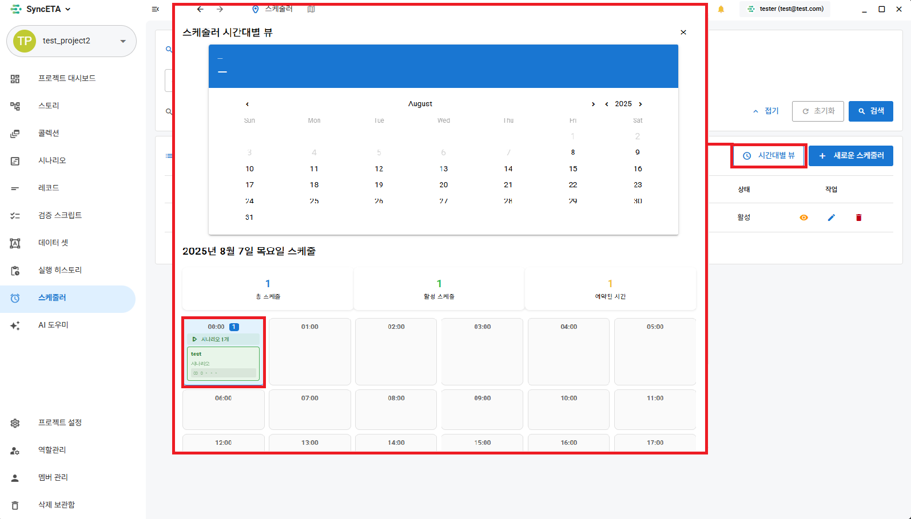

# 시나리오 실행 및 스케줄러 설정

SyncETA는 단일 시나리오의 즉시 실행부터 대규모 크로스 브라우징 검증, 시간대별 자동 회귀 테스트를 위한 스케줄러 기능을 지원합니다.

---

## 1. 시나리오 직접 실행 (Direct Execution)

시나리오 상세 화면 우측 상단의 **'실행'** 버튼을 클릭하여 테스트를 즉시 구동할 수 있습니다.

### 주요 실행 옵션 사양

| 설정 항목 | 설명 | 기본값 |
| :--- | :--- | :--- |
| **데이터셋 (Data Set)** | 테스트 실행 시 적용할 데이터셋 선택 (변수 치환) | 미적용 |
| **실행 브라우저** | Chromium, Chrome, Microsoft Edge, Firefox, WebKit 중 선택 | Chrome |
| **뷰포트 크기** | 브라우저 가로/세로 해상도 지정 (반응형 테스트) | 1920x1080 |
| **반복 실행 방식** | **직렬**: N회 순차 반복 실행 **병렬**: N개 브라우저 인스턴스를 동시에 구동하여 병렬 실행 | 직렬 1회 |
| **헤드리스 모드 (Headless)** | 브라우저 GUI 창을 띄우지 않고 백그라운드 프로세스로 고속 실행 | 비활성 |
| **실행 후 브라우저 종료** | 테스트 완료 후 브라우저 컨텍스트 자동 정리 여부 | 활성 |
| **동영상 저장 (Save Video)** | 테스트 실행 전 과정을 MP4 비디오 파일로 캡처하여 저장 | 활성 |
| **스텝 간 지연 시간 (Step Delay)** | 각 레코드 실행 사이의 기본 대기 시간(ms) 부여 | 0ms |

---

## 2. 스케줄러를 통한 정기 자동 실행

정기적인 회귀 검증(야간 빌드 테스트, 정기 배포 후 스모크 테스트 등)을 위해 Cron 기반의 스케줄러를 설정할 수 있습니다.

### 1단계: 스케줄러 메뉴 이동
좌측 사이드바에서 **'스케줄러'** 메뉴로 이동합니다.

### 2단계: 실행 주기 및 시간대 지정
매일 특정 시각, 주간 특정 요일 또는 지정된 분 단위 간격으로 실행 주기를 설정합니다.

### 3단계: 대상 시나리오 및 실행 파라미터 매핑
스케줄에 따라 실행할 시나리오 목록과 브라우저 타입, 해상도 환경을 지정합니다.

### 4단계: 스케줄링 등록 내역 및 실행 이력 확인
등록된 스케줄러 목록에서 다음 실행 예정 시간 및 최근 실행 성공/실패 여부를 모니터링합니다.

