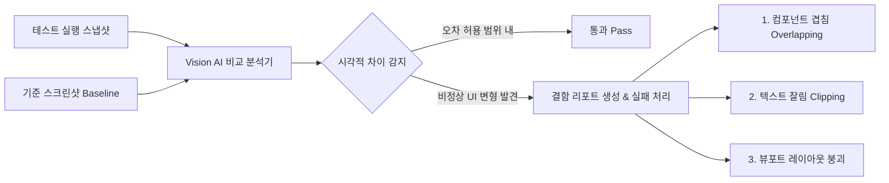
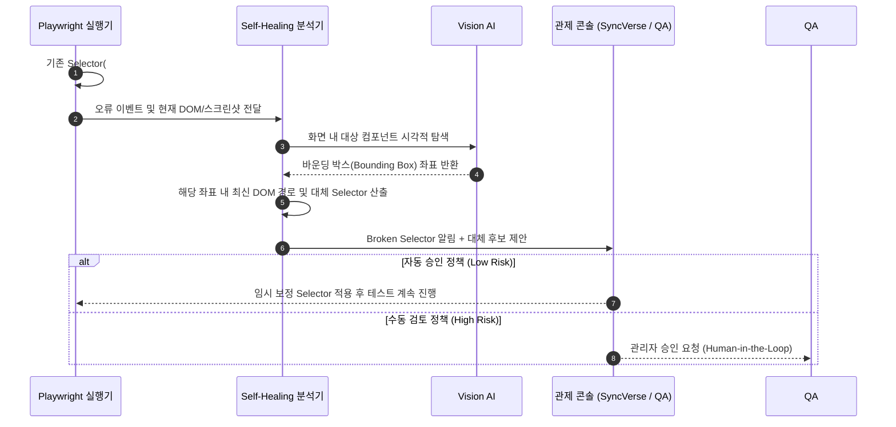

# 시각적 회귀 검증 및 선택자 자가 치유

웹 애플리케이션의 지속적인 배포 환경에서는 DOM 구조의 미세한 변경이나 CSS 레이아웃 어긋남으로 인해 기존 테스트 스크립트가 깨지거나(Flaky Test), 사용자 눈에만 보이는 UI 결함이 발생하기 쉽습니다. 

SyncETA는 **Vision AI 기반 시각 검증**과 **선택자 자가 치유(Self-Healing)** 파이프라인을 통해 이러한 문제를 체계적으로 해결합니다.

---

## 1. Vision AI 기반 시각적 회귀 검증

기존의 단순 픽셀 일치(Pixel-by-Pixel Diff) 방식은 브라우저 폰트 앤티앨리어싱이나 1픽셀 렌더링 오차에도 테스트가 실패하는 한계가 있었습니다. SyncETA는 시각 인지 비전 모델을 결합하여 실제 사용자가 인지하는 수준의 이상 여부를 판별합니다.

### 주요 시각 검증 항목
1. **컴포넌트 겹침(Overlapping)**: 배너나 팝업 레이어가 결제/장바구니 등 핵심 버튼을 가리는 현상 탐지
2. **텍스트 잘림(Clipping)**: 반응형 화면 전환 시 버튼이나 레이블의 텍스트가 박스 밖으로 넘치거나 잘리는 결함 검출
3. **영역 마스킹(Ignored Regions)**: 현재 시간, 실시간 배너 광고 등 매 실행 시 변경되는 동적 영역을 검증 대상에서 제외

---

## 2. 선택자 자가 치유 파이프라인 (Self-Healing)

프론트엔드 프레임워크 업데이트나 클래스명 난독화(Webpack/Vite Hash)로 인해 기존 식별자(XPath/CSS Selector)가 깨졌을 때, SyncETA는 자동으로 대체 선택자를 탐색하고 복구를 제안합니다.

---

## 3. Human-in-the-Loop 거버넌스

SyncETA는 AI가 테스트 코드를 임의로 변조하여 발생할 수 있는 거짓 양성(False Positive)을 원천 차단하기 위해 **관리자 승인 거버넌스**를 준수합니다.

- **자가 치유 제안 큐(Healing Queue)**: 변경된 UI 요소와 제안된 대체 XPath/Selector를 관리자 화면에 나열합니다.
- **Before/After 비교 뷰**: 이전 선택자가 가리키던 UI와 현재 제안된 UI를 스크린샷으로 대조하여 검토자가 1클릭으로 승인하거나 거절할 수 있습니다.
- **승인 이력 감사(Audit Log)**: 선택자 변경 사유 및 승인자 정보가 시스템에 영구 기록되어 테스트 자산의 무결성을 유지합니다.
