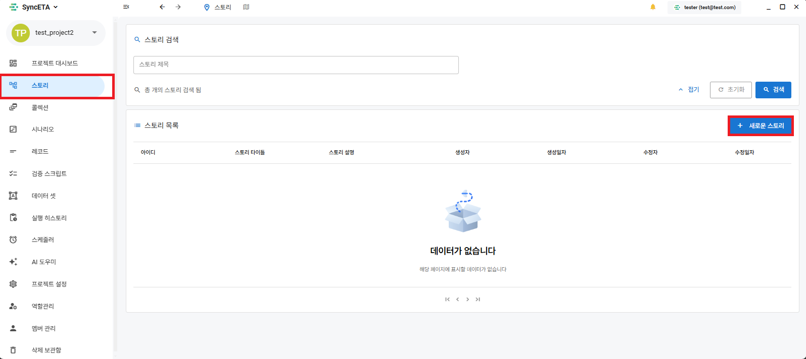
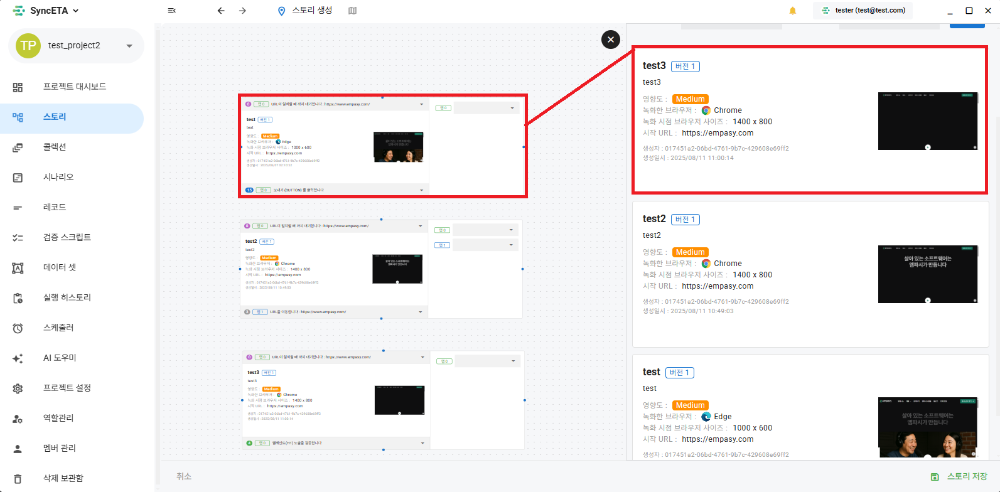
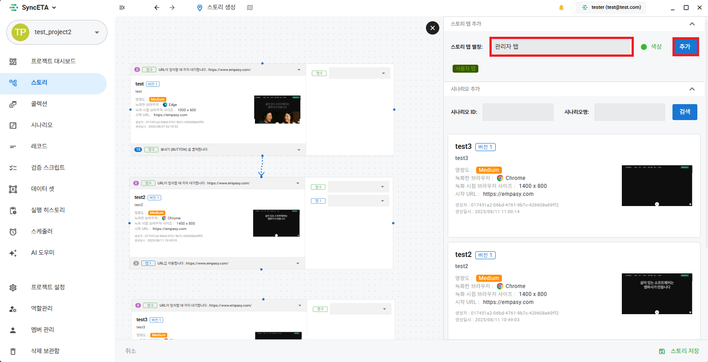
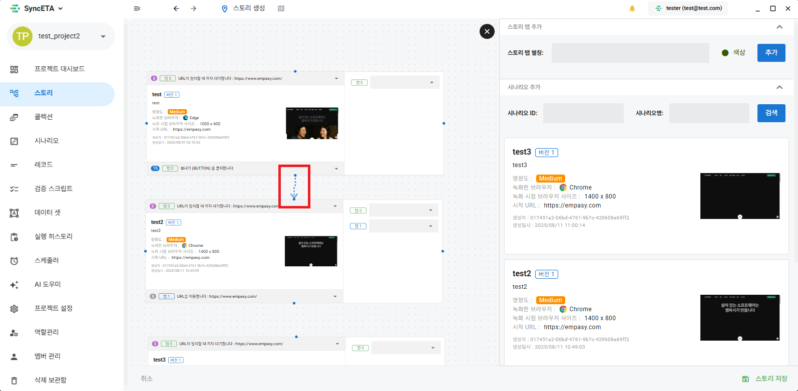

# 스토리 워크플로우 (플로우차트 연동)

**'스토리(Story)'**는 개별 시나리오들을 시각적 플로우차트(Flowchart) 형태로 결합하여, 단일 브라우저 세션 또는 다중 탭 환경에서 연속적으로 실행하는 상위 워크플로우 구성 도구입니다.

---

## 1. 스토리의 주요 특징

- **단일 브라우저 컨텍스트 유지**: 세션 쿠키, 로그인 인증 상태를 유지하면서 여러 시나리오를 단계별로 체이닝합니다.
- **다중 탭 별칭(Tab Alias) 제어**: 복수의 탭이나 팝업 창이 열리는 복합 비즈니스 흐름에서 탭별로 별칭을 부여하여 정확한 탭으로 포커스를 전환하며 테스트를 이어갑니다.
- **구간별 시작/종료 레코드 지정**: 전체 시나리오 중 필요한 특정 스텝 구간만을 선택적으로 연결할 수 있습니다.

---

## 2. 스토리 생성 및 플로우차트 구성 절차

### 1단계: 스토리 메뉴 이동
좌측 사이드바에서 **'스토리'** 메뉴를 클릭하고 신규 스토리 캔버스를 엽니다.

### 2단계: 캔버스에 시나리오 배치
우측 시나리오 서랍에서 스토리에 포함할 시나리오 블록을 캔버스 중앙으로 드래그 앤 드롭합니다.

### 3단계: 탭 별칭(Tab Alias) 정의 및 적용
동일 브라우저 내에서 탭 간 전환이 필요한 경우, 고유한 탭 별칭을 생성하여 각 시나리오 노드에 매핑합니다.

### 4단계: 시나리오 노드 간 연결선 생성
시나리오 블록의 출력 포트와 다음 시나리오 블록의 입력 포트를 드래그하여 실행 순서를 결합합니다.

### 5단계: 시작 및 종료 레코드 범위 지정
각 시나리오 블록을 클릭하여 실제 실행에 포함할 시작 레코드와 종료 레코드 범위를 미세 조정합니다.

