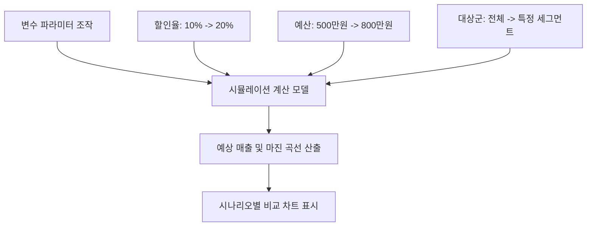
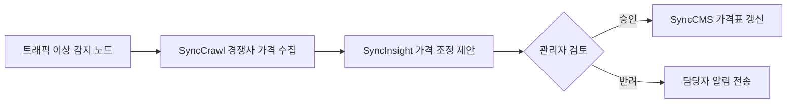

---
title: "자율 액션 승인 및 What-If 시뮬레이터"
sort: 3
description: "AI가 제안한 비즈니스 전략을 사전에 시뮬레이션하고, 관리자 승인(HITL)을 거쳐 하위 에이전트(SyncCMS, SyncShop)로 안전하게 전달하는 액션 실행 체계를 설명합니다."
head:
  - - meta
    - name: keywords
      content: 액션 승인 센터, Human-in-the-Loop, HITL, What-If 시뮬레이터, Before vs After, 워크플로우 빌더, SyncVerse 연동, 트랜잭션 롤백, Action Dispatcher, 비즈니스 자동화
  - - meta
    - property: og:title
      content: "SyncInsight 자율 액션 승인 및 What-If 시뮬레이터 | Empasy"
  - - meta
    - property: og:description
      content: "제안 전략의 사전 영향도 검증과 관리자 승인 기반의 안전한 실행(HITL) 파이프라인"
  - - meta
    - property: og:image
      content: https://empasy.io/images/favicon.png
  - - meta
    - property: og:url
      content: https://empasy.io/syncinsight/action-approval
---

# 자율 액션 승인 및 What-If 시뮬레이터 (Action Approval & Simulation)

데이터 분석 결과를 실무에 적용하기 위해, SyncInsight는 **실행 가능한 액션 플랜을 도출**하고 **사전 시뮬레이션(What-If)**을 통해 검증한 후, **관리자 승인을 거쳐 대상 시스템에 반영(HITL Execution)**하는 워크플로우를 제공합니다.

---

## 1. 관리자 참여형(HITL) 액션 승인 센터 (SI-009)

운영 안정성을 확보하기 위해, SyncInsight는 중요한 시스템 변경 시 **관리자 승인(Human-in-the-Loop)** 절차를 거치도록 설계되었습니다.

```mermaid
flowchart LR
    A[분석 엔진] -->|액션 제안 생성| B[액션 대기 큐\n(Pending Actions)]
    B --> C{관리자 검토 및 승인}
    C -->|승인 Approve| D[MCP 액션 디스패처]
    C -->|반려 / 보완 Reject| E[피드백 반영 및 전략 보정]
    D --> F[SyncVerse 연동 게이트웨이]
    F --> G1[SyncCMS 배너 등록]
    F --> G2[SyncShop 쿠폰 생성]
    F --> G3[SyncBoot 정책 적용]
```

### 1.1. 액션 승인 카드의 주요 검토 항목
* **Before vs After 비교**: 현재 설정값과 변경될 설정값을 나란히 비교하여 표시합니다.
* **위험도 등급 (Risk Level)**:
  - `LOW`: 조회 작업, 단순 UI 문구 변경
  - `MEDIUM`: 타겟팅 배너 게시, 쿠폰 생성
  - `HIGH`: 전사 가격 정책 변경, DB 스키마 수정 (다자간 승인 필요)
* **예상 효과 (Expected Lift)**: 주문 전환율 변동치, 예상 비용 절감액 등 정량적 추정치를 제시합니다.
* **롤백 지원 여부 (Rollback Support)**: 실행 후 이상 발생 시 이전 상태로 복구할 수 있는 보상 작업 정의 여부를 명시합니다.

---

## 2. What-If 시뮬레이터 (SI-010)

실제 시스템에 반영하기 전, 주요 파라미터를 변경하여 예상되는 지표 추이를 사전에 시뮬레이션합니다.



* **파라미터 슬라이더**: 할인율, 대상 모수, 프로모션 예산 등을 조절하여 예상 추이 그래프를 실시간으로 재계산합니다.
* **시나리오 비교 (Scenario Comparison)**: 기본 시나리오, 낙관적 시나리오, 보수적 시나리오를 한 화면에서 비교 검토할 수 있습니다.

---

## 3. 워크플로우 빌더 (SI-011)

다단계 업무 파이프라인을 노드(Node) 연결 방식으로 구성하여 자동화할 수 있습니다.



* **데이터 흐름 모니터링**: 노드 간 데이터 전달 상태를 시각적으로 확인합니다.
* **단계별 테스트**: 각 노드의 입출력 데이터를 개별적으로 테스트하고 디버깅할 수 있습니다.

---

## 4. 비상 정지 및 안전장치

시스템 이상 발생 시 액션 실행을 중단하고 복구할 수 있는 안전 관리 기능을 제공합니다.

1. **글로벌 비상 정지 (Kill Switch)**: 비상 정지 기능을 활성화하면 대기 중인 모든 외부 연동 액션이 일시 중지됩니다.
2. **이력 기반 복구 (Revert Action)**: 액션 실행 이력 화면에서 복구 기능을 실행하여 이전 설정 상태로 되돌릴 수 있습니다.
3. **부하 기반 차단 (Load-based Throttling)**: 서버 리소스 부하가 기준치를 초과할 경우 신규 액션 요청을 큐에 보류합니다.
